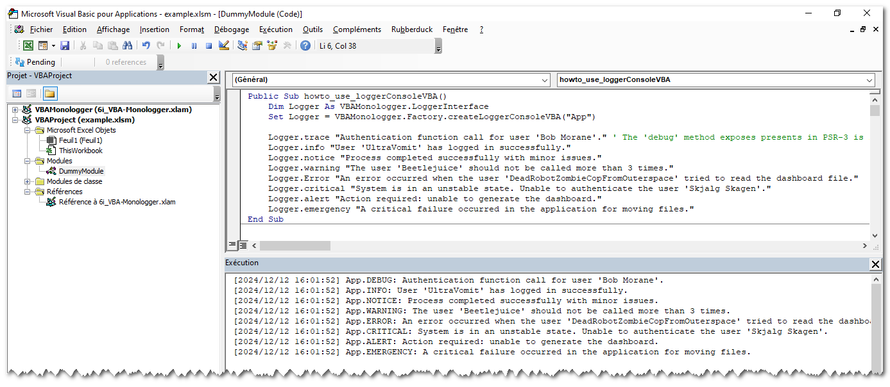
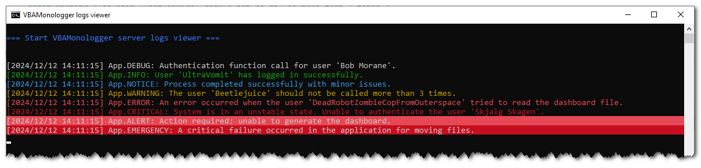
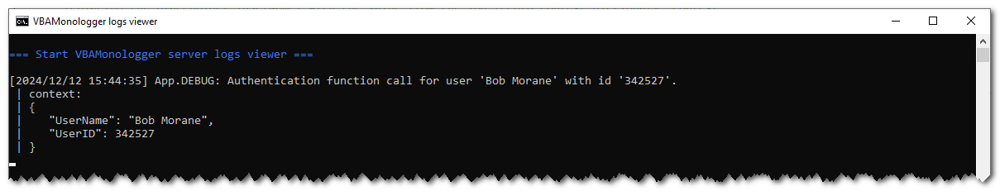

# VBA Monologger

[](https://github.com/v20100v/6i-Jekyll/blob/develop/LICENSE.md)
&nbsp;[](https://www.buymeacoffee.com/vincent.blain)

> VBA Monologger is an advanced and flexible logging solution for VBA (*Visual Basic for Applications*) ecosystem. It is largely inspired by the [Monolog](https://github.com/Seldaek/monolog) library in PHP, which itself is inspired by the [Logbook](https://logbook.readthedocs.io/en/stable/) library in Python.


## Preamble

VBA provides developers with the ability to automate tasks, interact with the features of 
Microsoft Office applications, and even create applications with a graphical user interface (`Userform`). However, compared to other development ecosystems, VBA only offers a rudimentary logging solution, limited to the `Debug.Print` function, which writes to the Excel console (a.k.a. the Excel immediate window).

The *VBA Monologger* library project was born out of the need for a more advanced and flexible logging solution in the VBA ecosystem. It is (heavily) inspired by the PSR-3 standard in the PHP ecosystem and its most recognized implementation, the Monolog library. The goal of this library is to provide similar features and capabilities, particularly by offering a modular architecture that can easily adapt to different use cases. The main idea is for each developer to easily configure and customize their own logging system according to their needs.


## Features

- Customize the logging format to define how log messages are structured and displayed - see [formatter](https://6i-software.github.io/vba-monologger/under-the-hood/formatter.html).
- Specify the destination where logs should be viewed (*e.g.*, VBA console *a.k.a* Excel's immediate window, Windows console (cmd.exe) with ANSI color support, file...) and configure the conditions under which logging events are triggered based on specific criteria - see [handler](https://6i-software.github.io/vba-monologger/under-the-hood/handler.html).
- Manages 8 standard severity levels to classify the importance of log messages, following the [PSR-3](https://www.php-fig.org/psr/psr-3/) standard - see [log severity levels](https://6i-software.github.io/vba-monologger/under-the-hood/log-severity-levels.html)
- Enrich log records with pre-processors, enabling the addition of context, transformation of data, or customization of log entries to suit specific needs (*e.g.* add CPU or memory usage, generate a UID for each session, add tags... and more) - see [pre-processor](https://6i-software.github.io/vba-monologger/under-the-hood/pre-processor.html).
- Use the provided loggers in the VBAMonologger factory (*e.g. `LoggerConsoleVBA`, `LoggerConsole` or `LoggerFile`*) for basic usage, or create your own custom logging system - see [logger](https://6i-software.github.io/vba-monologger/under-the-hood/logger.html).
- Easily develop your own custom formatter, handler, and pre-processors to tailor the logging system to your specific needs. By creating unique formatting styles, specialized handlers, and custom pre-processing logic, you can enhance the functionality and flexibility of your logging setup, ensuring it meets the precise requirements of your applications and workflows.


## Documentation

Please refer to the documentation for details on how to install and use VBA Monologger.
> [Go to the website documentation](https://6i-software.github.io/vba-monologger/)


## Basic usages

### Log output to VBA Console

To install the VBAMonologger library, simply download the `6i-VBAMonologger.xlam` file and add it as a reference in your project. Next, use the factory to create an instance of a logger preconfigured with default handler, formatter, and pre-processors, as shown below:

```vbscript
Public Sub howto_use_loggerConsoleVBA()
    ' Create a logger instance for output log into VBA console (Excel's immediate window)
    Dim Logger As VBAMonologger.LoggerInterface
    Set Logger = VBAMonologger.Factory.createLoggerConsoleVBA("App")
    
    ' Logs message for each severity levels
    Logger.trace "Authentication function call for user 'Bob Morane'." ' The 'debug' method exposes presents in PSR-3 is rename into 'trace' in order to be compatible in VBA ecosystem
    Logger.info "User 'UltraVomit' has logged in successfully."
    Logger.notice "Process completed successfully with minor issues."
    Logger.warning "The user 'Beetlejuice' should not be called more than 3 times."
    Logger.error "An error occurred when the user 'DeadRobotZombieCopFromOuterspace' tried to read the dashboard file."
    Logger.critical "System is in an unstable state. Unable to authenticate the user 'Skjalg Skagen'."
    Logger.alert "Action required: unable to generate the dashboard."
    Logger.emergency "A critical failure occurred in the application for moving files."
End Sub
```

You can see result in the VBA console (a.k.a. Excel's Immediate Windows).



> Note: If the console is not visible in Excel Visual basidc IDE, go to the menu and select *View > Immediate Window*. Alternatively, you can press <kbd>Ctrl</kbd> + <kbd>G</kbd> to quickly open it.


### Log output to file

By default, the logger file writes logs to the `./var/log/logfile_xxxx-yy-zz.log` file, relative to the path of the workbook. You can change the name and the folder of the file into the `HandlerFile`. To ensure compatibility with special and multilingual characters in this Handler, the UTF-8 encoding is preferred.

```vbscript
Public Sub howto_use_loggerConsoleVBA()
    ' Create a logger instance for output log into VBA console (Excel's immediate window)
    Dim Logger As VBAMonologger.LoggerInterface
    Set Logger = VBAMonologger.Factory.createLoggerConsoleVBA("App")
    
    ' Logs message for each severity levels
    (...)
End Sub
```


### Log output to Windows console (cmd.exe)

By default, the logger Windows console created with the factory includes a formatter that supports ANSI colors, and more. It also includes the pre-processors placeholders according to PSR-3 rules. It allows to use placeholders in log message that will be replaced with value provided in the log record context.

```vbscript
Public Sub howto_use_loggerConsole()
    Dim Logger As VBAMonologger.LoggerInterface
    Set Logger = VBAMonologger.Factory.createLoggerConsole("App")
    
    ' Logs message for each severity levels
    (...)
End Sub    
```




### Use placeholders with context data into log message

By default, all loggers create with the factory includes the pre-processors placeholders. It is used to dynamically insert specific contextual data into logging messages, allowing for more detailed and contextualized log records. You can choose to display (or not) the context data, either on a single line or across multiple lines, formatted as pretty JSON with whitespace.

```vbscript 
Public Sub howto_use_context()
    Dim Logger As VBAMonologger.LoggerInterface
    Set Logger = VBAMonologger.Factory.createLoggerConsole("App")
    
    Dim context As Object: Set context = CreateObject("Scripting.Dictionary")
    context.Add "UserName", "Bob Morane"
    context.Add "UserID", 342527
    
    Logger.trace "Authentication function call for user '{UserName}' with id '{UserID}'.", context
End Sub
```




## About

### Acknowledgements

This library is (heavily) inspired by the work of [Jordi Boggiano, a.k.a. Seldaek](https://github.com/Seldaek), with [Monolog](https://github.com/Seldaek/monolog). Knowing that Monolog is itself inspired by Python's [Logbook](https://logbook.readthedocs.io/en/stable/) library. Let's thank Seldaek, Armin Ronacher, Georg Brandl, and others for their work!

### Want to support me? Offer me a coffee!

**VBA Monologger** is free and open source under the [MIT License](./LICENSE), but if you want to support me, you can [offer me a coffee here](https://www.buymeacoffee.com/vincent.blain) or by scanning this QR code. Thank you in advance for your assistance (and your appreciation) for this work ^^.

<a href="https://www.buymeacoffee.com/vincent.blain"></a>


### Want to contribute ?

Ideas, bug reports, reports a typo in documentation, comments, pull-request & Github stars are always welcome !


### License

Release under [MIT License](./LICENSE),<br/>
Copyright (c) 2024 by 2o1oo vb20100bv@gmail.com
