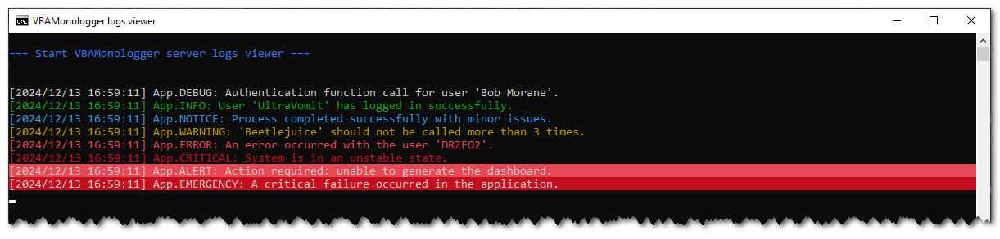
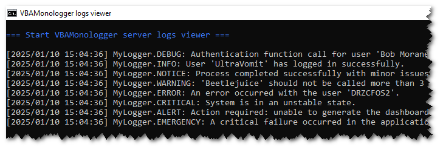
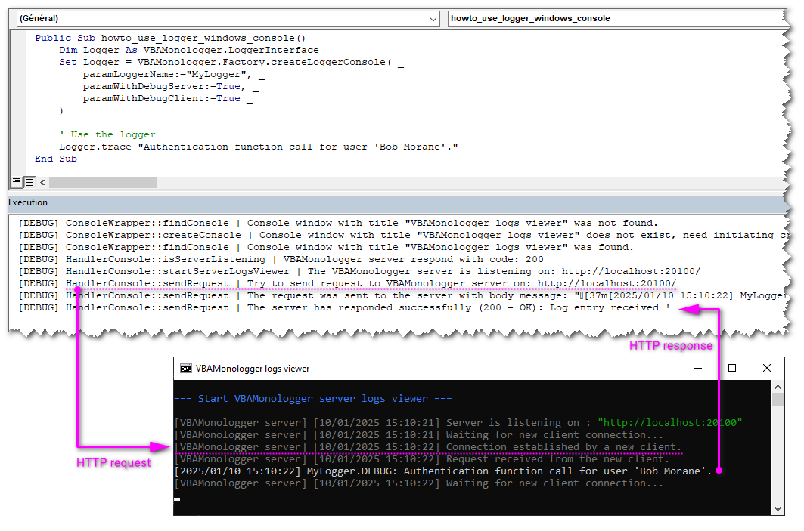

# How to send VBA logs to the Windows console ?

While there are many ways to handle logging, sending logs directly to the Windows Console can be particularly useful during development and debugging. This article will guide you through the steps to log messages from VBA to the Windows Console.



<!-- more -->


## Creating a Logger for the Windows console

To set this up with VBA Monologger, you can use its factory with the method `VBAMonologger.Factory.createLoggerConsole()`, which creates a specialized logger for the Windows Console, that supports ANSI colors.


### How it works?

This logger handles log messages by streaming them to the console through an HTTP-based client/server architecture. 

- **Client-Side**: The VBA client sends log records as HTTP requests to the server.
- **Server-Side**: The server, known as the "VBAMonologger HTTP server logs viewer" and written in Powershell, processes these requests and displays the log messages directly in the console output.

> This logger utilizes the `VBAMonologger.HandlerConsole` handler. For more details about this handler, check the documentation here: [Handler Console](./../../../under-the-hood/handler.md#handlerconsole).


### Example Code

Here's an example of how to implement this:

```vbscript
Public Sub howto_use_logger_console()
    ' Initialize the Logger for windows console
    Dim Logger As VBAMonologger.LoggerInterface
    Set Logger = VBAMonologger.Factory.createLoggerConsole("App")

    ' Use the logger for each severity levels
    Logger.trace "Authentication function call for user 'Bob Morane'." 
    Logger.info "User 'UltraVomit' has logged in successfully."
    Logger.notice "Process completed successfully with minor issues."
    Logger.warning "'Beetlejuice' should not be called more than 3 times."
    Logger.error "An error occurred with the user 'DRZCFOS2'."
    Logger.critical "System is in an unstable state."
    Logger.alert "Action required: unable to generate the dashboard."
    Logger.emergency "A critical failure occurred in the application."
End Sub
```

When you run this code, it launches a **cmd.exe** window, where you can view the log entries.

### Customize the logger windows console

As you can see, in the signature of this factory's method, it is also possible to set the name the logger, to load a custom formatter, and more. 

```vbscript
Public Function createLoggerConsole( _
    Optional ByVal paramLoggerName As String = vbNullString, _
    Optional ByRef paramFormatter As FormatterInterface = Nothing, _
    Optional ByRef paramWithANSIColorSupport As Boolean = True, _
    Optional ByRef paramWithNewlineForContextAndExtra As Boolean = True, _
    Optional ByRef paramWithDebugServer As Boolean = False, _
    Optional ByRef paramWithDebugClient As Boolean = False _
) As VBAMonologger.Logger
```

#### Disable support ANSI color

```vbscript
Public Sub howto_use_logger_windows_console()
    Dim Logger As VBAMonologger.LoggerInterface
    Set Logger = VBAMonologger.Factory.createLoggerConsole( _
        paramLoggerName:="MyLogger", _
        paramWithANSIColorSupport:=False _
    )

    ' Use the logger for each severity levels
    Logger.trace "Authentication function call for user 'Bob Morane'."
    (...)
    Logger.emergency "A critical failure occurred in the application."
End Sub
```




#### Enable the debug mode for client and server

To enable debug mode for both the client and server when setting up your logger in VBA, just set the `paramWithDebugServer` and `paramWithDebugClient` parameters to True. This allows you to trace and debug operations more precisely, as log messages from both the client and server will be captured and displayed.

```vbscript
Public Sub howto_use_logger_windows_console()
    Dim Logger As VBAMonologger.LoggerInterface
    Set Logger = VBAMonologger.Factory.createLoggerConsole( _
        paramLoggerName:="MyLogger", _
        paramWithDebugServer:=True, _
        paramWithDebugClient:=True _
    )
        
    ' Use the logger
    Logger.trace "Authentication function call for user 'Bob Morane'."
End Sub
```

When the logger is created, it launches the server into a console windows by using a special component, named `ConsoleWrapper`. It ensures that multiple cmd.exe windows are not opened if one is already running. 

The HTTP server is launched, and it listens on port `20100` by default, but you can configure the server to use a different IP address and port number if needed. When the server is listening, it awaits incoming client connections. Each time the logger is used to send a log (e.g., `Logger.trace`), it initiates a simple HTTP request that's processed and displayed by the server. The server then sends a response back to the VBA client, confirming that the message was successfully processed.


