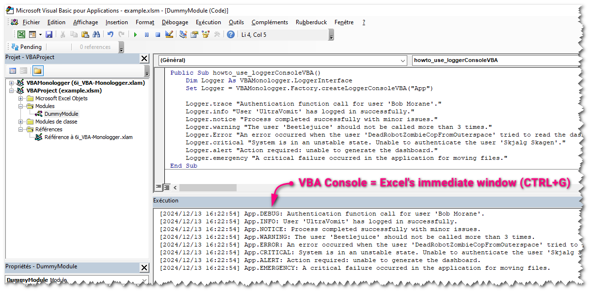

## Severity levels

The severity levels indicate the severity of each event, from the most trivial to the most catastrophic, and allow administrators or developers to filter messages based on their importance.

**VBA Monologger** manages 8 standard severity levels to classify the importance of log messages, following the [PSR-3](https://www.php-fig.org/psr/psr-3/) standard, which is itself based on RFC 5424, the standard defined by the IETF (*Internet Engineering Task Force*) to specify the format of messages for the Syslog protocol, which is used for transmitting logs over IP networks.

| Log level   | Description                                                                                                                                                                                                                               |
|-------------|-------------------------------------------------------------------------------------------------------------------------------------------------------------------------------------------------------------------------------------------|
| `EMERGENCY` | Indicates a very critical situation that requires immediate attention. (System crash, data corruption)                                                                                                                                    |
| `ALERT`     | Signals an alert condition. (Critical disk space running out)                                                                                                                                                                             |
| `CRITICAL`  | Indicates a serious error. (Database connection failure, server downtime)                                                                                                                                                                 |
| `ERROR`     | Represents an error in the system. (Failed to save user data, unexpected exception)                                                                                                                                                       |
| `WARNING`   | A warning about a potential problem. (Use a deprecated function used, low memory warning)                                                                                                                                                 |
| `NOTICE`    | Important notifications that are not urgent. (User login successful, configuration change detected)                                                                                                                                       |
| `INFO`      | General information about the normal operation. (System startup, data processed successfully)                                                                                                                                             |
| `DEBUG`     | Detailed information for debugging. (Variable values during loop iteration, query execution details). Notes, that the '**debug**' method exposes presents in PSR-3 is rename into '**trace**' in order to be compatible in VBA ecosystem. |

Each logger must implement hte interface `LoggerInterface`. ' This interface is (*supposed to be*) designed according to the PSR-3 standard (see: https://www.php-fig.org/psr/psr-3/), and exposed this methods:

```vbscript
' Logs message for each severity levels
Logger.trace "Authentication function call for user 'Bob Morane'." 
Logger.info "User 'UltraVomit' has logged in successfully."
Logger.notice "Process completed successfully with minor issues."
Logger.warning "'Beetlejuice' should not be called more than 3 times."
Logger.error "An error occurred with the user 'DRZCFOS2'."
Logger.critical "System is in an unstable state."
Logger.alert "Action required: unable to generate the dashboard."
Logger.emergency "A critical failure occurred in the application."
```


## Create default logger with factory

### Log output to VBA Console

To create a logger that output logs into the VBA console, we use the factory `VBAMonologger.Factory`, as shown below. 

This logger is configured by default with the handler `VBAMonologger.Handler.HandlerConsoleVBA`, which uses the default line formatter: `VBAMonologger.Formatter.FormatterLine`. By default, this logger also loads the pre-processors placeholders: `VBAMonologger.Processor.ProcessorPlaceholders`, allowing the use of placeholders in log messages that will be replaced with values provided in the log record context.

```vbscript
Public Sub howto_use_loggerConsoleVBA()
    ' Create a logger instance for output log into VBA console
    Dim Logger As VBAMonologger.LoggerInterface
    Set Logger = VBAMonologger.Factory.createLoggerConsoleVBA("App")
    
    ' Logs message for each severity levels
    Logger.trace "Authentication function call for user 'Bob Morane'." 
    Logger.info "User 'UltraVomit' has logged in successfully."
    Logger.notice "Process completed successfully with minor issues."
    Logger.warning "'Beetlejuice' should not be called more than 3 times."
    Logger.error "An error occurred with the user 'DRZCFOS2'."
    Logger.critical "System is in an unstable state."
    Logger.alert "Action required: unable to generate the dashboard."
    Logger.emergency "A critical failure occurred in the application."
End Sub
```

You can see result in the **VBA console** (a.k.a. **Excel's Immediate Windows**).



> Note: If the console is not visible in Excel Visual basidc IDE, go to the menu and select *View > Immediate Window*. Alternatively, you can press <kbd>Ctrl</kbd> + <kbd>G</kbd> to quickly open it.


### Log output to Windows Console

The factory also provides a logger for Windows console (*cmd.exe*). 

This logger handles log messages by streaming them to the Windows console using an HTTP-based client/server architecture. The client sends log entries as HTTP requests to the server, and the server processes these requests, displaying the log messages directly in the console output. By default, this logger features a formatter that supports ANSI colors (`VBAMonologger.Formatter.FormatterANSIcoloredLine`). It also includes the *placeholders* pre-processors.

```vbscript
Public Sub howto_use_loggerConsole()
    Dim Logger As VBAMonologger.LoggerInterface
    Set Logger = VBAMonologger.Factory.createLoggerConsole("App")

    Logger.trace "Authentication function call for user 'Bob Morane'." 
    (...)
End Sub    
```

When you execute this code, it launches a `cmd.exe`, and you can view the results in it.


### Log output to file

You can send logs into a file with the default logger file.


By default, this logger writes logs to the `./var/log/logfile_xxxx-yy-zz.log` file, relative to the path of the workbook. You can change the name and the folder of the file into the configuration of `VBAMonologger.Handler.HandlerFile`. To ensure compatibility with special and multilingual characters in this Handler, the UTF-8 encoding is preferred.

```vbscript
Public Sub howto_use_loggerConsoleVBA()
    Dim Logger As VBAMonologger.LoggerInterface
    Set Logger = VBAMonologger.Factory.createLoggerFile("App")
    
    ' Logs message for each severity levels
    Logger.trace "Authentication function call for user 'Bob Morane'."
    (...)
End Sub
```


## Use placeholders with context data

By default, all loggers create with the factory includes the pre-processors placeholders (`VBAMonologger.Processor.ProcessorPlaceholders`). You don't need to reference it; it's already done!


It is used to dynamically insert specific contextual data into logging messages, allowing for more detailed and contextualized log records. You can choose to display (or not) the context data, either on a single line or across multiple lines, formatted as pretty JSON with whitespace.

```vbscript 
Public Sub howto_use_placeholders()
    Dim Logger As VBAMonologger.LoggerInterface
    Set Logger = VBAMonologger.Factory.createLoggerConsoleVBA("App")
    
    ' Create a context dictionary
    Dim context As Object: Set context = CreateObject("Scripting.Dictionary")
    context.Add "UserName", "Bob Morane"
    context.Add "UserID", 342527
    
    ' Use placeholders into log message
    Logger.trace "Authentication function call for user '{UserName}' with id '{UserID}'.", context
End Sub
```

Result in VBA console:

```
[2024/12/13 16:19:48] App.DEBUG: Authentication function call for user 'Bob Morane' with id '342527'. | context: {"UserName":"Bob Morane","UserID":342527}
```


