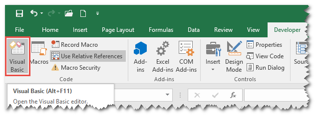
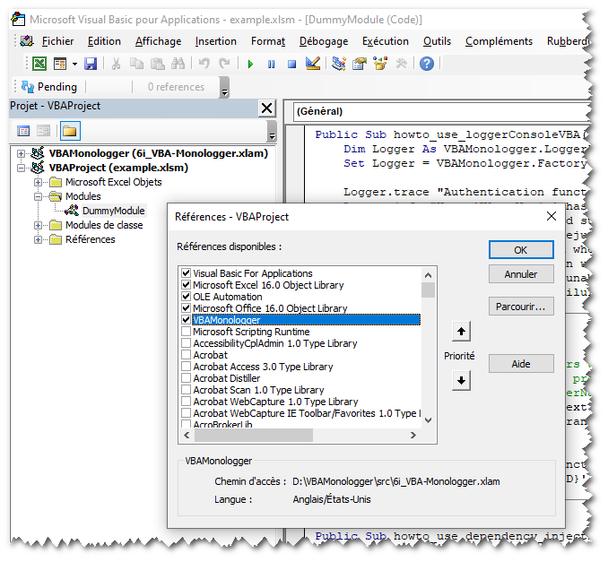

## Manual installation

1. Download the VBA Monologger Excel Add-in (.xlam file) to your computer.

    [6i_VBA-Monologger.xlam](https://github.com/6i-software/vba-monologger/raw/refs/heads/main/src/6i_VBA-Monologger.xlam)
    
    <small>*Hash SHA1: 46E0FF01DE2A81254375BCF0B5C9BB97C4E53E35*</small>

   
2. Put this xlam file into a folder trusted by Excel. Microsoft requires that the xlam file's location be set as a *Trusted Location* for the add-in to function properly. To set this up, go to: *File > Options > Trust Center > Trust Center Settings > Trusted Locations > Add New Location*.

3. Make sur the Developper tab is visible in Excel. By default, the Developer Ribbon is hidden; to enable it, go to *File > Options > Customize Ribbon*, then check the *Developer* box under the Main Tabs section and validate it.
    
   
 
4. And finally, add the .xlam file as a reference in your VBA project through *Tools > References* in the VBA editor.
     
    

That's it.

## Setup wizard installation (*as soon as possible*)

In the future, we plan to introduce a setup wizard to simplify the deployment of VBA add-ins using [InnoSetup](https://jrsoftware.org/isinfo.php). 

This setup will place the VBA Monologger `.xlam` file into the standard folder for Excel add-ins: `C:\Users\[name]\AppData\Roaming\Microsoft\AddIns\`. And after, it will automatically activate in Excel by updating the Windows Registry.

> See : https://github.com/6i-software/deploy-microsoft-office-extensions  

