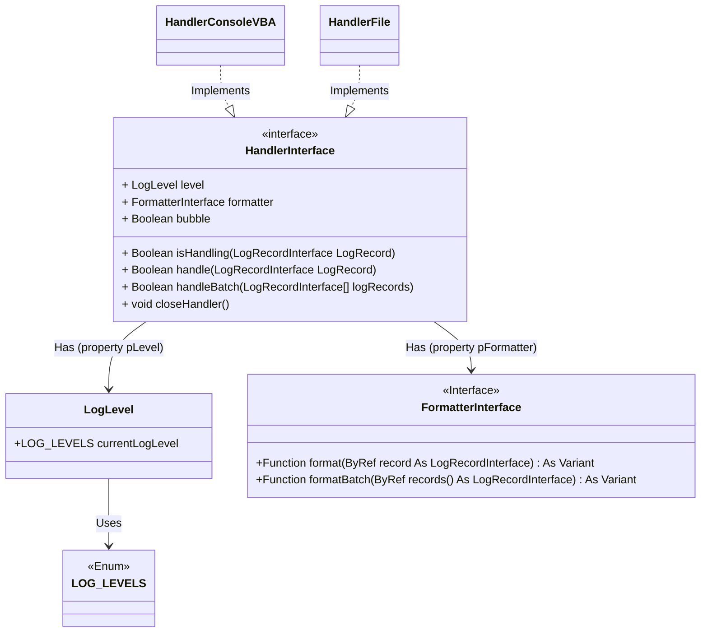
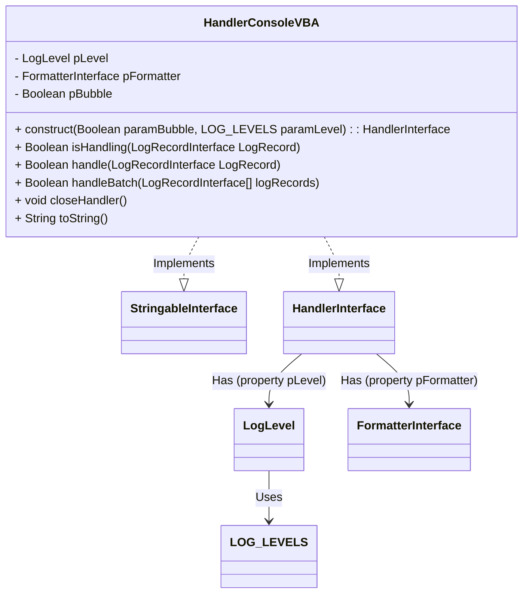
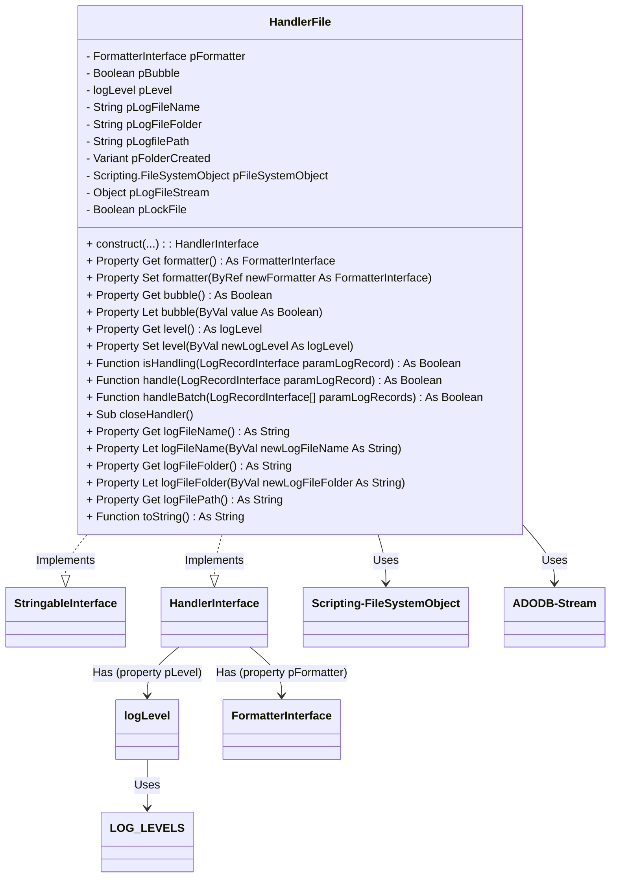

## Concept

A log handler is the key component responsible for processing each log entry. When a log message is generated, it is not simply recorded; it must be directed to a location where it can be viewed and used. This is where the handler comes in, determining where and how each log entry will be sent or saved. 

A log handler is responsible for directing log messages to specific outputs, such as file, console or database , and based on the log level and other configuration settings like bubble propagation.

## Modeling

The interface `VBAMonologger.Handler.HandlerInterface` defines the standard behavior that all handler implementations must follow. This interface specifies the necessary properties and methods to control how and where log records are processed.



This interface provides the following members.

``` vbscript
Public Property level As logLevel
```

Determines the current log level of handler. This property sets the minimum log level required for the handler to process a log entry. Only messages at or above this level are handled, allowing for filtering of log messages based on severity (e.g., DEBUG, INFO, ERROR).

``` vbscript
Public Property bubble As Boolean
```

Determines whether, or not, the log record should "bubble up" to other handlers in the stack after being processed by the current handler. When you have multiple handlers in the stack of your logger, and want a specific handler to be the only one processing certain log levels or messages, you have to set bubble to false for that handler. This is useful if you need specific messages to go only to a certain location.
    - If bubble is set to `true` (the default), the log record will be processed by the current handler and continue to "bubble up" to other handlers in the stack. This allows multiple handlers to process the same log message.
    - If bubble is set to `false`, the log record will stop propagating after being processed by the current handler. This essentially "catches" the record, preventing it from being handled by other handlers in the stack.

``` vbscript
Public Property formatter As FormatterInterface
```

Specifies the formatter associated with the handler, defining how each log record will be structured and formatted before output. This allows for flexible formatting (e.g., plain text, JSON) based on the formatter assigned to the handler.


``` vbscript
Function isHandling(ByRef logRecord As LogRecordInterface) As Boolean
```

Provides a way for handlers to filter log messages. This ensures that a handler only processes messages that are relevant to it, which can improve performance and reduce unnecessary processing. It returns true if the handler is capable of processing the  log message and false if the handler should not process the log message. This function evaluates if the handler is set to process the given log record based on the log level and other criteria. It returns `True` if the handler should handle the record, or `False` if it should be ignored.


``` vbscript
Function handle(ByRef logRecord As LogRecordInterface) As Boolean
```

All records may be passed to this method, and the handler should discard those that it does not want to handle. The return value of this function controls the bubbling process of the handler stack. Unless the bubbling is interrupted (by returning true), the Logger class will keep on calling further handlers in the stack with a given log record. If the handler can process the record (based on `isHandling`), it outputs the formatted log message to its designated destination (e.g., console, file). It returns a Boolean value to control the record's propagation through additional handlers, based on the `bubble` property.


``` vbscript
Function handleBatch(ByRef logRecords() As LogRecordInterface) As Boolean
```

This method handles an array of log records at once, processing each record in sequence. It provides an efficient way to process bulk log entries, making it ideal for scenarios where multiple messages need to be logged simultaneously.


``` vbscript
Sub closeHandler()
```

This method releases any resources or open connections the handler may use (e.g., closing file handles or flushing data). It ensures a proper shutdown of the logging cycle and frees up resources when logging is complete.

The `HandlerInterface` design provides a standardized, modular way to add various logging handlers without needing to change client code. By implementing this interface, different handlers can easily be added to support new output targets or custom logging behavior as needed. Handlers can be configured independently with custom formatters, levels, and bubbling behavior, offering fine-grained control over how and where logs are managed.


## HandlerConsoleVBA

The `VBAMonologger.Handler.HandlerConsoleVBA` class is responsible for directing log messages to the VBA Console (typically the Immediate Window in VBA environments like Excel). This class implements the `VBAMonologger.Handler.HandlerInterface`, which specifies the methods and properties that a logging handler must provide, such as formatting log messages, determining log levels, and handling message propagation.



### Creating a new `HandlerConsoleVBA`

Below is an example of how to create an instance of HandlerConsole.

```vbscript
Dim handlerConsole As VBAMonologger.HandlerInterface
Set handlerConsole = New VBAMonologger.HandlerConsoleVBA
Debug.Print handlerConsole.toString

Debug.Print "=== Handle a log record with HandlerConsoleVBA ==="
Dim record As VBAMonologger.LogRecord
Set record = New VBAMonologger.LogRecord
Set record = record.construct( _
    "Process completed successfully with minor issues for user.", _
    VBAMonologger.LEVEL_INFO, _
    "App"
)

Dim isHandling As Boolean
isHandling = handlerConsole.isHandling(record)
Debug.Print ">>> Result of handlerConsole.isHandling(record): " & isHandling
Debug.Print ">>> Result of handlerConsole.handle(record): "
handlerConsole.handle record
```

``` title="Result"
[VBAMonologger.Handler.HandlerConsoleVBA]
 | level: DEBUG
 | bubble: true

=== Handle a log record with HandlerConsoleVBA ===
>>> Result of handler.isHandling(dummyRecord): True
>>> Result of handler.handle(dummyRecord): 
[2024/11/13 10:42:03] App.INFO: Process completed successfully with minor issues for user.
```

### Changing the formatter of handler

The `HandlerConsoleVBA` class leverages a `FormatterInterface` to define the structure and appearance of each log entry, ensuring a specific, consistent format that makes log messages easier to read and understand in the console. 

By default, `HandlerConsoleVBA` uses the `FormatterLine` implementation of the `FormatterInterface`, which outputs each log entry in a simple, line-based format optimized for console viewing. Additionally, `HandlerConsoleVBA` is set with a default log level of `DEBUG`.

```vbscript
Dim handler As VBAMonologger.HandlerConsoleVBA
Set handler = New VBAMonologger.HandlerConsoleVBA

Dim formatterLine As VBAMonologger.FormatterLine
Set formatterLine = New VBAMonologger.FormatterLine
formatterLine.showContext = False
formatterLine.showExtra = False
Set handler.formatter = formatterLine

Debug.Print "=== Handle a collection of log records with default log level "DEBUG" ==="
Debug.Print handler.toString
Debug.Print ">>> Result of handler.handleBatch(records): "
handler.handleBatch randomLogRecordsForEachLevel
    
Debug.Print "=== Change level of handler to CRITICAL ==="
handler.level.currentLogLevel = VBAMonologger.LOG_LEVELS.LEVEL_CRITICAL
Debug.Print handler.toString
Debug.Print ">>> Result of handler.handleBatch(records): "
handler.handleBatch randomLogRecordsForEachLevel
```

``` title="Result"
=== Handle a collection of log records with default log level "DEBUG" ===

[VBAMonologger.Handler.HandlerConsoleVBA]
 | level: DEBUG
 | bubble: true
 
 >>> Result of handler.handleBatch(records): 
[2024/11/13 10:42:03] App.Authentification.EMERGENCY: A critical failure occurred in the application for {Operation} process
[2024/11/13 10:42:03] App.Authentification.ALERT: Action required for process {Operation} failure.
[2024/11/13 10:42:03] App.Authentification.CRITICAL: System is in an unstable state. Unable to authenticate {UserId}.
[2024/11/13 10:42:03] App.Authentification.ERROR: An error occurred when the user {UserId} try to {Operation} the file {file}. 
[2024/11/13 10:42:03] App.Authentification.WARNING: The user {UserId} does not exist. Unable to perform '{Operation}' user file. 
[2024/11/13 10:42:03] App.Authentification.NOTICE: Process completed successfully with minor issues for {UserId}. 
[2024/11/13 10:42:03] App.Authentification.INFO: User {UserId} has logged in successfully.
[2024/11/13 10:42:03] App.Authentification.DEBUG: Authentification function call for user {UserId}. 

=== Change level of handler to "CRITICAL" === 

[VBAMonologger.Handler.HandlerConsoleVBA]
 | level: CRITICAL
 | bubble: true
 
>>> Result of handler.handleBatch(records):
[2024/11/13 10:42:03] App.Authentification.EMERGENCY: A critical failure occurred in the application for {Operation} process
[2024/11/13 10:42:03] App.Authentification.ALERT: Action required for process {Operation} failure.
[2024/11/13 10:42:03] App.Authentification.CRITICAL: System is in an unstable state. Unable to authenticate {UserId}.
```

In the example above, the `HandlerConsoleVBA` object is first instantiated and configured to display logs in the VBA console using a custom formatter, where the `showContext` and `showExtra` options are disabled. This means that contextual and additional information will be excluded from the output.

Next, `handlerConsole` processes a set of log messages covering all severity levels (from DEBUG to EMERGENCY). Since the default log level is set to `DEBUG`, all log entries are displayed in the console.

In the second part of the example, the log level of `handlerConsole` is changed to `CRITICAL`, meaning that only messages with a `CRITICAL` severity level or higher (such as ALERT and EMERGENCY) will be displayed. As a result, entries with lower severity levels (ERROR, WARNING, etc.) are excluded and do not appear in the output.


## HandlerFile

The `VBAMonologger.Handler.HandlerFile` class is responsible for managing and logging messages to a file. This class implements the `VBAMonologger.Handler.HandlerInterface`, which specifies the methods and properties that a logging handler must provide.



We have several members that are used to configure and manage the handler log file:

| **Property**        | **Description**                                                                                                                  |
|---------------------|----------------------------------------------------------------------------------------------------------------------------------|
| `logFileName`       | The name of the log file. This name can be customized.                                                                           |
| `logFileFolder`     | To retrieve and set the folder where the log file will be stored.                                                                |
| `logFilePath`       | To get the full path to the log file, built by concatenation of  `logFileFolder` with `logFileName`.                             |
| `pFolderCreated`    | *(Private)* To showing whether the log folder has been successfully created.                                                     |
| `pFileSystemObject` | *(Private)* An object of `FileSystemObject` used to interact with the file system (for creating folders and manipulating files). |
| `pLogFileStream`    | *(Private)* An object of `ADODB.Stream` used to manage the stream for writing to the log file in UTF-8.                          |
| `pLockFile`         | *(Private)* An indicator for locking the file, used to control concurrent access to the log file.                                | |


### Creating a new `HandlerFile`

Here’s how to create a new instance of `HandlerFile` and handle log records.

```vbscript
Dim handlerFile As VBAMonologger.HandlerFile
Set handlerFile = New VBAMonologger.HandlerFile
Debug.Print handlerFile.toString

' Change the default formatter to a ANSI colored line formatter 
Dim formatterAnsiColoredLine As VBAMonologger.formatterAnsiColoredLine
Set formatterAnsiColoredLine = New VBAMonologger.formatterAnsiColoredLine
Set handlerFile.formatter = formatterAnsiColoredLine

' Change the default log level of handler to `ERROR`
handlerFile.level.currentLogLevel = VBAMonologger.LOG_LEVELS.LEVEL_ERROR

' Handle a log record with HandlerFile
Dim record As VBAMonologger.LogRecord
Set record = New VBAMonologger.LogRecord
Set record = record.construct( _
    "Process completed successfully with minor issues for user.", _
    VBAMonologger.LEVEL_INFO, _
    "App"
)
Dim isHandling As Boolean
Dim resultHandle As Boolean
isHandling = handlerFile.isHandling(record)
resultHandle = handlerFile.handle(record)

' Close the handler   
handlerFile.closeHandler
```

``` title="Result"
[VBAMonologger.Handler.HandlerFile]
 | logFileName: vbalogfile_2024-11-13.log
 | logfilePath: D:\VBAMonologger\var\log\vbalogfile_2024-11-13.log
 | logFileFolder: D:\VBAMonologger\var\log
```

You can open the logfile to view the entry records written in it.


### Supporting UTF-8 

In VBA, a text file can be created using the native `Open` and `Print #` methods or the `FileSystemObject`. The `Open` method allows you to open a file for writing, and if the file doesn’t exist, it will be created. However, by default, text is written using **ANSI** encoding, which is based on the system's language and regional settings (often **Windows-1252** for English or French systems). This encoding does not support non-Latin characters and may cause issues when the file is opened on systems with different encodings.

To ensure compatibility with special and multilingual characters in this `HandlerFile`, the **UTF-8** encoding is preferred. This can be achieved by using the `ADODB.Stream` object, which allows you to specify the desired encoding when writing to the file. The `ADODB.Stream` object is designed to handle data streams, making it ideal for both text and binary file operations. By using UTF-8, the log file can store data in multiple languages and special characters without any loss or corruption of information, unlike with other encodings.

!!! info "Can I change the encoding?"
    For now, there is no plan to provide an option to change the default UTF-8 encoding.


### Modifying the name and destination of the log file

Here’s how you can modify the log file and its destination folder.

```vbscript
Dim handlerFile As VBAMonologger.HandlerFile
Set handlerFile = New VBAMonologger.HandlerFile
    
Debug.Print "=== Change the logfile name ==="
handlerFile.logFileName = "Amazing-log-file-name.log"
Debug.Print handlerFile.toString
    
Debug.Print "=== Change the logfile folder ==="
handlerFile.logFileFolder = VBA.Environ$("USERPROFILE") & "\VBAMonologger\logs"
Debug.Print handlerFile.toString
    
Debug.Print "=== Initialize handlerFile with custom logfile name and folder ==="
Set handlerFile = handlerFile.construct( _
  paramLogFileName:="vba-log-file___" & format(Now, "yyyy-mm-dd") & ".log", _
  paramLogFileFolder:=ThisWorkbook.Path & "\var\log" _
)
Debug.Print handlerFile.toString
```

``` title="Result"
=== Change the logfile name ===
[VBAMonologger.Handler.HandlerFile]
 | logFileName: Amazing-log-file-name.log
 | logfilePath: D:\VBAMonologger\src\var\log\Amazing-log-file-name.log
 | logFileFolder: D:\VBAMonologger\src\var\log

=== Change the logfile folder ===
[VBAMonologger.Handler.HandlerFile]
 | logFileName: Amazing-log-file-name.log
 | logfilePath: C:\Users\vblain\VBAMonologger\logs\Amazing-log-file-name.log
 | logFileFolder: C:\Users\vblain\VBAMonologger\logs

=== Initialize handlerFile with custom logfile name and folder ===
[VBAMonologger.Handler.HandlerFile]
 | logFileName: vba-log-file___2024-11-13.log
 | logfilePath: D:\VBAMonologger\src\var\log\vba-log-file___2024-11-13.log
 | logFileFolder: D:\VBAMonologger\src\var\log
```
