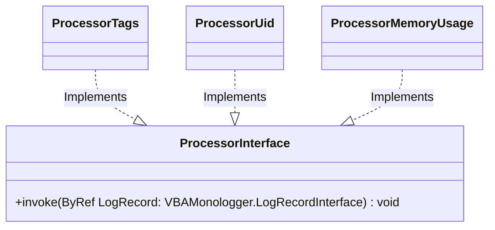
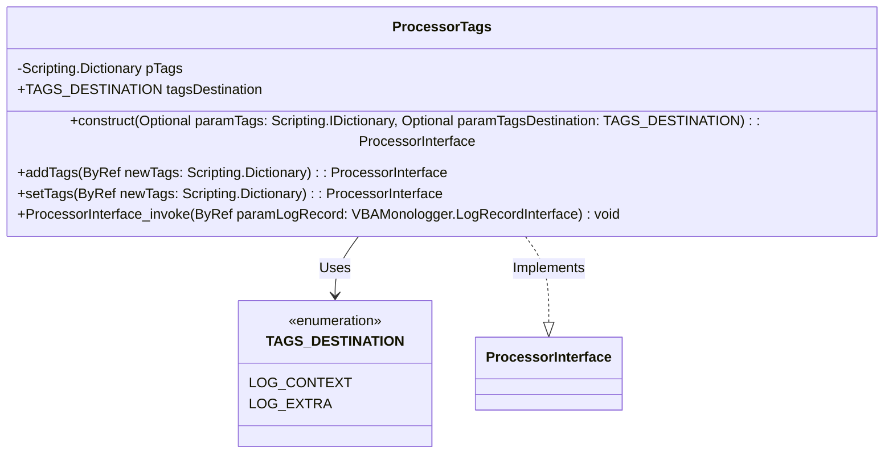
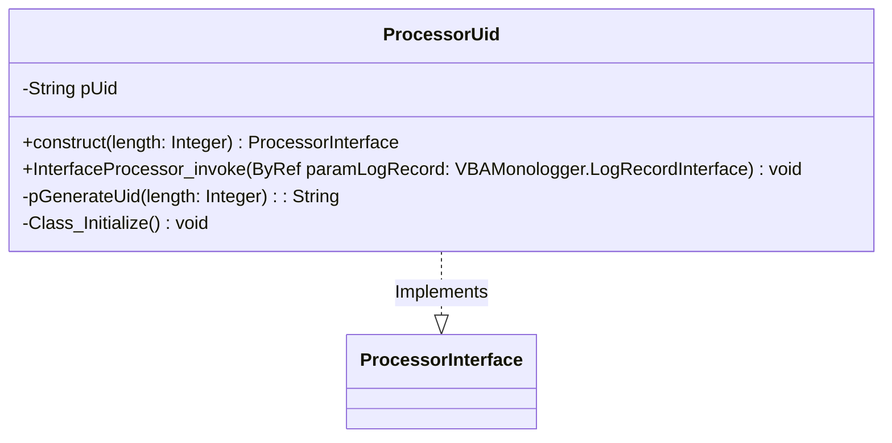

## Concept

Pre-processor is a powerful feature, allowing for additional metadatas to be added to log entries before they are recorded. This function can be used to enrich log messages with extra metadata that might not be directly part of the log entry itself, but is still relevant for better understanding and tracking. Pre-processors can modify, format, or even generate additional metadata that can be attached to each log message into the `extra` property.

**VBA Monologger** provides several built-in processors provide specific functionalities that allow you to add additional context or modify the log entry in various ways before it is sent to the handlers.

| Processor             | Description                                                                                                                     |
|------------------------|---------------------------------------------------------------------------------------------------------------------------------|
| `ProcessorTags`        | Adds one or more tags to a log entry.                                                                                          |
| `ProcessorUID`         | Adds a unique identifier (UID) to each log entry. The generated UID consists of hexadecimal characters, and its size can be configured. |
| `ProcessorMemoryUsage` | Adds the computer's memory usage to each log entry. The system's current memory status is retrieved using the `GlobalMemoryStatusEx` API in Windows. |


## Modeling

The interface `VBAMonologger.Processor.ProcessorInterface` defines the standard behavior for all processor implementations in thisJe logging system. This interface ensures that processors can modify or enhance log records consistently before they are handled by log handlers. 

By defining a single method, called `invoke`, it standardizes how log records are pre-processed, enabling traceability, enrichment, or transformation of logging data.



The `invoke` method serves as a core mechanism for transforming or enriching log records during the logging process. It operates directly on the `LogRecordInterface` object passed as a parameter, enabling seamless and efficient modifications to the data before it is forwarded to subsequent components.

When invoked, the method performs a specific transformation defined by its implementation. This may include adding new information, such as unique identifiers, additional metadata, or contextual tags, or modifying existing attributes like the message or log level. These changes are applied directly to the original object, ensuring smooth integration within the logging pipeline.

This method is crucial for customizing and adapting log records while maintaining a standardized structure for consistency. It does not return a value, as its primary purpose is to directly manipulate the log record data to prepare it for the next stage of processing.


## ProcessorTags

The `ProcessorTags` class is designed to add contextual tags to log records. By convention, these tags can be stored in the `context` or `extra` property of a log record, ensuring that metadata is consistently organized and easily accessible. 

> A **log context** is more often associated with global or session-related contextual information that can be shared across the application, whereas **log extra** is a mechanism to add specific, customized information directly to a particular log record.



The class leverages a VBA dictionary to maintain tags as key-value pairs, enabling flexible enrichment of log data. The private `pTags` dictionary is used to store the tags. It is initialized when the class is created, and can optionally be set with predefined tags through the construct method.


### Setting tags

Use the `setTags` method to replace the existing tags with an entirely new set of key-value pairs, ensuring that the dictionary is cleared before adding the new tags.

``` vbscript
Dim processorTagger As VBAMonologger.Processor.ProcessorTags
Set processorTagger = New VBAMonologger.Processor.ProcessorTags

Dim initialTags As Scripting.Dictionary
Set initialTags = New Scripting.Dictionary
initialTags.Add "env", "PROD"

' Sets new tags into pre-processor by overwritting existing tags.
processorTagger.setTags(initialTags)

' References processor into a logger
Dim logger As VBAMonologger.Logger
Set logger = New VBAMonologger.Logger
logger.addProcessor(processorTagger)

' The tag "env" is automatically added to every log record.
logger.info("User logged in succesfully")
```


### Adding a tag

Use the addTags method to add new key-value pairs to the existing tag dictionary without overwriting existing entries. This allows for incremental enrichment of tags, enabling you to append additional contextual information to log records as needed, while preserving any previously added tags. This method is useful when you want to enhance the log data with extra details without losing any prior metadata.

``` vbscript
Dim processorTagger As VBAMonologger.Processor.ProcessorTags
Set processorTagger = New VBAMonologger.Processor.ProcessorTags

Dim initialTags As Scripting.Dictionary
Set initialTags = New Scripting.Dictionary
initialTags.Add "env", "PROD"
initialTags.Add "app", "CRM"

' Sets initial tags
processorTagger.setTags(initialTags)

' Adds new tags without overwriting
Dim additionalTags As Scripting.Dictionary
Set additionalTags = New Scripting.Dictionary
additionalTags.Add "userId", "20100"
additionalTags.Add "service", "authentification"
processorTagger.addTags(additionalTags)

' References processor into a logger
Dim logger As VBAMonologger.Logger
Set logger = New VBAMonologger.Logger
logger.addProcessor(processorTagger)

' Tags "env", "app", "userId", and "service" will be added to each log record.
logger.info("User logged in successfully")
```


## ProcessorUID



