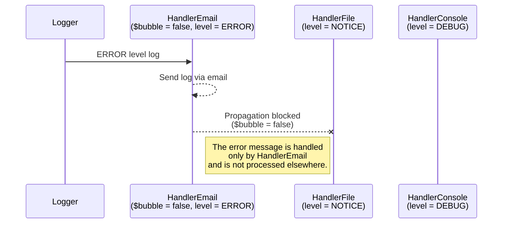
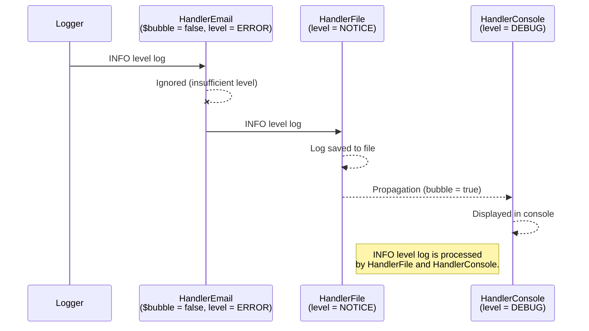
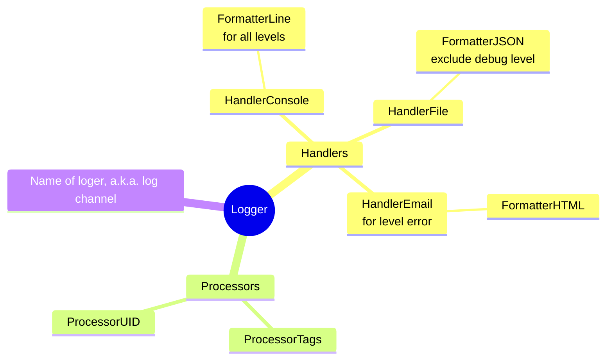

VBA Monologger
==============

> Welcome to the VBA Monologger documentation ! This page will provide you with an introduction to this logger, including installation instructions and usage guidelines.


## Preamble

### Logging system?

Logging is a process that involves recording and storing traces of events, activities, or errors that occur during the use of an application. Useful for both developers for debugging and administrators for diagnosing and resolving incidents, logs provide traceability and visibility into the behavior of an application throughout its operation.

In its simplest form, log entries are recorded in text format, with each line representing an event that occurred during the application's lifecycle.

```bash
[2024-11-05 09:15:34] app.INFO: Application started
    | ctx: {"version": "2.3.1", "user_id": 101}
[2024-11-05 09:16:01] app.INFO: Workbook loaded successfully
    | ctx: {"workbook_id": 789, "workbook_name": "Q4 Marketing"}
[2024-11-05 09:17:15] app.DEBUG: Task modified
    | ctx: {"task_id": 456, "task_name": "Strategy Review", "user_id": 101}
[2024-11-05 09:18:45] app.WARNING: Low disk space - risky save
    | ctx: {"available": "100 MB", "required": "200 MB"}
[2024-11-05 09:19:03] app.ERROR: Project save failed
    | ctx: {"project_id": 789, "error": "Insufficient disk space", "user_id": 101}
[2024-11-05 09:20:00] app.INFO: Application closed
    | ctx: {"user_id": 101}
```

According to the *twelve-factor app* manifest, you should "*[treat logs as event streams](https://12factor.net/logs)*". Logs are not just recorded in a file for later consultation. They can also be monitored in real-time in a terminal, sent to a database, or redirected to external log aggregation and analysis tools (such as the ELK stack, Graylog, BetterStack, Splunk...).

A logging system should offer flexible management, allowing different severity levels of events to be distinguished, so messages can be filtered according to their importance, from simple information to critical errors. It should also be capable of sending logs to multiple destinations simultaneously, such as a terminal, file, database, or monitoring service. Additionally, the log format must be customizable to meet the specific needs of the application and the tools used for analysis, making it easier to manage and interpret the collected data.


### Motivations of VBA Monologger

VBA, the programming language integrated into the Microsoft Office suite, provides developers with the ability to automate tasks, interact with the features of Office applications, and even create applications with a graphical user interface (`Userform`). However, compared to other development ecosystems, VBA only offers a rudimentary logging solution, limited to the `Debug.Print` function, which writes to the Excel console (a.k.a. the Excel immediate window).

The *VBA Monologger* library project was born out of the need for a more advanced and flexible logging solution in the VBA ecosystem. It is (heavily) inspired by the PSR-3 standard in the PHP ecosystem and its most recognized implementation, the Monolog library. The goal of this library is to provide similar features and capabilities, particularly by offering a modular architecture that can easily adapt to different use cases. The main idea is for each developer to easily configure and customize their own logging system according to their needs.


## Concepts

### Log severity levels

VBA Monologger manages 8 standard severity levels to categorize the importance of log messages, as described by the [PSR-3](https://www.php-fig.org/psr/psr-3/) standard and by [RFC 5424](https://datatracker.ietf.org/doc/html/rfc5424), a standard defined by the IETF (*Internet Engineering Task Force*) to specify the format of messages for the Syslog protocol, which is used for transmitting logs over IP networks.

The severity levels indicate the severity of each event, from the most trivial to the most catastrophic, and allow administrators and developers to filter messages based on their importance.

| Severity Level | Description                                                                                       |
|----------------|---------------------------------------------------------------------------------------------------|
| `EMERGENCY`    | Indicates a very critical situation that requires immediate attention. (System crash, data corruption) |
| `ALERT`        | Signals an alert condition. (Critical disk space running out)                                    |
| `CRITICAL`     | Indicates a serious error. (Database connection failure, server downtime)                         |
| `ERROR`        | Represents an error in the system. (Failed to save user data, unexpected exception)               |
| `WARNING`      | A warning about a potential problem. (Deprecated function used, low memory warning)              |
| `NOTICE`       | Important notifications that are not urgent. (User login successful, configuration change detected) |
| `INFO`         | General information about the normal operation. (System startup, data processed successfully)     |
| `DEBUG`        | Detailed information for debugging. (Variable values during loop iteration, query execution details) |


### Processing log entry (*handler*)

A log handler is a key component responsible for processing each log entry. When a log message is generated, it is not simply recorded; it must be directed to a location where it can be viewed and used. This is where the handler comes in, determining where and how each log entry will be sent or saved.

Here are some examples of *built-in* log handlers provided in VBA Monologger:

| Handler        | Description                                                                                   |
|-------------------|-----------------------------------------------------------------------------------------------|
| `HandlerConsoleVBA` | Sends messages to the console output of the VBA Project IDE (Immediate Window).               |
| `HandlerFile`     | Logs messages to a text file.                                                                 |
| `HandlerEmail`    | Sends messages by email, typically used to alert an administrator in case of critical errors. |

The benefit of using different handlers lies not only in applying specific treatments to logs but also in filtering messages based on their severity level. A handler can be configured to handle only certain severity levels. For example, one handler could be set to log only critical errors to a dedicated file, while another handler records all events in a general log file.


### Formatting log message (*formatter*)

Each *handler* is associated with a *formatter*. This is a specific component whose role is to define the format of log message. It transforms and structures each log entry, changing it from its raw form to a readable format tailored to a specific type (text, HTML, JSON, etc.).

The library provides the following formatters:

| Log Formatter              | Description                                                                                                                                                     |
|----------------------------|-----------------------------------------------------------------------------------------------------------------------------------------------------------------|
| `FormatterLine`            | The default formatter that represents each log entry on a single line of text.                                                                                  |
| `FormatterAnsiColoredLine` | A version derived from *FormatterLine* that supports color coding each log entry line using ANSI escape sequences.                                              |
| `FormatterJSON`            | Formats the logs in JSON. This is the most interoperable format, facilitating integration with external log aggregation and analysis tools (e.g., *ELK stack*). |
| `FormatterHTML`            | Produces messages in HTML format, typically used when sending logs via email.|


### Redirection and chaining handlers (*stack handlers*)

In log processing, there's no limitation to having multiple *handlers*, so that the same log entry can be sent to multiple destinations: console output, writing to a file, or sending via email. Each *handler* acts sequentially, one after the other, in the order they were added to the *logger*'s stack. When a log event occurs, it passes through all handlers, each performing its own processing.

This mechanism provides great flexibility in log processing because each handler can be independently configured to perform specific actions without interfering with the others.


### Propagation control of logs (*bubbling*)

Each *handler* can decide to block the **propagation** of a log message (*a.k.a.* bubbling) in the processing chain, or allow it to continue to other *handlers* referenced in the stack. The control of this propagation is managed by setting the `bubble` boolean property attached to each *handler*. When a *handler* blocks propagation (`bubble = false`), it means the log message will not be passed to the *handlers* below it in the stack. Otherwise, the message will continue to propagate until every *handler* in the stack has had a chance to process it.

Let's imagine a logging system with three *handlers*:

- First, a `HandlerEmail` to send error-level logs (`level >= ERROR`) via email, without propagation (`bubble = false`).
- Next, a `HandlerFile` to log other messages in a file, excluding the debug level (`DEBUG < level < ERROR`).
- Finally, a `HandlerConsole` to display the remaining logs in the console (`level < ERROR`).

When an error-level log is captured by `HandlerEmail`, the first handler in the stack, it will not propagate to the other *handlers*. An `ERROR` level log will only be sent via email. It will not be recorded in the log file (`HandlerFile`), nor displayed in the console (`HandlerConsole`).



When a log of level `INFO` is recorded, it is not captured by the first `HandlerEmail`. Its processing starts with the `HandlerFile`, which allows the propagation of the messages. The log is then sent to the `HandlerConsole` for processing. Therefore, this log will be recorded in a log file and displayed in the console.




### Context data of log

In addition to the basic log message, you may sometimes want to include extra information that helps to provide more context for the event being logged. This could include things like the username of the person triggering the event, a session ID, or any other piece of data that can assist in understanding the log entry better. This can be easily done by adding a *context* to your log messages. 

The context is essentially a VBA dictionary where you can store key-value pairs that hold relevant information. When you create a log entry, this context can be attached and will be incorporated into the log output, providing deeper insights into the logged event.

Regardless of which log handler is used and which formatter is applied, the fields within the context can be accessed as template variables within the log message. These template variables are enclosed in `{}` brackets. If a particular key doesn’t exist in the context, it will be replaced by an empty string.

```vbscript
' Set a log context into a dictionary
Dim context As Scripting.Dictionary
Set context = New Scripting.Dictionary    
context.Add "Username", "v20100v"

logger.info("Adding a new user", context)
logger.info("Adding the new user: '{username}', context)
```
<details open>
  <summary>Result</summary>

  ```shell
  [2024-11-05 09:15:34] app.INFO: Adding a new user | {"Username": "v20100v"}
  [2024-11-05 09:15:34] app.INFO: Adding the new user: 'v20100v' | {"Username": "v20100v"}
  ```
</details>

This feature is a great way to enrich your log entries with important details and provide better traceability and understanding of your application's behavior.


### Log pre-processors (*Processor*)

Log pre-processors are a powerful feature, allowing for additional metadatas to be added to log entries before they are recorded. These functions can be used to enrich log messages with extra information that might not be directly part of the log entry itself, but is still relevant for better understanding and tracking. Pre-processors can modify, format, or even generate additional metadata that can be attached to each log message into the `extra` property.

In VBA Monologger, several built-in processors provide specific functionalities that allow you to add additional context or modify the log entry in various ways before it is sent to the handlers. 

Below are a few examples of the pre-processors available:

| Log processor              | Description                                                                                                                     |
|----------------------------|---------------------------------------------------------------------------------------------------------------------------------|
| `ProcessorTags`             | Adds one or more tags to a log entry.                                                                                          |
| `ProcessorUID`              | Adds a unique identifier (UID) to each log entry. The generated UID consists of hexadecimal characters, and its size can be configured. |
| `ProcessorMemoryUsage`      | Adds the computer's memory usage to each log entry. The system's current memory status is retrieved using the `GlobalMemoryStatusEx` API in Windows. |


### Logger

The Logger is the central component, acting as the primary interface for recording, categorizing, and managing log messages throughout an application. It implements the LoggerInterface describes in the PSR-3. It provides developers with a highly configurable and flexible tool for implementing custom logging logic tailored to their specific needs. By using a logger, applications can systematically capture events and system states, facilitating both real-time monitoring and historical analysis of system behavior.

The Logger is designed to handle multiple logging levels, directing each log entry to the appropriate handlers (or destinations) and applying the correct formatting to messages. It also supports the use of various pre-processors, which can enrich log messages with extra contextual information, allowing for complex logging logic while keeping code readable and straightforward.



Additionally, the Logger standardizes and simplifies the use of logging methods (such as `logger.info` and `logger.debug`). It offers a consistent and intuitive approach to logging at different levels of severity, letting developers effortlessly call the appropriate logging level without dealing with the underlying technical details. Each log level can be invoked through a simple, clear method, making logging an integral yet unobtrusive part of the development process.

```vbscript
logger.emergency("System down! Critical components are unavailable.")
logger.alert("Database connection lost. Immediate recovery action required.")
logger.critical("Critical failure in payment processing system.")
logger.error("Error in user registration module: Email already exists.")
logger.warning("Low disk space on server. Consider freeing up space.")
logger.notice("New software update available for deployment.")
logger.info("User successfully logged in.")
logger.debug("User profile data: {username}, {userid}")
```


### Identifying a logger with a channel

Log channels are a powerful way to identify which part of an application a log entry is associated with. This is especially useful in large applications with multiple components and multiple loggers. The idea is to have several logging systems sharing the same handler, all writing into a single log file. Channels help identify the source of the log, making filtering and searching more manageable.

The logger’s name is the channel name.

Here’s an example with three distinct logging channels to demonstrate how they help differentiate logs by application component: one channel for the main application (`app`), another for authentication (`auth`), and a third for data processing (`data`).

```
[2024-11-05 09:15:34] auth.INFO: User login successful
[2024-11-05 09:16:01] app.INFO: Dashboard loaded successfully
[2024-11-05 09:16:20] data.DEBUG: Data import started
[2024-11-05 09:17:30] auth.WARNING: Suspicious login attempt detected
[2024-11-05 09:18:45] data.ERROR: Data import failed
[2024-11-05 09:19:03] app.INFO: User preferences saved
[2024-11-05 09:20:00] app.INFO: Application shutdown initiated
```
