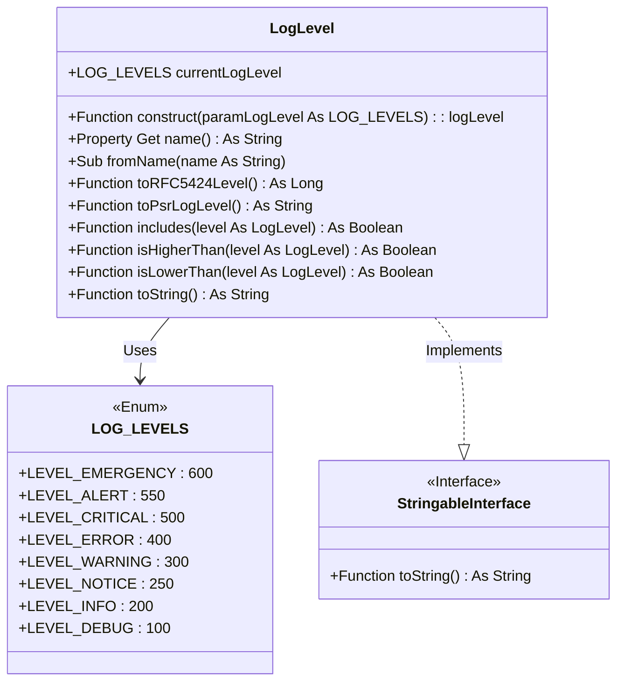
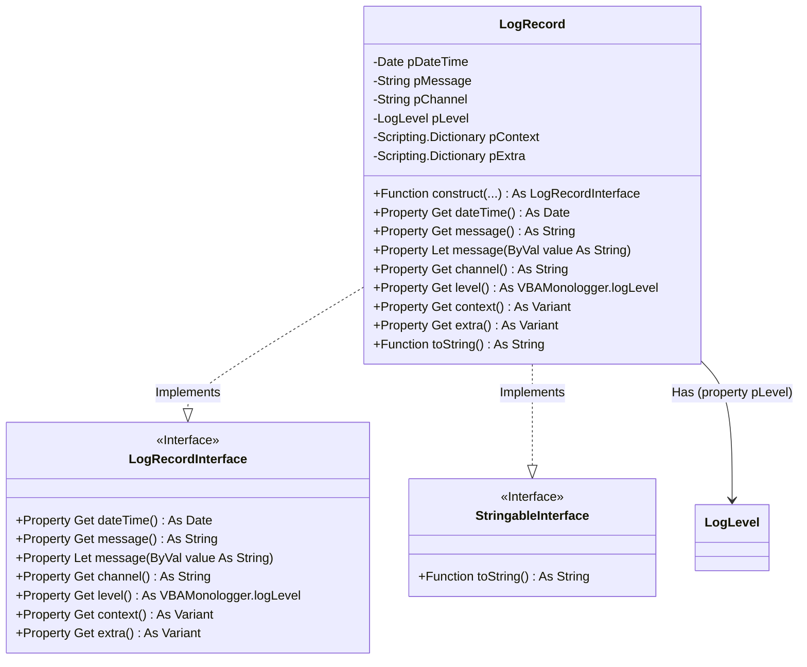
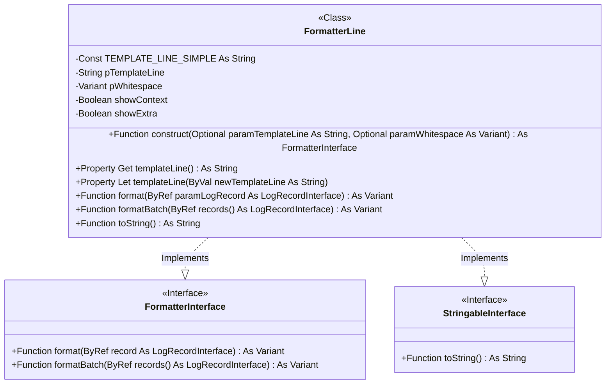
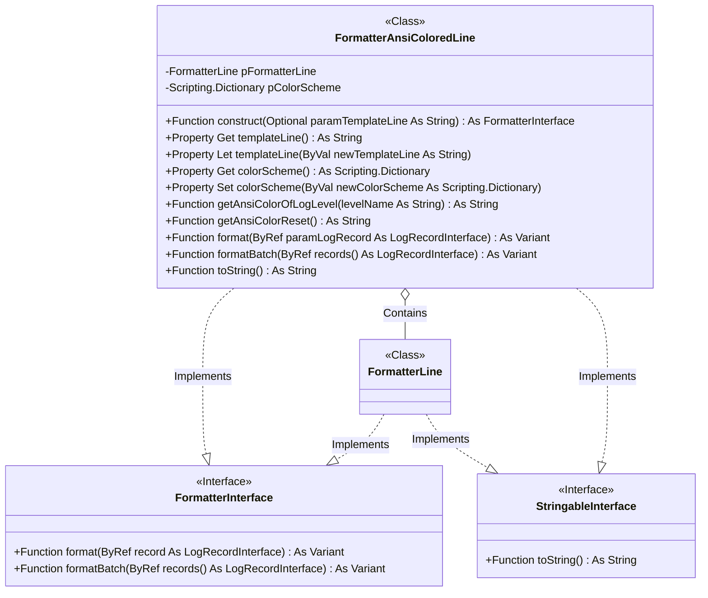
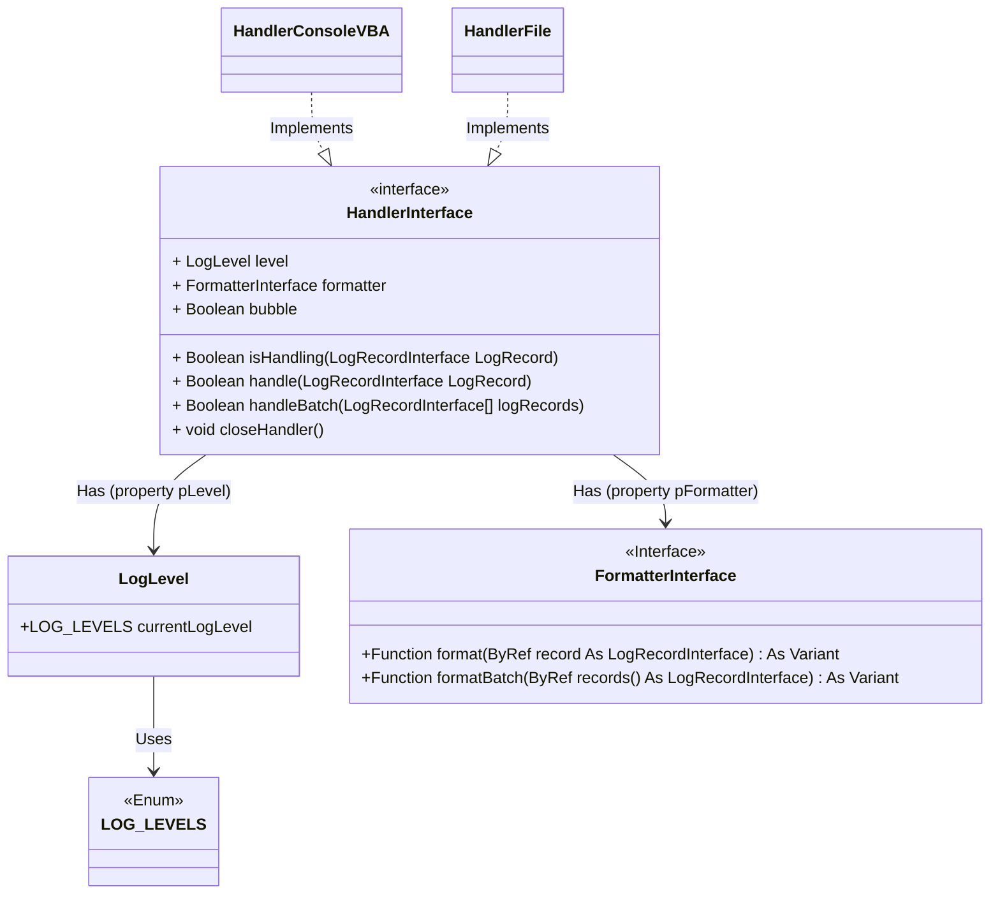
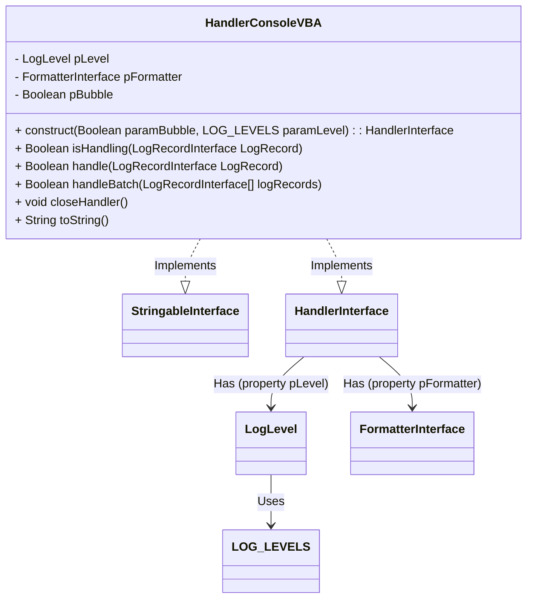
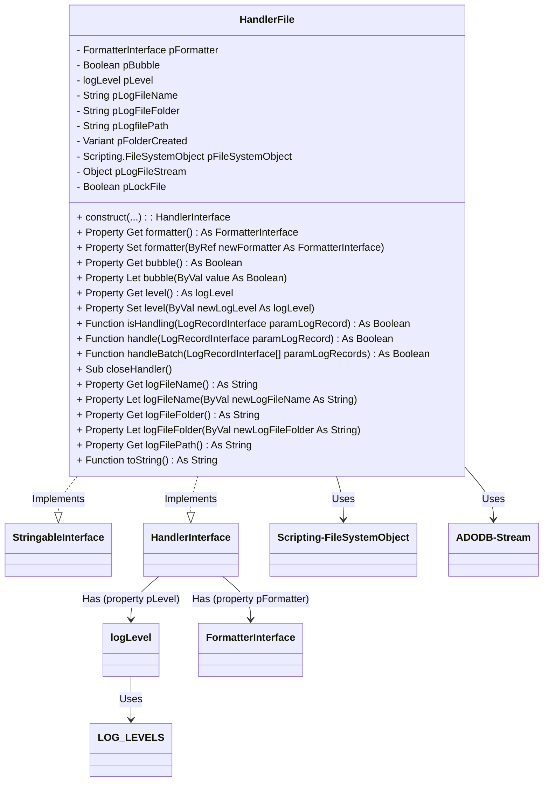

VBA Monologger
==============

> Let’s take the time, step by step, to examine and understand how each class, interface, and method in the library works. By analyzing the structure and behavior of each component, we can gain a better understanding of how they interact and contribute to the overall logging system.


## Log severity levels

To model the severity level of a log entry in compliance with the RFC-5424 standard, VBA Logger employs the `VBAMonologger.Log.LogLevel` class. These severity levels indicate the seriousness of each event, from minor to critical, allowing administrators and developers to filter messages based on their importance.




### Constructor in VBA?

A class constructor, regardless of the language, is a special method that is automatically called when an instance of a class is created, typically using the `New` keyword. The primary purpose of a constructor is to initialize the members of the class object when it is instantiated, allowing default values to be set, resources to be allocated, or other necessary actions to be taken so that the object is ready to use.

**But in VBA, there is no really constructor, but there is an alternative to emulate one.**

To illustrate, consider the property `currentLogLevel`. Its default value is set in the special VBA procedure `Class_Initialize()`. This procedure is automatically called whenever a class instance is created, *i.e.*, whenever an object is instantiated with the `New` keyword. Below is the code that initializes this default value.

```vbscript
Public currentLogLevel As LOG_LEVELS

'@Description('Called on each instantiation.')
Private Sub Class_Initialize()
    currentLogLevel = LOG_LEVELS.LEVEL_DEBUG
End Sub
```

However, the `Class_Initialize()` procedure neither accepts parameters nor returns values, which limits its function as a true constructor. To emulate a constructor with parameters, an additional function named `construct` (by convention) is added. **Note that this function is not automatically executed upon instantiation. You need to call it manually.**

```vbscript
'@Description('Emulate a class constructor with parameters.')
Public Function construct(paramLogLevel As LOG_LEVELS)
    currentLogLevel = paramLogLevel
    ' Fluent
    Set construct = Me
End Function
```

To create a new instance of `LogLevel` and use its `construct` method:

```vbscript
Sub Usecases_LogLevel()    
    Dim level As VBAMonologger.logLevel

    Debug.Print "### Instanciation ###"
    Set level = New VBAMonologger.logLevel
    Debug.Print level.toString

    Debug.Print "### Call the constructor (with 'INFO' level) ###"
    level.construct LEVEL_INFO
    Debug.Print level.toString
End Sub
```
<details>
  <summary>Output</summary>

  ```bash
  # === Instantiate the class ===
  [VBAMonologger.Log.LogLevel]
   | currentLogLevel: 100
   | name: 'DEBUG'
    
  # === Call the constructor (with 'INFO' level) ===
  [VBAMonologger.Log.LogLevel]
   | currentLogLevel: 200
   | name: 'INFO'
  ```
</details>


### Setting the current log level

The public property `currentLogLevel` defines the active log level within an instance. By default, it is set to `LEVEL_DEBUG` upon instantiation. However, this level can be modified in a few different ways:

- Through the class constructor:
  ```vbscript
  Dim level As VBAMonologger.logLevel
  
  Set level = New VBAMonologger.logLevel
  level.construct LEVEL_INFO
  ```
- By setting the property directly:
  ```vbscript
  Set level = New VBAMonologger.logLevel
  level.currentLogLevel = LEVEL_INFO
  ```
- By using the `fromName(name As String)` method, which accepts a string representation of the level to set the current log level.
  ```vbscript
  Set level = New VBAMonologger.logLevel
  level.fromName("INFO")
  ```


### Implementing `toString()` for readable object representation

The `toString()` function in the interface `StringableInterface` provides a straightforward, meaningful text representation of an instance. This feature proves especially useful for debugging, as it allows developers to easily inspect the state of an object by simply converting it to a string. With `toString()`, the internal data of an object can be output as a human-readable string that reveals key details, such as the current log level, its severity designation, or other significant properties. This approach helps developers quickly understand an object’s state without needing to access each property individually, streamlining both the debugging process and log readability.

The `StringableInterface` is straightforward, defining only a `toString()` function like this.

```vbscript
'@Interface
'@FQCN("VBAMonologger.Utils.StringableInterface")
'@ModuleDescription("Denotes the class as having a toString() method.")

'@Description("Give a string representation of instance.")
Public Function toString() As String
End Function
```

Within the `LogLevel` module class, the `toString()` function is implemented as follows. We have a proxy method for public exposition.

```vbscript
'@inheritdoc
Private Function StringableInterface_toString() As String
Dim output As String
    output = "[VBAMonologger.Log.LogLevel]" & vbCrLf
    output = output & " | currentLogLevel: " & currentLogLevel & vbCrLf
    output = output & " | name: '" & name() & "'" & vbCrLf

    StringableInterface_toString = output
End Function

'@Description("Proxy method for public exposition.")
Public Function toString() As String
    toString = StringableInterface_toString
End Function
```

Here’s an example demonstrating how to use it.

```vbscript
Dim level As VBAMonologger.Log.LogLevel
Set level = New VBAMonologger.Log.LogLevel
level.fromName("INFO")

' Output the state of the LogLevel instance
Debug.Print level.toString
```

This code would produce the following output:

```
[VBAMonologger.Log.LogLevel]
| currentLogLevel: 200
| name: 'INFO'
```


## Log record

A log record refers to an entry that captures specific information about an event or action occurring within an application. A log entry includes several key elements:

- **Date and Time**: To track the exact date and time the log entry was created.
- **Message**: The main text describing the event (e.g., "User attempted to log in.").
- **Severity Level**: The importance or severity level of the log entry (e.g., `INFO`, `WARNING`, `ERROR`).
- **Channel**: A way to categorize or segment logs based on their source or purpose.
- **Log Context**: Additional relevant information about the event (e.g., user ID).
- **Log Extra**: Optional, useful details (e.g., memory or CPU usage).

This model is described in the interface `VBAMonologger.Log.LogRecordInterface` and implemented in the module class `VBAMonologger.Log.LogRecord`.



### Create a LogRecord with minimal parameters

```vbscript
Dim record As VBAMonologger.LogRecord
Set record = New VBAMonologger.LogRecord

Set record = record.construct( _
  "I believe I can fly", _
  VBAMonologger.LEVEL_EMERGENCY _
)
Debug.Print record.toString
```
<details>
  <summary>Output</summary>

```bash
[VBAMonologger.Log.LogRecord]
| dateTime: 04/11/2024 18:41:32
| message: I believe I can fly
| channel: 
| level: EMERGENCY (level value=600)
| context: {}
| extra: {}
```
</details>


### Adding a channel

Log channels identify the source of log entries in large applications, simplifying filtering and searching within shared log files. To attach a log record to a channel, simply specify it as follows.

```vbscript
Set record = record.construct( _
  "I believe I can fly", _
  VBAMonologger.LEVEL_INFO, _
  "App" _
)
Debug.Print record.toString
```
<details>
  <summary>Output</summary>

```bash
[VBAMonologger.Log.LogRecord]
| dateTime: 04/11/2024 18:41:32
| message: I believe I can fly
| channel: App
| level: EMERGENCY (level value=600)
| context: {}
| extra: {}
```
</details>


### Adding a log context and processors extra metadata

In addition to the basic log message, you may sometimes want to add extra information for more context, using either log context or extra processor metadata.

```vbscript
' Set a dummy log context
Dim logContext As Scripting.Dictionary
Set logContext = New Scripting.Dictionary    
logContext.Add "UserName", "v20100v"
logContext.Add "UserID", 92763
logContext.Add "Operation", "Create"

' Set a dummy extra processors metadatas
Dim logExtra As Scripting.Dictionary
Set logExtra = New Scripting.Dictionary
logExtra.Add "ExecutionTime", " 9,2227 seconds"

Set record = record.construct( _
  "A critical failure occurred in the application for {Operation} process", _
  VBAMonologger.LEVEL_EMERGENCY, _
  "Authentification", _
  logContext,
  logExtra
)
Debug.Print record.toString
```
<details>
  <summary>Output</summary>

```bash
[VBAMonologger.Log.LogRecord]
| dateTime: 04/11/2024 18:41:32
| message: A critical failure occurred in the application for {Operation} process
| channel: Authentification
| level: EMERGENCY (level value=600)
| context: {"UserName":"v20100v","UserID":92763,"Operation":"Create"}
| extra: {"ExecutionTime":"9,2227 seconds"}
```
</details>


## Formatter

A log formatter is used to transform and structure a log entry into a readable representation that adheres to a specific format (e.g., text file, JSON, HTML…). Its standard behavior is defined in the `VBAMonologger.Formatter.FormatterInterface`, which exposes two methods.

- `Function format(ByRef record As LogRecordInterface) As Variant`  
  This method takes a log record (an instance implementing `LogRecordInterface`) as input and returns a formatted representation of that record. The output can be a string or any other data type, depending on the specific implementation of the formatter. The generated output includes information such as the creation date and time of the record, the channel, log level, message, context, and additional data.


- `Function formatBatch(ByRef records() As LogRecordInterface) As Variant`
  This method formats an array of log records. It iterates through each record in the array, applies the defined formatting, and returns output that combines all the formatted records.

By providing this interface, it is easy to implement different types of formatters without modifying or intervening in the client code that uses these formatters. New formatters can be added to the system at any time, as long as they adhere to the methods defined in the interface.


### FormatterLine, the default implementation

Let's demonstrate an implementation of this interface using the `VBAMonologger.Formatter.FormatterLine` class, which is the default formatter that outputs a log entry as a single-line text representation.




#### Create a new FormatterLine with the default line template

Here’s how to use this formatter on log entries.

```vbscript    
Dim formatter As VBAMonologger.FormatterLine
Set formatter = New VBAMonologger.FormatterLine
Debug.Print formatter.toString

Debug.Print "### Output record with channel name ###"
Set dummyRecord = dummyRecord.construct( _
  "I believe I can fly!", _
  VBAMonologger.LEVEL_INFO
)
Debug.Print formatter.format(dummyRecord) & vbCrLf

Debug.Print "### Output record with channel name ###"
Set dummyRecord = dummyRecord.construct( _
  "I believe I can fly!", _
  VBAMonologger.LEVEL_NOTICE, _
  "App" _
)
Debug.Print formatter.format(dummyRecord) & vbCrLf

Debug.Print "### Output record with log context and extra metadatas ###"
Set dummyRecord = dummyRecord.construct( _
  "I believe I can fly!", _
  VBAMonologger.LEVEL_NOTICE, _
  "App.Authentification", _
  logContext, _
  logExtra
)
Debug.Print formatter.format(dummyRecord) & vbCrLf
```
<details open>
  <summary>Output</summary>

```bash
[VBAMonologger.Formatter.FormatterLine]
| Template line: [{{ datetime }}] {{ channel <./>}}{{ level_name }}: {{ message }}{{< | ctx=/> context }}{{< | extra=/> extra }}
| Show context: True
| Show extra: True

### Output record minimal ###
[2024/11/12 16:13:44] INFO: I believe I can fly

### Output record with channel name ###
[2024/11/12 16:13:44] App.NOTICE: I believe I can fly

### Output record with log context and extra metadata ###
[2024/11/12 16:13:44] App.Authentification.EMERGENCY: A critical failure occurred in the application | ctx={"UserName":"v20100v","UserID":25508,"Operation":"Create"} | extra={"ExecutionTime":"3,9127 seconds"}
```
</details>


#### Batch log management

This class also supports batch processing of multiple log entries, according to the implementation of the interface `VBAMonologger.Formatter.FormatterInterface`. The `formatBatch` method allows you to format a series of log records and concatenate them into a single string, which is useful when you want to display or save multiple logs at once.


#### A flexible formatting template

The `FormatterLine` uses a string template to format each log entry. The **template line** defines the representation of a log entry, with placeholders that will be replaced by actual values from the log record. By default, this template looks like the following:

```
[{{datetime}}] {{channel}}{{level_name}}: {{message}}{{< | ctx=/> context}}{{< | extra=/> extra}}
```

These placeholders include:

| Placeholder      | Description                                                                                                                                                                                                           |
|------------------|-----------------------------------------------------------------------------------------------------------------------------------------------------------------------------------------------------------------------|
| `{{datetime}}`   | The date and time of the log entry.                                                                                                                                                                                   |
| `{{channel}}`    | The channel (or source) from which the log originates.                                                                                                                                                                |
| `{{level_name}}` | The log level (e.g., INFO, ERROR, DEBUG).                                                                                                                                                                             |
| `{{message}}`    | The main log message.                                                                                                                                                                                                 |
| `{{context}}`    | Additional log contextual information, such as user details, log IDs, or any other dynamic information that helps to describe the environment and the context of the log. This can include arbitrary key-value pairs. |
| `{{extra}}`      | Extra metadata or custom information attached to the log entry. This can include arbitrary key-value pairs, typically added by pre-processors.                                                                        |

This class allows you to customize the template to fit your needs. For example, if you prefer a simpler format or want to add additional information, you can easily adjust the template using the templateLine property. This provides flexibility in defining the exact format of your logs, whether for console output or a log file.

To change the template line just set the property `templateLine`.

```vbscript
Set formatter = New VBAMonologger.FormatterLine
formatter.templateLine = "[{{datetime}}] {{ <Chanel:/>channel< ; /> }}{{ level_name }}: {{ message }}{{< ; ctx: /> context}}{{< ; extra: /> extra < ;/> }}"
```

This formatting system uses regular expressions to handle placeholders within the log template, allowing them to be defined with *prefixes* and *suffixes* to modify their final output. The prefix text is added before the placeholder’s value, and the postfix text is added after the placeholder's value. If a placeholder has no value, then the prefix and postfix are not displayed in the final output. Here’s how a placeholder can be structured in the template:

```

```

So in the example above, if the log entry does not contain a value for the `{{channel}}` placeholder, the prefix `"Channel:"` and the postfix `" ; "` associated with that placeholder will not appear in the final output. This behavior ensures that the log formatting remains clean and consistent, without unnecessary or empty placeholders cluttering the output when no value is provided for them.


#### Show or hide log context and extra pre-processors metadata

Logs can include context information (such as data specific to the execution of a process) and additional metadata. The `FormatterLine` class allows you to control the display of this data using the `showContext` and `showExtra` properties. 

By default, these properties are set to true, but you can hide its by setting these properties to `False`.

```vbscript    
Set formatter = New VBAMonologger.FormatterLine
formatter.showContext = False
formatter.showExtra = False
```


### FormatterAnsiColoredLine

The main purpose of the `FormatterAnsiColoredLine` class is to format log messages by converting them into text strings using the templating model provided by `FormatterLine`, while applying ANSI escape sequences for coloring the messages in terminals based on the log level. It allows for customizing the log display with specific colors for each message type (e.g., "DEBUG", "INFO", "ERROR", etc.) using a configurable color palette.

#### No extends, but through composition of FormatterLine

Since VBA does not support inheritance, the `FormatterAnsiColoredLine` class instead has a composition relationship with an instance of `FormatterLine`, exposing the same methods. The class also contains the `colorScheme` dictionary for defining the colors.



The use of this formatter is similar to that of `FormatterLine`. You can change the line template, show or hide log context and extra pre-processors metadata.

```vbscript
Dim formatterAnsiColoredLine As VBAMonologger.formatterAnsiColoredLine
Set formatterAnsiColoredLine = New VBAMonologger.formatterAnsiColoredLine
formatterAnsiColoredLine.showContext = false
formatterAnsiColoredLine.showExtra = false
Debug.Print formatterAnsiColoredLine.toString

Debug.Print "=== Output record minimal ==="
Dim record As VBAMonologger.LogRecord
Set record = New VBAMonologger.LogRecord
Set record = record.construct( _
    "I believe I can fly", _
    VBAMonologger.LEVEL_INFO _
)
Debug.Print formatterAnsiColoredLine.format(record) & vbCrLf

Debug.Print "=== Output by using FormatBatch on records collection ==="
Dim records() As VBAMonologger.LogRecordInterface
ReDim records(1 To 8)
records = randomLogRecordsForEachLevel
Debug.Print formatterAnsiColoredLine.formatBatch(records) & vbCrLf
```

<details open>
  <summary>Output</summary>

```
[VBAMonologger.Formatter.FormatterAnsiColoredLine]
| Template line: [{{ datetime }}] {{ channel <./>}}{{ level_name }}: {{ message }}{{< | ctx=/> context }}{{< | extra=/> extra }}
| Show context: False
| Show extra: False
| Color sheme:
| {
|   "DEBUG": "\u001B[37m",
|   "INFO": "\u001B[32m",
|   "NOTICE": "\u001B[36m",
|   "WARNING": "\u001B[33m",
|   "ERROR": "\u001B[31m",
|   "CRITICAL": "\u001B[31;4m",
|   "ALERT": "\u001B[37;41m",
|   "EMERGENCY": "\u001B[41;37;5m",
|   "RESET": "\u001B[0m"
| }

=== Output record minimal ===
[2024/11/12 17:50:17] INFO: I believe I can fly

=== Output by using FormatBatch on records collection ===
[2024/11/12 17:50:17] App.Authentification.EMERGENCY: A critical failure occurred in the application for {Operation} process
[2024/11/12 17:50:17] App.Authentification.ALERT: Action required for process {Operation} failure.
[2024/11/12 17:50:17] App.Authentification.CRITICAL: System is in an unstable state. Unable to authenticate {UserId}.
[2024/11/12 17:50:17] App.Authentification.ERROR: An error occurred when the user {UserId} try to {Operation} the file {file}.
[2024/11/12 17:50:17] App.Authentification.WARNING: The user {UserId} does not exist. Unable to perform '{Operation}' user file.
[2024/11/12 17:50:17] App.Authentification.NOTICE: Process completed successfully with minor issues for {UserId}.
[2024/11/12 17:50:17] App.Authentification.INFO: User {UserId} has logged in successfully.
[2024/11/12 17:50:17] App.Authentification.DEBUG: Authentification function call for user {UserId}.
```
</details>

As you can see, each log entry is properly wrapped in an ANSI escape sequence to apply color. However, the VBA console does not support displaying these escape ANSI sequences, so you would need to view these messages in a compatible console that supports ANSI color codes (but that's a separate topic, which we will cover when discussing log handlers). You should see the following result:


#### Customizing the color scheme

To change the color scheme, all you need to do is create a dictionary and assign a color to each log level. This allows you to customize the colors for different severity levels, such as "DEBUG," "INFO," "ERROR," and so on. The dictionary maps each log level to a specific ANSI color code, enabling you to control the appearance of each type of log message when displayed in a terminal or compatible environment. 

By updating the dictionary, you can easily modify the color scheme without altering the underlying code logic, providing flexibility in how the logs are visually represented.

```vbscript
Public Function customColorScheme() As Scripting.Dictionary
  Dim colorScheme As Scripting.Dictionary
  Set colorScheme = New Scripting.Dictionary
  colorScheme.Add "DEBUG", Chr$(27) & "[2;32m" ' FG Green faint
  colorScheme.Add "INFO", Chr$(27) & "[32m" ' FG Green normal
  colorScheme.Add "NOTICE", Chr$(27) & "[1;32m" ' FG Green bright
  colorScheme.Add "WARNING", Chr$(27) & "[2;33m" ' FG Yellow faint
  colorScheme.Add "ERROR", Chr$(27) & "[33m" ' FG Yellow normal
  colorScheme.Add "CRITICAL", Chr$(27) & "[31m" ' FG Red normal
  colorScheme.Add "ALERT", Chr$(27) & "[1;31m" ' FG Red bright
  colorScheme.Add "EMERGENCY", Chr$(27) & "[41;37;5m"
  colorScheme.Add "RESET", Chr$(27) & "[0m"
  
  Set customColorScheme = trafficLightColorScheme
End Function

Dim formatterAnsiColoredLine As VBAMonologger.formatterAnsiColoredLine
Set formatterAnsiColoredLine = New VBAMonologger.formatterAnsiColoredLine
Set formatterAnsiColoredLine.colorScheme = customColorScheme
formatterAnsiColoredLine.showContext = False
formatterAnsiColoredLine.showExtra = False
```


## Handler

A log handler is a key component responsible for processing each log entry. When a log message is generated, it is not simply recorded; it must be directed to a location where it can be viewed and used. This is where the handler comes in, determining where and how each log entry will be sent or saved. A log handler is responsible for directing log messages to specific outputs (such as files, consoles ...) based on the log level and other configuration settings. 

The interface `VBAMonologger.Handler.HandlerInterface` defines the standard behavior that all handler implementations must follow. This interface specifies the necessary properties and methods to control how and where log records are processed.




This interface provides the following members.

- `Public Property level As logLevel`

  Determines the current log level of handler. This property sets the minimum log level required for the handler to process a log entry. Only messages at or above this level are handled, allowing for filtering of log messages based on severity (e.g., DEBUG, INFO, ERROR).


- `Public Property bubble As Boolean`

  Determines whether, or not, the log record should "bubble up" to other handlers in the stack after being processed by the current handler. When you have multiple handlers in the stack of your logger, and want a specific handler to be the only one processing certain log levels or messages, you have to set bubble to false for that handler. This is useful if you need specific messages to go only to a certain location.
    - If bubble is set to `true` (the default), the log record will be processed by the current handler and continue to "bubble up" to other handlers in the stack. This allows multiple handlers to process the same log message.
    - If bubble is set to `false`, the log record will stop propagating after being processed by the current handler. This essentially "catches" the record, preventing it from being handled by other handlers in the stack.  

  
- `Public Property formatter As FormatterInterface`

  Specifies the formatter associated with the handler, defining how each log record will be structured and formatted before output. This allows for flexible formatting (e.g., plain text, JSON) based on the formatter assigned to the handler.


- `Function isHandling(ByRef logRecord As LogRecordInterface) As Boolean`

  Provides a way for handlers to filter log messages. This ensures that a handler only processes messages that are relevant to it, which can improve performance and reduce unnecessary processing. It returns true if the handler is capable of processing the  log message and false if the handler should not process the log message. This function evaluates if the handler is set to process the given log record based on the log level and other criteria. It returns `True` if the handler should handle the record, or `False` if it should be ignored.


- `Function handle(ByRef logRecord As LogRecordInterface) As Boolean`

  All records may be passed to this method, and the handler should discard those that it does not want to handle. The return value of this function controls the bubbling process of the handler stack. Unless the bubbling is interrupted (by returning true), the Logger class will keep on calling further handlers in the stack with a given log record. If the handler can process the record (based on `isHandling`), it outputs the formatted log message to its designated destination (e.g., console, file). It returns a Boolean value to control the record's propagation through additional handlers, based on the `bubble` property.


- `Function handleBatch(ByRef logRecords() As LogRecordInterface) As Boolean`

  This method handles an array of log records at once, processing each record in sequence. It provides an efficient way to process bulk log entries, making it ideal for scenarios where multiple messages need to be logged simultaneously.


- `Sub closeHandler()`
  This method releases any resources or open connections the handler may use (e.g., closing file handles or flushing data). It ensures a proper shutdown of the logging cycle and frees up resources when logging is complete.

The `HandlerInterface` design provides a standardized, modular way to add various logging handlers without needing to change client code. By implementing this interface, different handlers can easily be added to support new output targets or custom logging behavior as needed. Handlers can be configured independently with custom formatters, levels, and bubbling behavior, offering fine-grained control over how and where logs are managed.


### HandlerConsoleVBA

The `VBAMonologger.Handler.HandlerConsoleVBA` class is responsible for directing log messages to the VBA Console (typically the Immediate Window in VBA environments like Excel). This class implements the `VBAMonologger.Handler.HandlerInterface`, which specifies the methods and properties that a logging handler must provide, such as formatting log messages, determining log levels, and handling message propagation.



Below is an example of how to create an instance of HandlerConsole.

```vbscript
Dim handlerConsole As VBAMonologger.HandlerInterface
Set handlerConsole = New VBAMonologger.HandlerConsoleVBA
Debug.Print handlerConsole.toString

Debug.Print "=== Handle a log record with HandlerConsoleVBA ==="
Dim record As VBAMonologger.LogRecord
Set record = New VBAMonologger.LogRecord
Set record = record.construct( _
    "Process completed successfully with minor issues for user.", _
    VBAMonologger.LEVEL_INFO, _
    "App"
)

Dim isHandling As Boolean
isHandling = handlerConsole.isHandling(record)
Debug.Print ">>> Result of handlerConsole.isHandling(record): " & isHandling
Debug.Print ">>> Result of handlerConsole.handle(record): "
handlerConsole.handle record
```
<details open>
  <summary>Output</summary>

```
[VBAMonologger.Handler.HandlerConsoleVBA]
 | level: DEBUG
 | bubble: true

=== Handle a log record with HandlerConsoleVBA ===
>>> Result of handler.isHandling(dummyRecord): True
>>> Result of handler.handle(dummyRecord): 
[2024/11/13 10:42:03] App.INFO: Process completed successfully with minor issues for user.
```
</details>

The `HandlerConsoleVBA` class leverages a `FormatterInterface` to define the structure and appearance of each log entry, ensuring a specific, consistent format that makes log messages easier to read and understand in the console. By default, `HandlerConsoleVBA` uses the `FormatterLine` implementation of the `FormatterInterface`, which outputs each log entry in a simple, line-based format optimized for console viewing. Additionally, `HandlerConsoleVBA` is set with a default log level of `DEBUG`.

```vbscript
Dim handlerConsole As VBAMonologger.HandlerConsoleVBA
Set handlerConsole = New VBAMonologger.HandlerConsoleVBA

Dim formatterLine As VBAMonologger.FormatterLine
Set formatterLine = New VBAMonologger.FormatterLine
formatterLine.showContext = False
formatterLine.showExtra = False
Set handlerConsole.formatter = New VBAMonologger.FormatterLine

Debug.Print "### Handle a collection of log records with default log level "DEBUG" ###"
Debug.Print handlerConsole.toString
Debug.Print ">>> Result of handlerConsole.handleBatch(records): "
handlerConsole.handleBatch randomLogRecordsForEachLevel
    
Debug.Print "### Change level of handler to CRITICAL ###"
handler.level.currentLogLevel = VBAMonologger.LOG_LEVELS.LEVEL_CRITICAL
Debug.Print handlerConsole.toString
Debug.Print ">>> Result of handlerConsole.handleBatch(records): "
handlerConsole.handleBatch randomLogRecordsForEachLevel
```
<details open>
  <summary>Output</summary>

```
### Handle a collection of log records with default log level "DEBUG" ###
[VBAMonologger.Handler.HandlerConsoleVBA]
 | level: DEBUG
 | bubble: true
 >>> Result of handler.handleBatch(records): 
[2024/11/13 10:42:03] App.Authentification.EMERGENCY: A critical failure occurred in the application for {Operation} process
[2024/11/13 10:42:03] App.Authentification.ALERT: Action required for process {Operation} failure.
[2024/11/13 10:42:03] App.Authentification.CRITICAL: System is in an unstable state. Unable to authenticate {UserId}.
[2024/11/13 10:42:03] App.Authentification.ERROR: An error occurred when the user {UserId} try to {Operation} the file {file}. 
[2024/11/13 10:42:03] App.Authentification.WARNING: The user {UserId} does not exist. Unable to perform '{Operation}' user file. 
[2024/11/13 10:42:03] App.Authentification.NOTICE: Process completed successfully with minor issues for {UserId}. 
[2024/11/13 10:42:03] App.Authentification.INFO: User {UserId} has logged in successfully.
[2024/11/13 10:42:03] App.Authentification.DEBUG: Authentification function call for user {UserId}. 

### Change level of handler to "CRITICAL" ### 
[VBAMonologger.Handler.HandlerConsoleVBA]
 | level: CRITICAL
 | bubble: true
>>> Result of handler.handleBatch(records):
[2024/11/13 10:42:03] App.Authentification.EMERGENCY: A critical failure occurred in the application for {Operation} process
[2024/11/13 10:42:03] App.Authentification.ALERT: Action required for process {Operation} failure.
[2024/11/13 10:42:03] App.Authentification.CRITICAL: System is in an unstable state. Unable to authenticate {UserId}.
```
</details>

In the example above, the `HandlerConsoleVBA` object is first instantiated and configured to display logs in the VBA console using a custom formatter, where the `showContext` and `showExtra` options are disabled. This means that contextual and additional information will be excluded from the output. 

Next, `handlerConsole` processes a set of log messages covering all severity levels (from DEBUG to EMERGENCY). Since the default log level is set to `DEBUG`, all log entries are displayed in the console.

In the second part of the example, the log level of `handlerConsole` is changed to `CRITICAL`, meaning that only messages with a `CRITICAL` severity level or higher (such as ALERT and EMERGENCY) will be displayed. As a result, entries with lower severity levels (ERROR, WARNING, etc.) are excluded and do not appear in the output.


### HandlerFile

The `VBAMonologger.Handler.HandlerFile` class is responsible for managing and logging messages to a file. This class implements the `VBAMonologger.Handler.HandlerInterface`, which specifies the methods and properties that a logging handler must provide.




#### Create a new `HandlerFile` 

Here’s how to create a new instance of `HandlerConsole` and handle a log record.

```vbscript
Dim handlerFile As VBAMonologger.HandlerFile
Set handlerFile = New VBAMonologger.HandlerFile
Debug.Print handlerFile.toString

' Change the default formatter to a ANSI colored line formatter 
Dim formatterAnsiColoredLine As VBAMonologger.formatterAnsiColoredLine
Set formatterAnsiColoredLine = New VBAMonologger.formatterAnsiColoredLine
Set handlerFile.formatter = formatterAnsiColoredLine

' Change the default log level of handler to `ERROR`
handlerFile.level.currentLogLevel = VBAMonologger.LOG_LEVELS.LEVEL_ERROR

' Handle a log record with HandlerFile
Dim record As VBAMonologger.LogRecord
Set record = New VBAMonologger.LogRecord
Set record = record.construct( _
    "Process completed successfully with minor issues for user.", _
    VBAMonologger.LEVEL_INFO, _
    "App"
)
Dim isHandling As Boolean
Dim resultHandle As Boolean
isHandling = handlerFile.isHandling(record)
resultHandle = handlerFile.handle(record)

' Close the handler   
handlerFile.closeHandler
```
<details open>
  <summary>Output</summary>

```
[VBAMonologger.Handler.HandlerFile]
 | logFileName: vbalogfile_2024-11-13.log
 | logfilePath: D:\VBAMonologger\src\var\log\vbalogfile_2024-11-13.log
 | logFileFolder: D:\VBAMonologger\src\var\log
```
</details>


#### Configure the destination log file and output directory

The class contains several members that are used to configure and manage the handler log file:

| **Property**        | **Description**                                                                                                                |
|---------------------|--------------------------------------------------------------------------------------------------------------------------------|
| `logFileName`       | The name of the log file. This name can be customized.                                                                         |
| `logFileFolder`     | To retrieve and set the folder where the log file will be stored.                                                              |
| `logFilePath`       | To get the full path to the log file, built by concatenation of  `logFileFolder` with `logFileName`.                           |
| `pFolderCreated`    | (Private) To showing whether the log folder has been successfully created.                                                     |
| `pFileSystemObject` | (Private) An object of `FileSystemObject` used to interact with the file system (for creating folders and manipulating files). |
| `pLogFileStream`    | (Private) An object of `ADODB.Stream` used to manage the stream for writing to the log file in UTF-8.                          |
| `pLockFile`         | (Private) An indicator for locking the file, used to control concurrent access to the log file.                                | |

Here’s how you can modify the log file and its destination folder.

```vbscript
Dim handlerFile As VBAMonologger.HandlerFile
Set handlerFile = New VBAMonologger.HandlerFile
    
Debug.Print "=== Change the logfile name ==="
handlerFile.logFileName = "Amazing-log-file-name.log"
Debug.Print handlerFile.toString
    
Debug.Print "=== Change the logfile folder ==="
handlerFile.logFileFolder = VBA.Environ$("USERPROFILE") & "\VBAMonologger\logs"
Debug.Print handlerFile.toString
    
Debug.Print "=== Initialize handlerFile with custom logfile name and folder ==="
Set handlerFile = handlerFile.construct( _
  paramLogFileName:="vba-log-file___" & format(Now, "yyyy-mm-dd") & ".log", _
  paramLogFileFolder:=ThisWorkbook.Path & "\var\log" _
)
Debug.Print handlerFile.toString
```
<details open>
  <summary>Output</summary>

```
=== Change the logfile name ===
[VBAMonologger.Handler.HandlerFile]
 | logFileName: Amazing-log-file-name.log
 | logfilePath: D:\VBAMonologger\src\var\log\Amazing-log-file-name.log
 | logFileFolder: D:\VBAMonologger\src\var\log

=== Change the logfile folder ===
[VBAMonologger.Handler.HandlerFile]
 | logFileName: Amazing-log-file-name.log
 | logfilePath: C:\Users\vblain\VBAMonologger\logs\Amazing-log-file-name.log
 | logFileFolder: C:\Users\vblain\VBAMonologger\logs

=== Initialize handlerFile with custom logfile name and folder ===
[VBAMonologger.Handler.HandlerFile]
 | logFileName: vba-log-file___2024-11-13.log
 | logfilePath: D:\VBAMonologger\src\var\log\vba-log-file___2024-11-13.log
 | logFileFolder: D:\VBAMonologger\src\var\log
```
</details>


## Processor