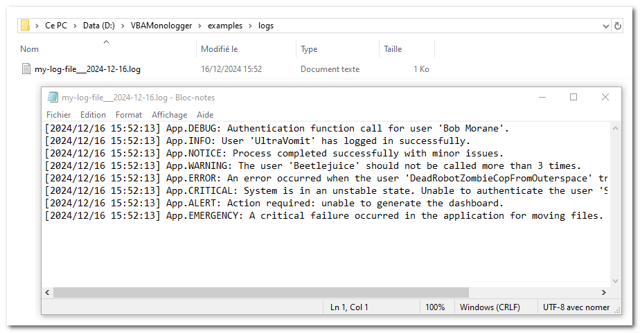

# How to create a log file in VBA?

In the realm of computing, a log file serves as a record keeper for events that transpire within an operating system or during the execution of software applications. These logs can also store communications between different users of particular software. The act of recording this information is referred to as logging. Typically, messages and events are documented in a single log file.

<!-- more -->


## Creating a logger file with VBA Monologger 

To set this up with VBA Monologger, you can use its factory with the method `VBAMonologger.Factory.createLoggerFile()`, which creates a specialized logger for file. By default, this logger writes logs to the `./var/log/logfile_yyyy-mm-dd.log` file, relative to the path of the workbook (yyyy-mm-dd = date of the day). But if you want, you can change the name and the folder of the file.

```
Public Function createLoggerFile( _
    Optional ByVal paramLoggerName As String = vbNullString, _
    Optional ByRef paramFormatter As FormatterInterface = Nothing, _
    Optional ByVal paramLogFileName As String = vbNullString, _
    Optional ByVal paramLogFileFolder As String = vbNullString _
) As VBAMonologger.Logger
```

To ensure compatibility with special and multilingual characters, the UTF-8 encoding is preferred.

> This logger utilizes the `VBAMonologger.HandlerFile` handler. For more details about this handler, check the documentation here: [Handler Console](./../../../under-the-hood/handler.md#handlerfile).


## Example Code

Here's an example of how to implement this:

```vbscript
Public Sub howto_use_logger_file()
    ' Initialize the Logger for ouput logs into file
    Dim Logger As VBAMonologger.LoggerInterface
    Set Logger = VBAMonologger.Factory.createLoggerFile( _ 
        paramLoggerName:= "App", _
        paramLogFileName:="my-log-file___"&format(Now, "yyyy-mm-dd") & ".log", _
        paramLogFileFolder:=ThisWorkbook.Path & "\logs" _        
    )    

    ' Use the logger for each severity levels
    Logger.trace "Authentication function call for user 'Bob Morane'." 
    Logger.info "User 'UltraVomit' has logged in successfully."
    Logger.notice "Process completed successfully with minor issues."
    Logger.warning "'Beetlejuice' should not be called more than 3 times."
    Logger.error "An error occurred with the user 'DRZCFOS2'."
    Logger.critical "System is in an unstable state."
    Logger.alert "Action required: unable to generate the dashboard."
    Logger.emergency "A critical failure occurred in the application."
End Sub
```

So when you run this code, it creates the file into output folder and it writes logs messages into it.



Happy logging ^^.