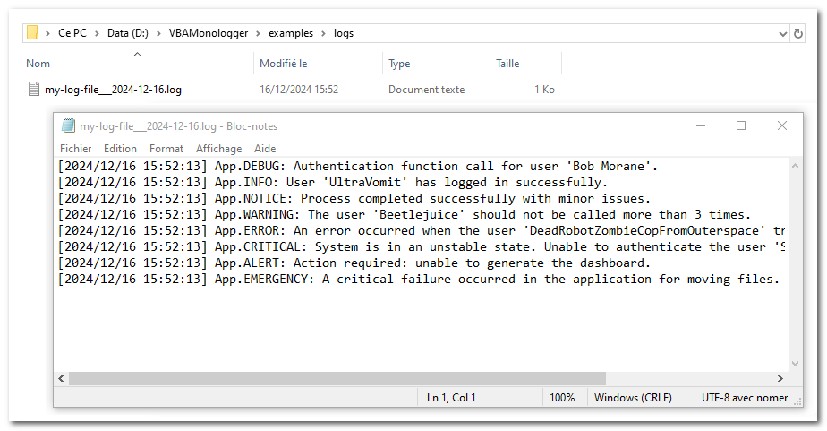

## Log output to VBA console

In *VBA Monologger*, we use a factory in order to simplify and standardize the creation of objects, such as loggers, by encapsulating the logic needed to initialize them. The factory pattern abstracts the object creation process, which can be particularly useful. 

So to instantiate your first logger that output logs into the VBA console, just use the method `VBAMonologger.Factory.createLoggerConsoleVBA()`, as shown below. 

```vbscript
Public Sub howto_use_logger_console_VBA()
    Dim Logger As VBAMonologger.LoggerInterface
    Set Logger = VBAMonologger.Factory.createLoggerConsoleVBA()
    
    ' Use the logger for each severity levels
    Logger.trace "Authentication function call for user 'Bob Morane'." 
    Logger.info "User 'UltraVomit' has logged in successfully."
    Logger.notice "Process completed successfully with minor issues."
    Logger.warning "'Beetlejuice' should not be called more than 3 times."
    Logger.error "An error occurred with the user 'DRZCFOS2'."
    Logger.critical "System is in an unstable state."
    Logger.alert "Action required: unable to generate the dashboard."
    Logger.emergency "A critical failure occurred in the application."
End Sub
```

You can see result in the **VBA console** (*a.k.a.* **Excel's Immediate Windows**).


> Note: If the console is not visible in Excel Visual basic IDE, go to the menu and select *View > Immediate Window*. Alternatively, you can press <kbd>Ctrl</kbd> + <kbd>G</kbd> to quickly open it.

This logger, provided by the factory's method `createLoggerConsoleVBA`, is configured by default: 

- with the handler `VBAMonologger.Handler.HandlerConsoleVBA`, which uses the default line formatter: `VBAMonologger.Formatter.FormatterLine`.
- with the pre-processors placeholders: `VBAMonologger.Processor.ProcessorPlaceholders`, allowing the use of placeholders in log messages that will be replaced with values provided in the log record context.
- and without a channel name. 

As you can see, in the signature of this factory's method, it is possible to set the name the logger (channel) and to load a custom formatter.

```vbscript title='VBAMonologger.Factroy.createLoggerConsoleVBA()' 
Public Function createLoggerConsoleVBA( _
    Optional ByVal paramLoggerName As String = vbNullString, _
    Optional ByRef paramFormatter As FormatterInterface = Nothing _
) As VBAMonologger.Logger
```


## Log output to Windows console

If you prefer to display your logs outside the Excel VBA IDE, you can output them directly to the Windows Console (cmd.exe). This approach is particularly useful when working on complex applications where monitoring logs in real-time is crucial, or when you need a larger with colors support via ANSI sequence, dedicated interface for debugging. 

The factory can create a dedicated logger for Windows Console with `VBAMonologger.Factory.createLoggerConsole()` method. It handles log messages by streaming them to the Windows console using an HTTP-based client/server architecture. The client sends log records as HTTP requests to the server, and the server processes these requests, displaying the log messages directly in the console output. This logger features a formatter that supports ANSI colors `VBAMonologger.Formatter.FormatterANSIcoloredLine`.

```vbscript
Public Sub howto_use_logger_console()
    Dim Logger As VBAMonologger.LoggerInterface
    Set Logger = VBAMonologger.Factory.createLoggerConsole("App")

    ' Use the logger for each severity levels
    Logger.trace "Authentication function call for user 'Bob Morane'." 
    (...)
End Sub    
```

When you execute this code, it launches a `cmd.exe`, and you can view the results in it. The formatter's configuration allows you to customize the color scheme.


As you can see, in the signature of this factory's method, it is also possible to set the name the logger, to load a custom formatter, and more. We will explore how to fully utilize these options later in the documentation.

```vbscript
Public Function createLoggerConsole( _
    Optional ByVal paramLoggerName As String = vbNullString, _
    Optional ByRef paramFormatter As FormatterInterface = Nothing, _
    Optional ByRef paramWithANSIColorSupport As Boolean = True, _
    Optional ByRef paramWithNewlineForContextAndExtra As Boolean = True, _
    Optional ByRef paramWithDebugServer As Boolean = False, _
    Optional ByRef paramWithDebugClient As Boolean = False _
) As VBAMonologger.Logger
```


## Log output to a file

You can send logs into a file with the default logger file provided by factory's method `VBAMonologger.Factory.createLoggerFile()`. To ensure compatibility with special and multilingual characters, the UTF-8 encoding is preferred.

```vbscript
Public Sub howto_use_loggerFile()
    Dim Logger As VBAMonologger.LoggerInterface
    Set Logger = VBAMonologger.Factory.createLoggerFile("App")
    
    ' Logs message for each severity levels
    Logger.trace "Authentication function call for user 'Bob Morane'."
    (...)
End Sub
```
This logger, provided by the factory's method `createLoggerFile`, is configured by default:

- with the handler `VBAMonologger.Handler.HandlerFile`, which employs the same default line formatter, `VBAMonologger.Formatter.FormatterLine`, as the one used by `HandlerConsoleVBA`.
- with the pre-processors placeholders: `VBAMonologger.Processor.ProcessorPlaceholders`, allowing the use of placeholders in log messages that will be replaced with values provided in the log record context.
- and without a channel name. 

By default, this logger writes logs to the `./var/log/logfile_yyyy-mm-dd.log` file, relative to the path of the workbook (yyyy-mm-dd = date of the day). You can change the name and the folder of the file, into the configuration of `VBAMonologger.Handler.HandlerFile` or directly into the signature of the factory's method.

```vbscript
Public Function createLoggerFile( _
    Optional ByVal paramLoggerName As String = vbNullString, _
    Optional ByRef paramFormatter As FormatterInterface = Nothing, _
    Optional ByVal paramLogFileName As String = vbNullString, _
    Optional ByVal paramLogFileFolder As String = vbNullString _
) As VBAMonologger.Logger
```

Here’s an example of how to change the name and folder of the log file.

```vbscript
Public Sub howto_change_logger_file_name_and_folder()
    Dim Logger As VBAMonologger.LoggerInterface
    Set Logger = VBAMonologger.Factory.createLoggerFile( _ 
        paramLoggerName:= "App", _
        paramLogFileName:="my-log-file___"&format(Now, "yyyy-mm-dd") & ".log", _
        paramLogFileFolder:=ThisWorkbook.Path & "\logs" _        
    )
    
    ' Logs message for each severity levels
    Logger.trace "Authentication function call for user 'Bob Morane'."
    (...)
End Sub
```




## Next steps

If you skipped the [introduction](./introduction.md) and especially the [concepts](./introduction.md#concepts) section, we strongly recommend reading it before moving on to the rest of the documentation.