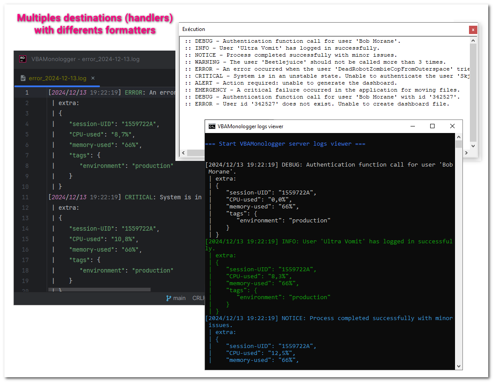

## Custom logger with one handler

In this example, we create an empty logger, and we push into a unique handler for VBA console with a custom formatter.

### Instantiate an empty logger

To create a simple logger without any handlers or pre-processors, essentially an empty logger, you can utilize the factory method `VBAMonologger.Factory.createLogger` as follows:

```vbscript
Public Sub howto_create_empty_logger()
    ' Create an emtpy logger (without handler, pre-processors...)
    Dim Logger As VBAMonologger.Logger
    Set Logger = VBAMonologger.Factory.createLogger()
    Logger.name = "App"
End Sub
```

### Instantiate handler with a custom line formatter

To illustrate how to load a custom formatter, we will create a new line formatter with a different line template, but it works the same way with any formatter. 

Check this out for additional details on [creating a custom formatter](./create-custom-formatter.md#what-is-a-log-formatter).

```vbscript
Public Sub howto_create_handler_with_custom_formatter()
    ' Create a custom line formatter
    Dim customFormatterLine As VBAMonologger.FormatterLine
    Set customFormatterLine = VBAMonologger.Factory.createFormatterLine
    customFormatterLine.showContext = True
    customFormatterLine.showExtra = True
    customFormatterLine.withAllowingInlineLineBreaks = False
    customFormatterLine.templateLine = _ 
        ":: {{ channel }}{{ level_name }} - {{ message }}"
        
    ' Create a console VBA handler with this custom line formatter
    Dim customHandlerConsoleVBA As VBAMonologger.HandlerConsoleVBA
    Set customHandlerConsoleVBA = VBAMonologger.Factory.createHandlerConsoleVBA
    Set customHandlerConsoleVBA.formatter = customFormatterLine        
End Sub
```


### Push handler into logger

To load a handler into the logger, just use the `pushHandler` Logger's method, as follows: 

```vbscript
Public Sub howto_push_handler_into_empty_logger()
    ' Create an emtpy logger (without handler, pre-processors...)
    Dim Logger As VBAMonologger.Logger
    Set Logger = VBAMonologger.Factory.createLogger()
    Logger.name = "App"    
    
    ' Create a custom line formatter
    Dim customFormatterLine As VBAMonologger.FormatterLine
    Set customFormatterLine = VBAMonologger.Factory.createFormatterLine
    customFormatterLine.showContext = True
    customFormatterLine.showExtra = True
    customFormatterLine.withAllowingInlineLineBreaks = False
    customFormatterLine.templateLine = _ 
        ":: {{ channel }}{{ level_name }} - {{ message }}"
    
    ' Create a console VBA handler with this custom line formatter
    Dim customHandlerConsoleVBA As VBAMonologger.HandlerConsoleVBA
    Set customHandlerConsoleVBA = VBAMonologger.Factory.createHandlerConsoleVBA
    Set customHandlerConsoleVBA.formatter = customFormatterLine
    
    ' Push the handler into empty logger
    customLogger.pushHandler customHandlerConsoleVBA
    
    ' Use the custom logger for each severity levels
    customLogger.trace "Authentication function call for user 'Bob Morane'." 
    customLogger.info "User 'UltraVomit' has logged in successfully."
    customLogger.notice "Process completed successfully with minor issues."
    customLogger.warning "'Beetlejuice' should not be called more than 3 times."
    customLogger.error "An error occurred with the user 'DRZCFOS2'."
    customLogger.critical "System is in an unstable state."
    customLogger.alert "Action required: unable to generate the dashboard."
    customLogger.emergency "A critical failure occurred in the application."    
End Sub
```

``` title='Result'
:: App.DEBUG - Authentication function call for user 'Bob Morane'.
:: App.INFO - User 'UltraVomit' has logged in successfully.
:: App.NOTICE - Process completed successfully with minor issues.
:: App.WARNING - The user 'Beetlejuice' should not be called more than 3 times.
:: App.ERROR - An error occurred when the user 'DeadRobotZombieCopFromOuterspace' tried to read the dashboard file.
:: App.CRITICAL - System is in an unstable state. Unable to authenticate the user 'Skjalg Skagen'.
:: App.ALERT - Action required: unable to generate the dashboard.
:: App.EMERGENCY - A critical failure occurred in the application for moving files.
```


## Custom logger with multilpes handlers (i.e. destinations)

In this example, we create an empty logger, and we push into multiples handlers with different formatters.

 - a handler for output log into console VBA
 - a handler for output log into console
 - a handler for output log into file only for error log records (level >= error)
 - and with the following preprocessors: placeholders, UID, CPU usage, memory usage, and tags.

```vbscript
Public Sub howto_create_custom_Logger_with_multiples_handlers()
    Dim customLogger As VBAMonologger.Logger
    Set customLogger = VBAMonologger.Factory.createLogger
    
    ' Create a console VBA handler using a custom line formatter
    Dim customFormatterLine As VBAMonologger.FormatterLine
    Set customFormatterLine = VBAMonologger.Factory.createFormatterLine
    customFormatterLine.showContext = True
    customFormatterLine.showExtra = True
    customFormatterLine.withAllowingInlineLineBreaks = False
    customFormatterLine.templateLine = _ 
        ":: {{ channel }}{{ level_name }} - {{ message }}"
    Dim customHandlerConsoleVBA As VBAMonologger.HandlerConsoleVBA
    Set customHandlerConsoleVBA = VBAMonologger.Factory.createHandlerConsoleVBA
    Set customHandlerConsoleVBA.formatter = customFormatterLine
    
    ' Create a Windows console handler with default formatter (ANSI support)
    Dim customHandlerConsole As VBAMonologger.HandlerConsole
    Set customHandlerConsole = VBAMonologger.Factory.createHandlerConsole
    customHandlerConsole.portServer = 20101
    customHandlerConsole.hostnameServer = "127.0.0.1"
    customHandlerConsole.withANSIColorSupport = True
    customHandlerConsole.withDebug = False
    customHandlerConsole.withNewlineForContextAndExtra = True
    customHandlerConsole.startServerLogsViewer
    
    ' Create a file handler with a custom formatter and which captures only 
    ' error log records (i.e. with level >= LEVEL_ERROR)
    Dim customHandlerFile As VBAMonologger.handlerFile
    Set customHandlerFile = VBAMonologger.Factory.createHandlerFile
    customHandlerFile.logFileName = "error_" & Format(Now, "yyyy-mm-dd") & ".log"
    customHandlerFile.logFileFolder = ThisWorkbook.Path & "\logs"
    customHandlerFile.Level = LEVEL_ERROR
    Dim formatter As VBAMonologger.FormatterLine
    Set formatter = customHandlerFile.formatter
    formatter.setTemplateLineWithNewlineForContextAndExtra
    formatter.withWhitespace = True
    formatter.withAllowingInlineLineBreaks = True
    
    ' Push handlers into custom logger
    customLogger.pushHandler customHandlerConsoleVBA
    customLogger.pushHandler customHandlerConsole
    customLogger.pushHandler customHandlerFile
    
    ' Add pre-processors into custom loggers
    VBAMonologger.Factory.pushProcessorPlaceholders customLogger
    VBAMonologger.Factory.pushProcessorUID customLogger, 8
    VBAMonologger.Factory.pushProcessorUsageCPU customLogger
    VBAMonologger.Factory.pushProcessorUsageMemory customLogger
    Dim tags As Object
    Set tags = CreateObject("Scripting.Dictionary")
    tags.Add "environment", "production"
    VBAMonologger.Factory.pushProcessorTags customLogger, tags, TAGS_DESTINATION.LOG_EXTRA
    
    ' Use the custom logger
    customLogger.trace "Authentication function call for user 'Bob Morane'." ' The 'debug' method exposes presents in PSR-3 is rename into 'trace' in order to be compatible in VBA ecosystem
    customLogger.info "User 'Ultra Vomit' has logged in successfully."
    customLogger.notice "Process completed successfully with minor issues."
    customLogger.warning "The user 'Beetlejuice' should not be called more than 3 times."
    customLogger.Error "An error occurred when the user 'DeadRobotZombieCopFromOuterspace' tried to read the dashboard file."
    customLogger.critical "System is in an unstable state. Unable to authenticate the user 'Skjalg Skagen'."
    customLogger.alert "Action required: unable to generate the dashboard."
    customLogger.emergency "A critical failure occurred in the application for moving files."
    
    Dim context As Object: Set context = CreateObject("Scripting.Dictionary")
    context.Add "UserName", "Bob Morane"
    context.Add "UserID", 342527
    customLogger.trace "Authentication function call for user '{UserName}' with id '{UserID}'.", context
    customLogger.Error "User id '{UserID}' does not exist. Unable to create dashboard file.", context
End Sub
```



