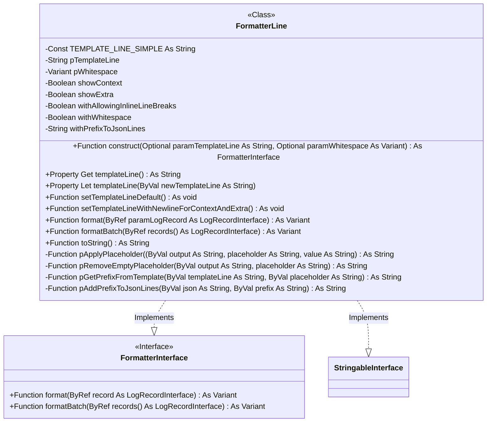
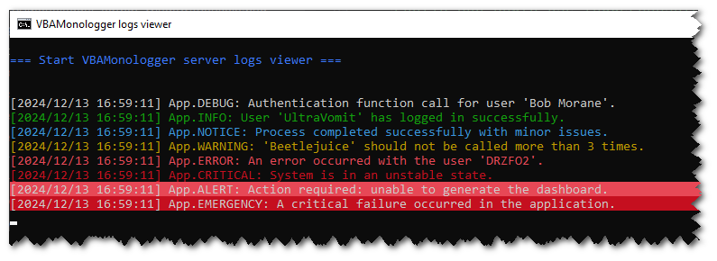
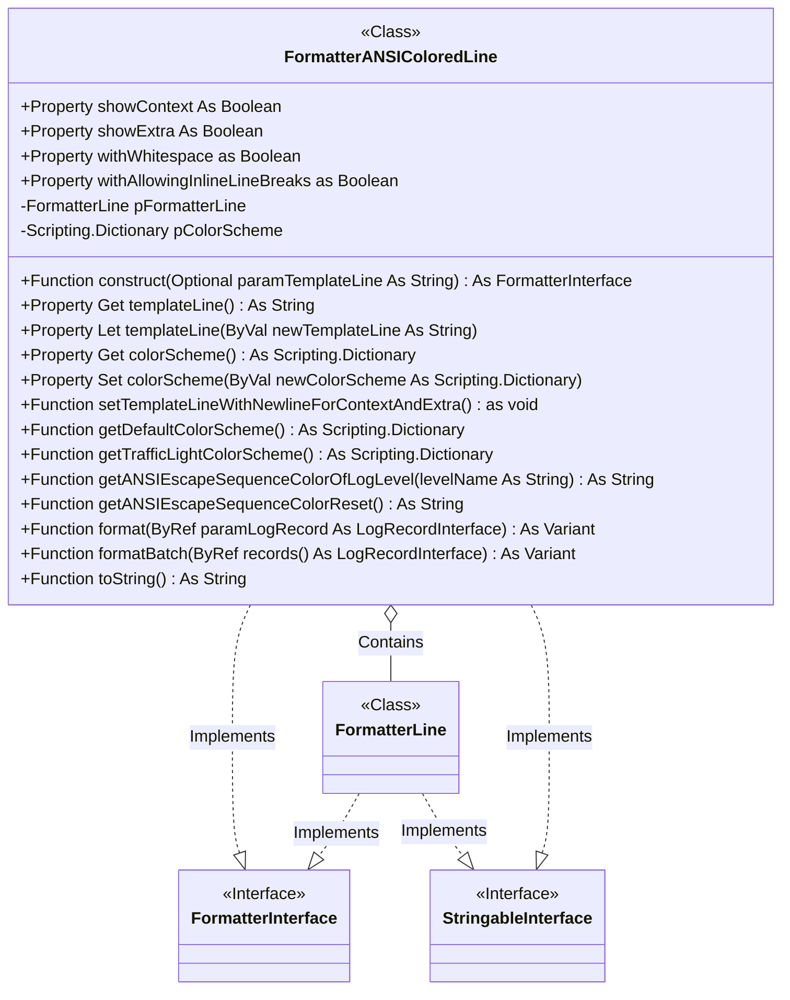
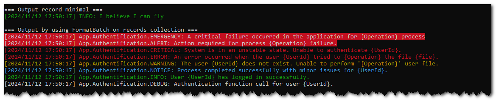

## Concept

A log formatter is used to transform and structure a log record into a readable representation that adheres to a specific format (*e.g.*, text file, JSON, HTML…). 

**VBA Monologger** provides the following formatters:

| Log Formatter              | Description                                                                                                                                                                               |
|----------------------------|-------------------------------------------------------------------------------------------------------------------------------------------------------------------------------------------|
| `FormatterLine`            | The default formatter that represents each log entry on a single line of text.                                                                                                            |
| `FormatterANSIColoredLine` | A version derived from *FormatterLine* that supports color coding each log entry line by using ANSI escape sequences.                                                                     |
| ~~`FormatterJSON`~~        | ~~Formats the logs in JSON. This is the most interoperable format, facilitating integration with external log aggregation and analysis tools (e.g., *ELK stack*).~~ (*not yet available*) |
| ~~`FormatterHTML`~~        | ~~Produces messages in HTML format, typically used when sending logs via email.~~ (*not yet available*)                                                                                   |


## Modeling

Its behavior is defined in the `VBAMonologger.Formatter.FormatterInterface`, which exposes two methods.

``` vbscript
Function format(ByRef record As LogRecordInterface) As Variant
```

This method takes a log record (an instance implementing `LogRecordInterface`) as input and returns a formatted representation of that record. The output can be a string or any other data type, depending on the specific implementation of the formatter. The generated output includes information such as the creation date and time of the record, the channel, log level, message, context, and additional data.

``` vbscript
Function formatBatch(ByRef records() As LogRecordInterface) As Variant
``` 

This method formats an array of log records. It iterates through each record in the array, applies the defined formatting, and returns output that combines all the formatted records.

By providing this interface, it is easy to implement different types of formatters without modifying or intervening in the client code that uses these formatters. New formatters can be added to the system at any time, as long as they adhere to the methods defined in the interface.


## FormatterLine, the default formatter

Let's demonstrate an implementation of `FormatterInterface` with the `FormatterLine` class. It is the default formatter that outputs a log entry as a single-line text representation.




### Creating a line formatter

Here’s how to create a line formatter and use it on log entries.

``` vbscript    
Dim formatter As VBAMonologger.FormatterLine
Set formatter = New VBAMonologger.FormatterLine
Debug.Print formatter.toString

Debug.Print ">>> Output a minimal log record"
Set dummyRecord = dummyRecord.construct( _
  "I believe I can fly!", _
  VBAMonologger.LEVEL_INFO
)
Debug.Print formatter.format(dummyRecord) & vbCrLf
```
``` title="Result"
[VBAMonologger.Formatter.FormatterLine]
| Template line: [{{ datetime }}] {{ channel <./>}}{{ level_name }}: {{ message }}{{< | ctx=/> context }}{{< | extra=/> extra }}
| Show context: True
| Show extra: True

>>> Output a minimal log record
[2024/11/12 16:13:44] INFO: I believe I can fly
```

#### Format a log record with channel

``` vbscript
Debug.Print ">>> Output record with channel name"
Set dummyRecord = dummyRecord.construct( _
  "I believe I can fly!", _
  VBAMonologger.LEVEL_NOTICE, _
  "App" _
)
Debug.Print formatter.format(dummyRecord)
```
``` title="Result"
>>> Output record with channel name
[2024/11/12 16:13:44] App.NOTICE: I believe I can fly
```

#### Format a log record with context and extra metadata

``` vbscript
Debug.Print ">>> Output log record with context and extra metadatas"
Set dummyRecord = dummyRecord.construct( _
  "I believe I can fly!", _
  VBAMonologger.LEVEL_NOTICE, _
  "App.Authentification", _
  logContext, _
  logExtra
)
Debug.Print formatter.format(dummyRecord)
```
``` title="Result"
>>> Output log record with context and extra metadatas
[2024/11/12 16:13:44] App.Authentification.EMERGENCY: A critical failure occurred in the application | ctx={"UserName":"v20100v","UserID":25508,"Operation":"Create"} | extra={"ExecutionTime":"3,9127 seconds"}
```


#### Batch log management

This class also supports batch processing of multiple log entries, according to the implementation of the interface `VBAMonologger.Formatter.FormatterInterface`. The `formatBatch` method allows you to format a series of log records and concatenate them into a single string, which is useful when you want to display or save multiple logs at once.


### Customizing the line template

The `FormatterLine` uses a **line template**, as a string, in order to format each log entry. It uses regular expressions to handle placeholders within the line template, allowing them to be defined with prefixes and suffixes to modify their final output. This template defines the representation of a log entry, with **line placeholders** that will be replaced by actual values from the log record. Please note, this is unrelated to the preprocessors placeholders. It's a different templating engine.

A prefix text can be added before the placeholder’s value, and also a suffix text can be added after the placeholder's value. If a placeholder has no value, then the prefix and postfix are not displayed in the final output. Here’s how a placeholder can be structured in the template:

```twig
{{ <prefix/> placeholder <suffix/> }}
```

The line formatter provides two lines templates:

 - **A default line template**, enable by default or by `formatter.setTemplateLineDefault()` method. It looks like the following:
   ``` twig title="Default line template"
   [{{ datetime }}] {{ channel <./>}}{{ level_name }}: {{ message }}{{< | context: /> context }}{{< | extra: /> extra }}
   ```

 - **And a line template with newline for log context and extra**, that you can enable it with the method `formatter.setTemplateLineWithNewlineForContextAndExtra()`
    ``` twig title="Line template with new line for data context and extra"
    [{{ datetime }}] {{ channel <./>}}{{ level_name }}: {{ message }}{{<\n | context: /> context }}{{<\n | extra: /> extra }}
    ```


#### Available placeholders

These placeholders include:

| Placeholder&nbsp;&nbsp;&nbsp;&nbsp;&nbsp;&nbsp;&nbsp;&nbsp;&nbsp;&nbsp;&nbsp;&nbsp;&nbsp; | Description                                                                                                                                 |
|-------------------------------------------------------------------------------------------|---------------------------------------------------------------------------------------------------------------------------------------------|
| `{{datetime}}`                                                                            | The date and time of the log entry.                                                                                                         |
| `{{channel}}`                                                                             | The channel (or source) from which the log originates.                                                                                      |
| `{{level_name}}`                                                                          | The log level (*e.g.*, `INFO`, `ERROR`, `DEBUG` ...).                                                                                       |
| `{{message}}`                                                                             | The main log message.                                                                                                                       |
| `{{context}}`                                                                             | The log context data. This includes arbitrary key-value pairs.                                                                              |
| `{{extra}}`                                                                               | Extra metadata or custom information attached to the log entry. This includes arbitrary key-value pairs, typically added by pre-processors. |

So you can customize the template to fit your needs. 

For example, if you prefer a simpler format or want to add additional information, you can easily adjust the template using the templateLine property. This provides flexibility in defining the exact format of your logs, whether for console output or a log file.

#### Changing the line template

To change the template line just set the property `templateLine`. With this line template, it will produce new output:

```vbscript
Set formatter = New VBAMonologger.FormatterLine
formatter.templateLine = _ 
   "{{datetime}} | {{ channel }} | {{ level_name }} | {{ message }}"
```

``` title='Result with new template'
>>> Output minimal log record 
2024/11/12 16:11:24 | | NOTICE | I believe I can fly

>>> Output record with channel name
2024/11/12 16:13:44 | App | NOTICE | I believe I can fly
```

As tou can see, when the log record have not chanel value, we would to not have the '|' character. To hide it, in this case, we need to use prefixes and suffixes placeholder.


#### Using prefix and suffix of placeholders

This formatting system uses regular expressions to handle placeholders within the log template, allowing them to be defined with *prefixes* and *suffixes* to modify their final output. 

Here’s how a placeholder can be structured in the template:

``` twig
{{ <prefix/> placeholder <suffix/> }}
```

The prefix text is added before the placeholder’s value, and the suffixe text is added after the placeholder's value. And if a placeholder has no value, then the prefix and postfix are not displayed in the final output. 

For example, using this new line template with prefix and suffix on `{{ channel }}` placeholder. With this new line template, it will produce new output.

```vbscript
Set formatter = New VBAMonologger.FormatterLine

formatter.templateLine = "{{datetime}} | {{ <Chanel:/>channel< | /> }}{{ level_name }} | {{ message }}{{< | ctx: /> context}}{{< | extra: /> extra < |/> }}"
```

``` title='Result'
>>> Output minimal log record 
2024/11/12 16:11:24 | NOTICE | I believe I can fly

>>> Output record with channel name
2024/11/12 16:13:44 | Channel: App | NOTICE | I believe I can fly
```

Indeed, in this example, if the log entry does not contain a value for the `{{channel}}` placeholder, so the prefix `"Channel:"` and the suffix `" | "` associated will not appear in the final output. This behavior ensures that the log formatting remains clean and consistent, without unnecessary or empty placeholders cluttering the output when no value is provided for them.


#### Show or hide log context and extra metadata

Logs can include context information (such as data specific to the execution of a process) and additional metadata. The `FormatterLine` class allows you to control the display of this data using the `showContext` and `showExtra` properties. 

By default, these properties are set to `True`, but you can hide them by setting the properties to `False`.

```vbscript    
Set formatter = New VBAMonologger.FormatterLine

formatter.showContext = False
formatter.showExtra = False
```


#### Beautify representation of log context and extra (whitespace)

Here's an example demonstrating how to beautify the representation of log context and extra data. The code below sets up a formatter to include newlines for log context and extra metadata, allowing for a more readable log output. This setup is particularly useful during the development phase for debugging, as it makes log outputs more readable and easier to analyze.

```vbscript
Set formatter = New VBAMonologger.FormatterLine

formatter.setTemplateLineWithNewlineForContextAndExtra
formatter.withWhitespace = True
formatter.withAllowingInlineLineBreaks = True
formatter.withPrefixToJsonLines = " | "

Debug.Print ">>> Output log record with context and extra metadatas"
Set dummyRecord = dummyRecord.construct( _
  "I believe I can fly!", _
  VBAMonologger.LEVEL_NOTICE, _
  "App", _
  logContext, _
  logExtra
)
Debug.Print formatter.format(dummyRecord)
```

``` title='Result'
>>> Output log record with context and extra metadatas
[2024/11/12 16:13:44] App.NOTICE: I believe I can fly!
 | context: 
 | { 
 |    "UserName":"v20100v",
 |    "UserID":25508,
 |    "Operation":"Create"
 | } 
 | extra: 
 | {
 |     "ExecutionTime":"3,9127 seconds"
 | }
```

## Add colors support with FormatterANSIColoredLine

The main purpose of `FormatterANSIColoredLine` is to augment FormatterLine by adding color support. It formats log messages by converting them into text strings using the templating model provided by `FormatterLine`, while applying ANSI escape sequences for coloring the messages in terminals based on the log level. 

It enables the customization of log display by assigning specific colors to each log level through a configurable color palette.




### Not through inheritance, but by composing with FormatterLine

As VBA does not support inheritance, the `FormatterANSIColoredLine` class is composed of an instance of `FormatterLine`, granting access to the same methods. It also includes a `colorScheme` dictionary to specify the colors.



The use of this formatter is similar to that of `FormatterLine`. You can change the line template, show or hide log context and extra pre-processors metadata.

```vbscript
Dim formatterWithColor As VBAMonologger.formatterANSIColoredLine
Set formatterWithColor = New VBAMonologger.formatterANSIColoredLine
formatterWithColor.showContext = false
formatterWithColor.showExtra = false
Debug.Print formatterWithColor.toString

Debug.Print "=== Output record minimal ==="
Dim record As VBAMonologger.LogRecord
Set record = New VBAMonologger.LogRecord
Set record = record.construct( _
    "I believe I can fly", _
    VBAMonologger.LEVEL_INFO _
)
Debug.Print formatterWithColor.format(record) & vbCrLf

Debug.Print "=== Output by using FormatBatch on records collection ==="
Dim records() As VBAMonologger.LogRecordInterface
ReDim records(1 To 8)
records = randomLogRecordsForEachLevel
Debug.Print formatterWithColor.formatBatch(records) & vbCrLf
```

``` title="Result"
[VBAMonologger.Formatter.FormatterAnsiColoredLine]
| Template line: [{{ datetime }}] {{ channel <./>}}{{ level_name }}: {{ message }}{{< | ctx=/> context }}{{< | extra=/> extra }}
| Show context: False
| Show extra: False
| Color sheme:
| {
|   "DEBUG": "\u001B[37m",
|   "INFO": "\u001B[32m",
|   "NOTICE": "\u001B[36m",
|   "WARNING": "\u001B[33m",
|   "ERROR": "\u001B[31m",
|   "CRITICAL": "\u001B[31;4m",
|   "ALERT": "\u001B[37;41m",
|   "EMERGENCY": "\u001B[41;37;5m",
|   "RESET": "\u001B[0m"
| }

=== Output record minimal ===
[2024/11/12 17:50:17] INFO: I believe I can fly

=== Output by using FormatBatch on records collection ===
[2024/11/12 17:50:17] App.Authentification.EMERGENCY: A critical failure occurred in the application for {Operation} process
[2024/11/12 17:50:17] App.Authentification.ALERT: Action required for process {Operation} failure.
[2024/11/12 17:50:17] App.Authentification.CRITICAL: System is in an unstable state. Unable to authenticate {UserId}.
[2024/11/12 17:50:17] App.Authentification.ERROR: An error occurred when the user {UserId} try to {Operation} the file {file}.
[2024/11/12 17:50:17] App.Authentification.WARNING: The user {UserId} does not exist. Unable to perform '{Operation}' user file.
[2024/11/12 17:50:17] App.Authentification.NOTICE: Process completed successfully with minor issues for {UserId}.
[2024/11/12 17:50:17] App.Authentification.INFO: User {UserId} has logged in successfully.
[2024/11/12 17:50:17] App.Authentification.DEBUG: Authentification function call for user {UserId}.
```

As you can see, each log entry is properly wrapped in an ANSI escape sequence to apply color. However, the VBA console does not support displaying these escape ANSI sequences, so you would need to view these messages in a compatible console that supports ANSI color codes. You should see the following result:




### Customizing the color scheme

To change the color scheme, all you need to do is create a dictionary and assign a color to each log level. This allows you to customize the colors for different severity levels, such as "DEBUG," "INFO," "ERROR," and so on. The dictionary maps each log level to a specific ANSI color code, enabling you to control the appearance of each type of log message when displayed in a terminal or compatible environment.

By updating the dictionary, you can easily modify the color scheme without altering the underlying code logic, providing flexibility in how the logs are visually represented.

```vbscript
Public Function getCustomColorScheme() As Scripting.Dictionary
   Dim colorScheme As Scripting.Dictionary
   Set colorScheme = New Scripting.Dictionary
   colorScheme.Add "DEBUG", Chr$(27) & "[2;32m" ' FG Green faint
   colorScheme.Add "INFO", Chr$(27) & "[32m" ' FG Green normal
   colorScheme.Add "NOTICE", Chr$(27) & "[1;32m" ' FG Green bright
   colorScheme.Add "WARNING", Chr$(27) & "[2;33m" ' FG Yellow faint
   colorScheme.Add "ERROR", Chr$(27) & "[33m" ' FG Yellow normal
   colorScheme.Add "CRITICAL", Chr$(27) & "[31m" ' FG Red normal
   colorScheme.Add "ALERT", Chr$(27) & "[1;31m" ' FG Red bright
   colorScheme.Add "EMERGENCY", Chr$(27) & "[41;37;5m"
   colorScheme.Add "RESET", Chr$(27) & "[0m"
   
   Set getCustomColorScheme = colorScheme
End Function

Dim formatterAnsiColoredLine As VBAMonologger.formatterAnsiColoredLine
Set formatterAnsiColoredLine = New VBAMonologger.formatterAnsiColoredLine
Set formatterAnsiColoredLine.colorScheme = getCustomColorScheme
formatterAnsiColoredLine.showContext = False
formatterAnsiColoredLine.showExtra = False
```


To get an ANSI sequence color, you can also use the `VBAMonologger.ANSI` module. It provides various ANSI escape sequences to colorize your text output. You can combine styles using the "&" operator. For example to get a bright red background with white foreground text, use the following: `VBAMonologger.ANSI.BG_BRIGHT_RED & VBAMonologger.ANSI.WHITE`.

Here’s an example of how to create a custom color scheme:

```
Public Function getCustomColorScheme() As Scripting.Dictionary
   Dim colorScheme As Scripting.Dictionary
   Set colorScheme = New Scripting.Dictionary
   colorScheme.Add "DEBUG", VBAMonologger.ANSI.WHITE
   colorScheme.Add "INFO", VBAMonologger.ANSI.GREEN
   colorScheme.Add "NOTICE", VBAMonologger.ANSI.CYAN
   colorScheme.Add "WARNING", VBAMonologger.ANSI.YELLOW
   colorScheme.Add "ERROR", VBAMonologger.ANSI.BRIGHT_RED
   colorScheme.Add "CRITICAL", VBAMonologger.ANSI.RED
   colorScheme.Add "ALERT", _ 
      VBAMonologger.ANSI.BG_BRIGHT_RED & VBAMonologger.ANSI.WHITE
   colorScheme.Add "EMERGENCY", _ 
      VBAMonologger.ANSI.BG_RED & VBAMonologger.ANSI.WHITE
  
   Set getCustomColorScheme = colorScheme
End Function
```

### Available ANSI sequence colors

The `VBAMonologger.ANSI` module provides a variety of ANSI escape sequences for styling text. 

Here’s a list of the available sequences:

| **Function Name**     | **Description**                               |
|-----------------------|-----------------------------------------------|
| `RESET`               | Reset all attributes                          |
| `BOLD`                | Bold text style                               |
| `WEAK`                | Weak (dim) text style                         |
| `UNDERLINE`           | Underline text                                |
| `BLINK`               | Blink text                                    |
| `REVERSE`             | Reverse foreground and background colors      |
| `HIDDEN`              | Hidden text                                   |
| `BLACK`               | Black foreground color                        |
| `RED`                 | Red foreground color                          |
| `GREEN`               | Green foreground color                        |
| `YELLOW`              | Yellow foreground color                       |
| `BLUE`                | Blue foreground color                         |
| `MAGENTA`             | Magenta foreground color                      |
| `CYAN`                | Cyan foreground color                         |
| `WHITE`               | White foreground color                        |
| `BRIGHT_BLACK`        | Bright black foreground color                 |
| `BRIGHT_RED`          | Bright red foreground color                   |
| `BRIGHT_GREEN`        | Bright green foreground color                 |
| `BRIGHT_YELLOW`       | Bright yellow foreground color                |
| `BRIGHT_BLUE`         | Bright blue foreground color                  |
| `BRIGHT_MAGENTA`      | Bright magenta foreground color               |
| `BRIGHT_CYAN`         | Bright cyan foreground color                  |
| `BRIGHT_WHITE`        | Bright white foreground color                 |
| `BG_BLACK`            | Black background color                        |
| `BG_RED`              | Red background color                          |
| `BG_GREEN`            | Green background color                        |
| `BG_YELLOW`           | Yellow background color                       |
| `BG_BLUE`             | Blue background color                         |
| `BG_MAGENTA`          | Magenta background color                      |
| `BG_CYAN`             | Cyan background color                         |
| `BG_WHITE`            | White background color                        |
| `BG_BRIGHT_BLACK`     | Bright black background color                 |
| `BG_BRIGHT_RED`       | Bright red background color                   |
| `BG_BRIGHT_GREEN`     | Bright green background color                 |
| `BG_BRIGHT_YELLOW`    | Bright yellow background color                |
| `BG_BRIGHT_BLUE`      | Bright blue background color                  |
| `BG_BRIGHT_MAGENTA`   | Bright magenta background color               |
| `BG_BRIGHT_CYAN`      | Bright cyan background color                  |
| `BG_BRIGHT_WHITE`     | Bright white background color                 |

Enjoy the ... colors!