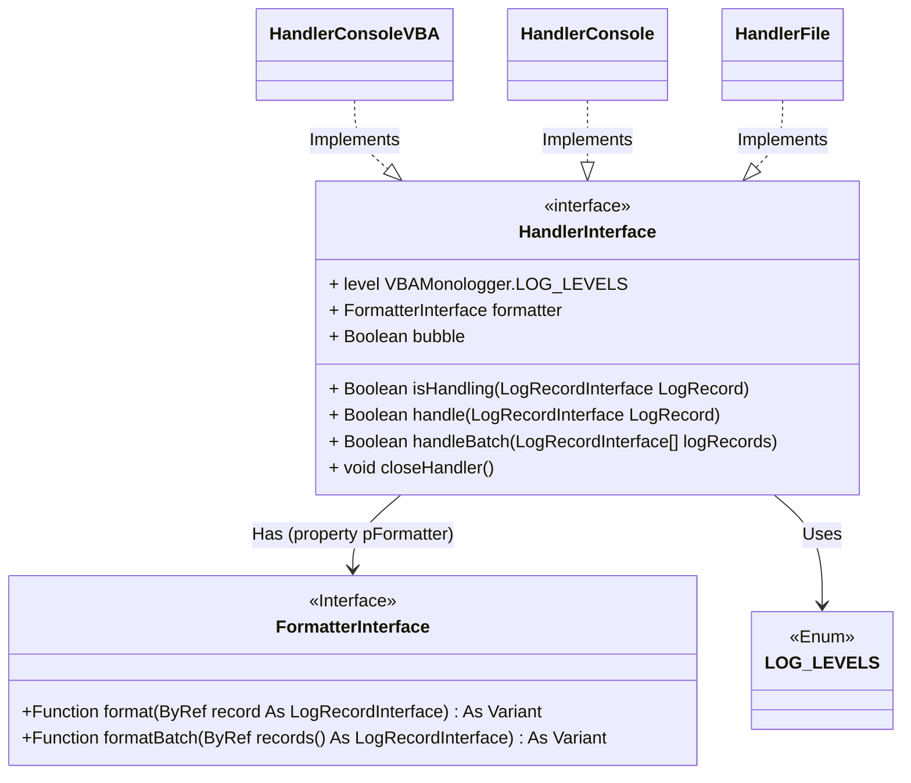
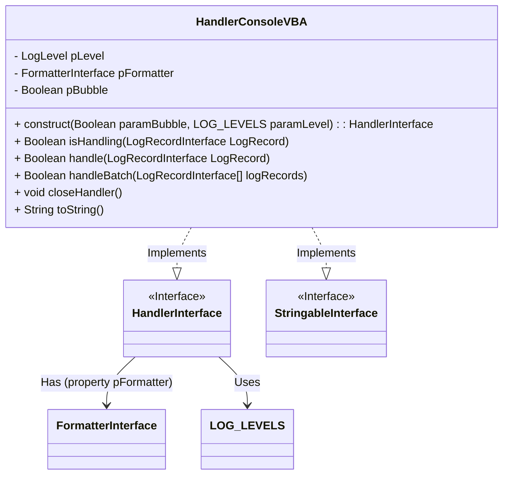
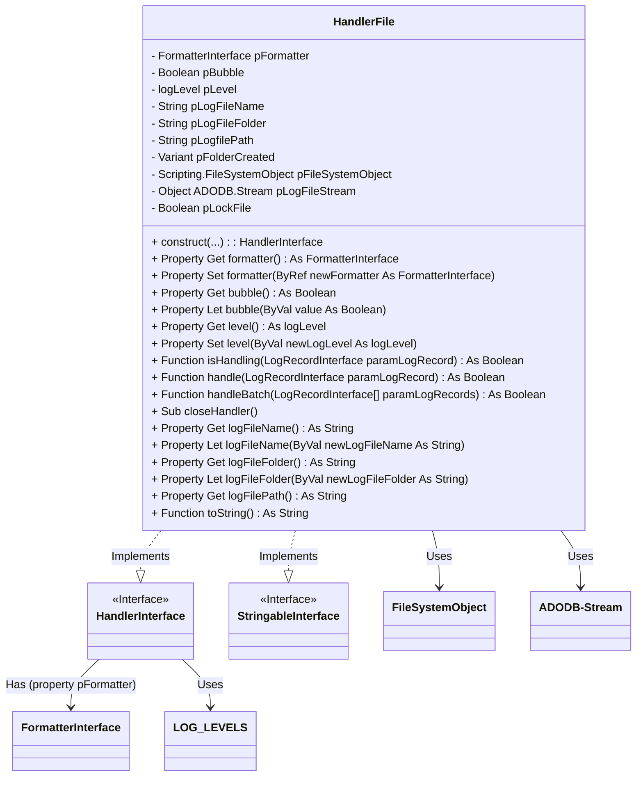
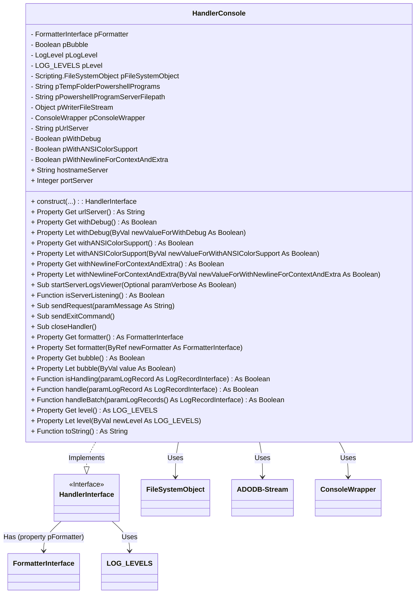
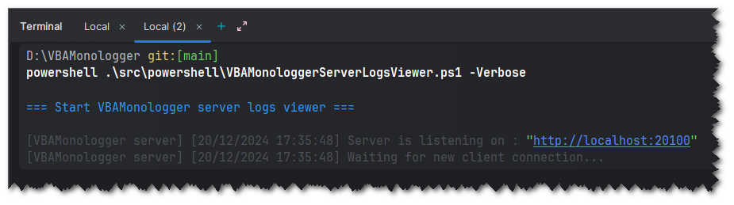
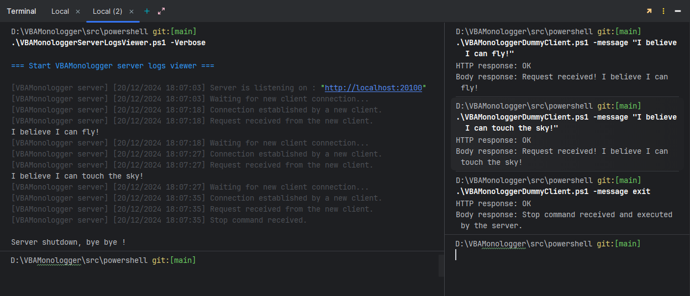
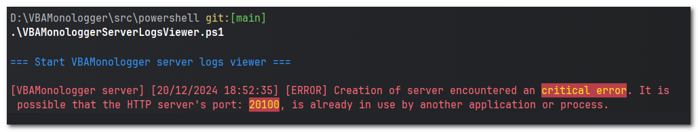

## Concept

A log handler is the key component responsible for processing each log entry. When a log message is generated, it is not simply recorded; it must be directed to a location where it can be viewed and used. This is where the handler comes in, determining where and how each log entry will be sent or saved. 

A log handler is responsible for directing log messages to specific outputs, such as file, console or database , and based on the log level and other configuration settings like bubble propagation.

## Modeling

The interface `VBAMonologger.Handler.HandlerInterface` defines the standard behavior that all handler implementations must follow. 

It provides a standardized, modular way to add various logging handlers without needing to change client code. By implementing this interface, different handlers can easily be added to support new output targets or custom logging behavior as needed. Handlers can be configured independently with custom formatters, levels, and bubbling behavior, offering fine-grained control over how and where logs are managed.



This interface specifies the necessary properties and methods to control how and where log records are processed, and it provides the following members.

``` vbscript
Public level As VBAMonologger.LOG_LEVELS
```
Determines the current log level of handler. This property sets the minimum log level required for the handler to process a log entry. Only messages at or above this level are handled, allowing for filtering of log messages based on severity (e.g., DEBUG, INFO, ERROR).

```vbscript
Public Property bubble As Boolean
```
Determines whether, or not, the log record should "bubble up" to other handlers in the stack after being processed by the current handler.

When you have multiple handlers in the stack of your logger, and want a specific handler to be the only one processing certain log levels or messages, you have to set bubble to false for that handler. This is useful if you need specific messages to go only to a certain location.
 - If bubble is set to `true` (the default), the log record will be processed by the current handler and continue to "bubble up" to other handlers in the stack. This allows multiple handlers to process the same log message.
 - If bubble is set to `false`, the log record will stop propagating after being processed by the current handler. This essentially "catches" the record, preventing it from being handled by other handlers in the stack.
 
``` vbscript
Public Property formatter As FormatterInterface
```
Specifies the formatter associated with the handler, defining how each log record will be structured and formatted before output. This allows for flexible formatting (e.g., plain text, JSON) based on the formatter assigned to the handler.

``` vbscript
Function isHandling(ByRef logRecord As LogRecordInterface) As Boolean
```
Provides a way for handlers to filter log messages. This ensures that a handler only processes messages that are relevant to it, which can improve performance and reduce unnecessary processing. It returns true if the handler is capable of processing the  log message and false if the handler should not process the log message. This function evaluates if the handler is set to process the given log record based on the log level and other criteria. It returns `True` if the handler should handle the record, or `False` if it should be ignored.

``` vbscript
Function handle(ByRef logRecord As LogRecordInterface) As Boolean
```
All records may be passed to this method, and the handler should discard those that it does not want to handle. The return value of this function controls the bubbling process of the handler stack. Unless the bubbling is interrupted (by returning true), the Logger class will keep on calling further handlers in the stack with a given log record. If the handler can process the record (based on `isHandling`), it outputs the formatted log message to its designated destination (e.g., console, file). It returns a Boolean value to control the record's propagation through additional handlers, based on the `bubble` property.

``` vbscript
Function handleBatch(ByRef logRecords() As LogRecordInterface) As Boolean
```
This method handles an array of log records at once, processing each record in sequence. It provides an efficient way to process bulk log entries, making it ideal for scenarios where multiple messages need to be logged simultaneously.

 
``` vbscript
Sub closeHandler()
```
This method releases any resources or open connections the handler may use (e.g., closing file handles or flushing data). It ensures a proper shutdown of the logging cycle and frees up resources when logging is complete.


## HandlerConsoleVBA

The `VBAMonologger.Handler.HandlerConsoleVBA` class is responsible for directing log messages into the VBA Console (i.e. the Immediate window in Excel). 



### Creating a new `HandlerConsoleVBA`

Below is an example of how to create an instance of handler console VBA.

```vbscript
Dim handlerConsole As VBAMonologger.HandlerInterface
Set handlerConsole = New VBAMonologger.HandlerConsoleVBA
Debug.Print handlerConsole.toString

Debug.Print "=== Handle a log record with HandlerConsoleVBA ==="
Dim record As VBAMonologger.LogRecord
Set record = New VBAMonologger.LogRecord
Set record = record.construct( _
    "Process completed successfully with minor issues for user.", _
    VBAMonologger.LEVEL_INFO, _
    "App"
)

Dim isHandling As Boolean
isHandling = handlerConsole.isHandling(record)
Debug.Print ">>> Result of handlerConsole.isHandling(record): " & isHandling
Debug.Print ">>> Result of handlerConsole.handle(record): "
handlerConsole.handle record
```

``` title="Result"
[VBAMonologger.Handler.HandlerConsoleVBA]
 | level: DEBUG
 | bubble: true

=== Handle a log record with HandlerConsoleVBA ===
>>> Result of handler.isHandling(dummyRecord): True
>>> Result of handler.handle(dummyRecord): 
[2024/11/13 10:42:03] App.INFO: Process completed successfully with minor issues for user.
```

### Changing the formatter of handler

The `HandlerConsoleVBA` class leverages a `FormatterInterface` to define the structure and appearance of each log entry, ensuring a specific, consistent format that makes log messages easier to read and understand in the console. 

By default, `HandlerConsoleVBA` uses the `FormatterLine` implementation of the `FormatterInterface`, which outputs each log entry in a simple, line-based format optimized for console viewing. Additionally, `HandlerConsoleVBA` is set with a default log level of `DEBUG`.

```vbscript
Dim handler As VBAMonologger.HandlerConsoleVBA
Set handler = New VBAMonologger.HandlerConsoleVBA

Dim formatterLine As VBAMonologger.FormatterLine
Set formatterLine = New VBAMonologger.FormatterLine
formatterLine.showContext = False
formatterLine.showExtra = False
Set handler.formatter = formatterLine

Debug.Print "=== Handle a collection of log records with default log level "DEBUG" ==="
Debug.Print handler.toString
Debug.Print ">>> Result of handler.handleBatch(records): "
handler.handleBatch randomLogRecordsForEachLevel
    
Debug.Print "=== Change level of handler to CRITICAL ==="
handler.level.currentLogLevel = VBAMonologger.LOG_LEVELS.LEVEL_CRITICAL
Debug.Print handler.toString
Debug.Print ">>> Result of handler.handleBatch(records): "
handler.handleBatch randomLogRecordsForEachLevel
```

``` title="Result"
=== Handle a collection of log records with default log level "DEBUG" ===

[VBAMonologger.Handler.HandlerConsoleVBA]
 | level: DEBUG
 | bubble: true
 
 >>> Result of handler.handleBatch(records): 
[2024/11/13 10:42:03] App.Authentification.EMERGENCY: A critical failure occurred in the application for {Operation} process
[2024/11/13 10:42:03] App.Authentification.ALERT: Action required for process {Operation} failure.
[2024/11/13 10:42:03] App.Authentification.CRITICAL: System is in an unstable state. Unable to authenticate {UserId}.
[2024/11/13 10:42:03] App.Authentification.ERROR: An error occurred when the user {UserId} try to {Operation} the file {file}. 
[2024/11/13 10:42:03] App.Authentification.WARNING: The user {UserId} does not exist. Unable to perform '{Operation}' user file. 
[2024/11/13 10:42:03] App.Authentification.NOTICE: Process completed successfully with minor issues for {UserId}. 
[2024/11/13 10:42:03] App.Authentification.INFO: User {UserId} has logged in successfully.
[2024/11/13 10:42:03] App.Authentification.DEBUG: Authentification function call for user {UserId}. 

=== Change level of handler to "CRITICAL" === 

[VBAMonologger.Handler.HandlerConsoleVBA]
 | level: CRITICAL
 | bubble: true
 
>>> Result of handler.handleBatch(records):
[2024/11/13 10:42:03] App.Authentification.EMERGENCY: A critical failure occurred in the application for {Operation} process
[2024/11/13 10:42:03] App.Authentification.ALERT: Action required for process {Operation} failure.
[2024/11/13 10:42:03] App.Authentification.CRITICAL: System is in an unstable state. Unable to authenticate {UserId}.
```

In the example above, the `HandlerConsoleVBA` object is first instantiated and configured to display logs in the VBA console using a custom formatter, where the `showContext` and `showExtra` options are disabled. This means that contextual and additional information will be excluded from the output.

Next, `handlerConsole` processes a set of log messages covering all severity levels (from DEBUG to EMERGENCY). Since the default log level is set to `DEBUG`, all log entries are displayed in the console.

In the second part of the example, the log level of `handlerConsole` is changed to `CRITICAL`, meaning that only messages with a `CRITICAL` severity level or higher (such as ALERT and EMERGENCY) will be displayed. As a result, entries with lower severity levels (ERROR, WARNING, etc.) are excluded and do not appear in the output.


## HandlerFile

The `VBAMonologger.Handler.HandlerFile` class is responsible for managing and logging messages to a file. This class implements the `VBAMonologger.Handler.HandlerInterface`, which specifies the methods and properties that a logging handler must provide.



We have several members that are used to configure and manage the handler log file:

| **Property**        | **Description**                                                                                                                  |
|---------------------|----------------------------------------------------------------------------------------------------------------------------------|
| `logFileName`       | The name of the log file. This name can be customized.                                                                           |
| `logFileFolder`     | To retrieve and set the folder where the log file will be stored.                                                                |
| `logFilePath`       | To get the full path to the log file, built by concatenation of  `logFileFolder` with `logFileName`.                             |
| `pFolderCreated`    | *(Private)* To showing whether the log folder has been successfully created.                                                     |
| `pFileSystemObject` | *(Private)* An object of `FileSystemObject` used to interact with the file system (for creating folders and manipulating files). |
| `pLogFileStream`    | *(Private)* An object of `ADODB.Stream` used to manage the stream for writing to the log file in UTF-8.                          |
| `pLockFile`         | *(Private)* An indicator for locking the file, used to control concurrent access to the log file.                                | |


### Creating a new `HandlerFile`

Here’s how to create a new instance of `HandlerFile` and handle log records.

```vbscript
Dim handlerFile As VBAMonologger.HandlerFile
Set handlerFile = New VBAMonologger.HandlerFile
Debug.Print handlerFile.toString

' Change the default formatter to a ANSI colored line formatter 
Dim formatterAnsiColoredLine As VBAMonologger.formatterAnsiColoredLine
Set formatterAnsiColoredLine = New VBAMonologger.formatterAnsiColoredLine
Set handlerFile.formatter = formatterAnsiColoredLine

' Change the default log level of handler to `ERROR`
handlerFile.level.currentLogLevel = VBAMonologger.LOG_LEVELS.LEVEL_ERROR

' Handle a log record with HandlerFile
Dim record As VBAMonologger.LogRecord
Set record = New VBAMonologger.LogRecord
Set record = record.construct( _
    "Process completed successfully with minor issues for user.", _
    VBAMonologger.LEVEL_INFO, _
    "App"
)
Dim isHandling As Boolean
Dim resultHandle As Boolean
isHandling = handlerFile.isHandling(record)
resultHandle = handlerFile.handle(record)

' Close the handler   
handlerFile.closeHandler
```

``` title="Result"
[VBAMonologger.Handler.HandlerFile]
 | logFileName: vbalogfile_2024-11-13.log
 | logfilePath: D:\VBAMonologger\var\log\vbalogfile_2024-11-13.log
 | logFileFolder: D:\VBAMonologger\var\log
```

You can open the logfile to view the entry records written in it.


### Supporting UTF-8 

In VBA, a text file can be created using the native `Open` and `Print #` methods or the `FileSystemObject`. The `Open` method allows you to open a file for writing, and if the file doesn’t exist, it will be created. However, by default, text is written using **ANSI** encoding, which is based on the system's language and regional settings (often **Windows-1252** for English or French systems). This encoding does not support non-Latin characters and may cause issues when the file is opened on systems with different encodings.

To ensure compatibility with special and multilingual characters in this `HandlerFile`, the **UTF-8** encoding is preferred. This can be achieved by using the `ADODB.Stream` object, which allows you to specify the desired encoding when writing to the file. The `ADODB.Stream` object is designed to handle data streams, making it ideal for both text and binary file operations. By using UTF-8, the log file can store data in multiple languages and special characters without any loss or corruption of information, unlike with other encodings.

!!! info "Can I change the encoding?"
    No! For now, there is no plan to provide an option to change the default UTF-8 encoding.


### Modifying the name and destination of the log file

Here’s how you can modify the log file and its destination folder.

```vbscript
Dim handlerFile As VBAMonologger.HandlerFile
Set handlerFile = New VBAMonologger.HandlerFile
    
Debug.Print "=== Change the logfile name ==="
handlerFile.logFileName = "Amazing-log-file-name.log"
Debug.Print handlerFile.toString
    
Debug.Print "=== Change the logfile folder ==="
handlerFile.logFileFolder = VBA.Environ$("USERPROFILE") & "\VBAMonologger\logs"
Debug.Print handlerFile.toString
    
Debug.Print "=== Initialize handlerFile with custom logfile name and folder ==="
Set handlerFile = handlerFile.construct( _
  paramLogFileName:="vba-log-file___" & format(Now, "yyyy-mm-dd") & ".log", _
  paramLogFileFolder:=ThisWorkbook.Path & "\var\log" _
)
Debug.Print handlerFile.toString
```

``` title="Result"
=== Change the logfile name ===
[VBAMonologger.Handler.HandlerFile]
 | logFileName: Amazing-log-file-name.log
 | logfilePath: D:\VBAMonologger\src\var\log\Amazing-log-file-name.log
 | logFileFolder: D:\VBAMonologger\src\var\log

=== Change the logfile folder ===
[VBAMonologger.Handler.HandlerFile]
 | logFileName: Amazing-log-file-name.log
 | logfilePath: C:\Users\vblain\VBAMonologger\logs\Amazing-log-file-name.log
 | logFileFolder: C:\Users\vblain\VBAMonologger\logs

=== Initialize handlerFile with custom logfile name and folder ===
[VBAMonologger.Handler.HandlerFile]
 | logFileName: vba-log-file___2024-11-13.log
 | logfilePath: D:\VBAMonologger\src\var\log\vba-log-file___2024-11-13.log
 | logFileFolder: D:\VBAMonologger\src\var\log
```


## HandlerConsole

The handler `VBAMonologger.HandlerConsole` streams log messages to the Windows console (cmd.exe) by employing an HTTP-based client/server architecture. 

The client sends log records as HTTP POST requests to the server. The server processes these requests and displays the log messages directly in the console output. This handler features a formatter that supports ANSI colors with `VBAMonologger.Formatter.FormatterANSIcoloredLine`.





### VBAMonologger HTTP client

The client implementation resides in the `sendRequest` method of the `HandlerConsole` class. 

This VBA client is initialized using `CreateObject("MSXML2.XMLHTTP")`, which is a common method for making HTTP requests in VBA.

```vbscript title="VBAMonologger.Handler.HandlerConsole.sendRequest()"
Public Sub sendRequest(paramMessage As String)
    Dim http As Object
    Dim message As String

    ' Try to connect to VBAMonologger HTTP server logs viewer
    If withDebug Then Debug.Print "[DEBUG] HandlerConsole::sendRequest | Try to send request to VBAMonologger server on: " & urlServer
    Set http = CreateObject("MSXML2.XMLHTTP")
    http.Open "POST", urlServer, False ' False = Request should be handled synchronously
    
    ' Send request to server
    http.setRequestHeader "Content-Type", "application/x-www-form-urlencoded"
    http.setRequestHeader "User-Agent", "VBAMonologger VBA client"
    http.setRequestHeader "Cache-Control", "no-cache"
    http.setRequestHeader "Connection", "keep-alive"
    http.send paramMessage
    If withDebug Then Debug.Print "[DEBUG] HandlerConsole::sendRequest | The request was sent to the server with body message: """ & paramMessage & """"
    
    ' Received and read the response's server
    Dim responseBody As String
    Dim responseCode As Integer
    responseBody = http.responseText
    responseCode = http.Status
    If withDebug Then
        Select Case responseCode
            Case 200
                Debug.Print "[DEBUG] HandlerConsole::sendRequest | The server has responded successfully (200 - OK): " & responseBody
            Case 404
                Debug.Print "[DEBUG] HandlerConsole::sendRequest | The server responded an error (404 - resource not found)."
            Case Else
                Debug.Print "[DEBUG] HandlerConsole::sendRequest | Unexpected server response with HTTP code: " & responseCode & " and body response: " & responseBody
        End Select
    End If
    
    If responseCode <> 200 Then
        Err.Raise vbObjectError + 1000, "VBAMonologger.Handler.HandlerConsole::sendRequest", "Unexpected server response with HTTP code: " & responseCode & " and body response: " & responseBody
    End If
End Sub
```

The handler does nothing more than sending an HTTP request with the formatted log record into message to the VBAMonologger server logs viewer, in order to display it in console.

```vbscript title="VBAMonologger.Handler.HandlerConsole.handle()"
Private Function HandlerInterface_handle(paramLogRecord As LogRecordInterface) As Boolean
    Dim result As Boolean
    If Not HandlerInterface_isHandling(paramLogRecord) Then
        result = False
    Else
        Dim formattedMessage As String
        formattedMessage = VBA.CStr$(pformatter.format(paramLogRecord))
        formattedMessage = VBA.Replace$(formattedMessage, "\n", vbCrLf)
        
        ' Call VBAMonologger client logs sender in order to send a request to VBAMonologger server logs viewer (i.e. send a message to show into server's output)
        Call sendRequest(formattedMessage)
        result = True
    End If
    result = (True = pBubble)
    
    HandlerInterface_handle = result
End Function
```


### VBAMonologger HTTP server logs viewer

#### Testing the server manually in powershell

For those interested in testing the PowerShell server, you can easily start it manually with a simple command. Notes, that you can modify the server's hostname and port using the corresponding parameters.

```
cd .\src\powershell\
powershell .\VBAMonologgerServerLogsViewer.ps1 -Verbose
```



In the same folder, you can find a PowerShell client for testing purposes, which allows you to send requests to the VBAmonologger server. In reality, this powerShell client is not used within the library. The real client implementation resides in the `sendRequest` method of the `HandlerConsole` class. This VBA client is initialized using `CreateObject("MSXML2.XMLHTTP")`, which is a common method for making HTTP requests in VBA.

```
cd .\src\powershell\
.\VBAMonologgerDummyClient.ps1 -message "I believe I can fly!"
.\VBAMonologgerDummyClient.ps1 -message "I believe I can touch the sky!"
.\VBAMonologgerDummyClient.ps1 -message "exit"
```

<div style="position: relative; display: inline-block;">
    <a title="Click to play" href="./VBAMonologgerServerLogsViewerAndClientPowershell.gif">
        
    </a>
</div>

To view the full code of VBA Monologger server logs viewer, please visit the following here:  [VBAMonologgerServerLogsViewer.ps1](https://github.com/6i-software/vba-monologger/blob/main/src/powershell/VBAMonologgerServerLogsViewer.ps1).


#### Create an HTTP server in powershell

Just use the `System.Net.HttpListener` library, as fallows.

```powershell
function _createHTTPServer
{
    try
    {
        $server = [System.Net.HttpListener]::new()
        $server.Prefixes.Add(
            "http://" + $Global:hostname + ":" + $Global:port + "/"
        )
        $server.Start()
        [console]::WriteLine(
            "[DEBUG] Server is listening on : <h>""http://" + 
            $Global:hostname + ":" + 
            $Global:port + """</h>"
        )
    }
    catch
    {
        [console]::WriteLine("[ERROR] Creation of server encountered an critical error. It is possible that the HTTP server's port: " + $Global:port + ", is already in use by another application or process.`n$_")
        Exit 1
    }

    return $server
}
```

To stop the server, we add this function.

``` powershell
function _stopHTTPServer
{
    param ([Parameter(Mandatory = $true)] [System.Net.HttpListener] $server)
    $server.Stop()
    [console]::WriteLine("`nServer shutdown, bye bye !")
}
```

And to start the server we add this function. This is a minimal first version of VBAMonologger server logs viewer with basic processing. It simply displays the client's response. Nothing more, nothing less.

```powershell
function _startHTTPServer
{
    param ([Parameter(Mandatory = $true)] [System.Net.HttpListener] $server)

    $continue = $true
    while ($continue)
    {
        [console]::WriteLine(("Waiting for new client connection...")
        $context = $server.GetContext()
        $request = $context.Request
        $response = $context.Response
        [console]::WriteLine(("Connection established by a new client.")

        # Read client request (with support encoding UTF-8)
        $reader = [System.IO.StreamReader]::new(
            $request.InputStream, [System.Text.Encoding]::UTF8
        )
        $message = $reader.ReadToEnd()
        [console]::WriteLine(("Request received from the new client.")
        [console]::WriteLine($message)
        
        # Preapre server reponse
        $responseString = "Request received! " + $message
        
        # Add custom headers 
        $response.Headers.Add("Server", "VBAMonologger HTTP Server")
        $response.Headers.Add("X-Powered-By", "PowerShell 5")
        $response.Headers.Add(
            "X-Request-Received",
            (Get-Date).ToString("yyyy-MM-ddTHH:mm:ss")
        )
        
        # Send server response (with support encoding UTF-8)
        $response.StatusCode = 200
        $response.ContentType = "text/plain; charset=utf-8"
        $buffer = [System.Text.Encoding]::UTF8.GetBytes($responseString)
        $response.OutputStream.Write($buffer, 0, $buffer.Length)
        $response.Close()
    }
}
```

#### Enhanced server processing request's client

Our PowerShell-based HTTP server has been designed to handle client requests in order to show the body of the request into console. With this feature we can show a log record given by a client. To enhance the server's capabilities, we've added a feature that allows it to identify and process specific stop commands. This ensures the server can shut down smoothly. Upon receiving a stop command, the server acknowledges it, optionally waits for a designated time, and then stops further processing. 

If a client sends a message containing `exit`, `stop`, or `stop-server` in the body, the server will initiate its shutdown process. This feature ensures that the server acknowledges the stop command, processes it, and halts further operations smoothly. Additionally, it's possible to delay the shutdown process by a specified number of milliseconds using the -wait option. For example, including `-wait 2000` in the command will delay the shutdown by 2000 milliseconds.

This is achieved through the following code snippet:

```powershell
$message = $reader.ReadToEnd()

# Process client's request
$command = $message.ToLower()

# Check if `-wait` option  is given in request's command
$waitTime = 0
if ($command -like '*-wait*')
{
    $parts = $command.Split()
    $mainCommand = $parts[0]
    $waitForIndex = [Array]::IndexOf($parts, '-wait')
    if ($waitForIndex -ne -1 -and $waitForIndex + 1 -lt $parts.Length)
    {
        $waitTime = [int]$parts[$waitForIndex + 1]
    }
}
else
{
    $mainCommand = $command
}

if ($mainCommand -eq 'exit' -or $mainCommand -eq 'stop' -or $mainCommand -eq 'stop-server')
{
    if ($waitTime -gt 0)
    {
        _consoleDebug("Stop command received, with a wait time for its execution of : <h>""" + $waitTime + """</h>.")
        Start-Sleep -Milliseconds $waitTime
    } else {
        _consoleDebug("Stop command received.")
    }

    $responseString = "Stop command received and executed by the server."
    $continue = $false
}
else
{
    $responseString = "Request received! " + $message
    # Simply output message's request into console, in order to show log record
    [console]::WriteLine($message)
}
```


#### Enhanced server console outputs

The provided PowerShell function enhances the console output with functions to handle and style messages. 

These helper functions allow for dynamic styling of console messages, changing text colors and background colors based on the type of message. Debug messages are shown in gray, errors in red, and warnings in dark yellow.

```powershell
function _consoleDebug()
{
    param ([Parameter(Mandatory = $true)] [string]$message)
    if ($VerbosePreference -eq "Continue")
    {
        _consoleLog -message $message -type "debug"
    }
}

function _consoleError()
{
    param ([Parameter(Mandatory = $true)] [string]$message)
    _consoleLog -message $message -type "error"
}

function _consoleWarning()
{
    param ([Parameter(Mandatory = $true)] [string]$message)
    _consoleLog -message $message -type "warning"
}
```

The `_consoleLog` function centralizes the logging process, adjusting the style based on the message type (debug, error, warning, etc.). Other functions like `_consoleDebug`, `_consoleError`, and `_consoleWarning` call `_consoleLog` with appropriate parameters to handle different log types.

```powershell
function _consoleLog
{
    param (
        [Parameter(Mandatory = $true)] [string] $message,
        [Parameter(Mandatory = $true)] [string] $type
    )

    # Save current colors
    $currentForegroundColor = [console]::ForegroundColor
    $currentBackgroundColor = [console]::BackgroundColor
    $currentHighlightForegroundColor = $Global:highlightForegroundColor
    $currentHighlightBackgroundColor = $Global:highlightBackgroundColor

    # Prepare output message
    $type = $type.ToLower()
    switch ($type)
    {
        "debug" {
            if ($VerbosePreference -eq "Continue")
            {
                [console]::ForegroundColor = "DarkGray"
                $message = $Global:prefixConsoleOutput + " [{0}] {1}" -f (Get-Date).ToString(), $message
            }
        }
        "error" {
            [console]::ForegroundColor = "Red"
            $Global:highlightForegroundColor = "Yellow"
            $Global:highlightBackgroundColor = "DarkRed"
            $message = $Global:prefixConsoleOutput + " [{0}] [ERROR] {1}" -f (Get-Date).ToString(), $message
        }
        "warning" {
            [console]::ForegroundColor = "DarkYellow"
            $Global:highlightBackgroundColor = "DarkMagenta"
            $message = $Global:prefixConsoleOutput + " [{0}] [WARNING] {1}" -f (Get-Date).ToString(), $message
        }
        default {
            [console]::ForegroundColor = "White"
            $message = $Global:prefixConsoleOutput + " [{0}] {1}" -f (Get-Date).ToString(), $message
        }
    }
    _consoleWriteStyles($message)

    # Restore previous colors
    [console]::ForegroundColor = $currentForegroundColor
    [console]::BackgroundColor = $currentBackgroundColor
    $Global:highlightForegroundColor = $currentHighlightForegroundColor
    $Global:highlightBackgroundColor = $currentHighlightBackgroundColor
}
```

The `_consoleWriteStyles` function is designed to style console messages with custom colors. It looks for tags in the message that specify styling, such as changing text and background colors. When it finds these tags, it applies the specified styles to the text within the tags. If no tags are found, it writes the message with default console colors. The function ensures that the console's colors are restored to their original settings after applying the styles.

This function provides a feature of replacing tags `{h}{/h}` with according style `<style=...>...</s>` in the message. This allows it to apply default styles to highlighted text within these tags.

```powershell
function _consoleWriteStyles
{
    param (
        [Parameter(Mandatory = $true)] [string]$message
    )

    # Search tag {h}{/h} and replace it by its default styles
    $message = $message -replace '<h>(.*?)</h>', "<style=`"foregroundColor:$highlightForegroundColor; backgroundColor:$highlightBackgroundColor;`">`${1}`</s>"

    # Regex used to capture styles
    $regex = '<style="([^"]+)">(.+?)</s>'
    $regexStyleColor = '(?:foregroundColor:(?<fgColor>[^;]+);?)?(?:\s*backgroundColor:(?<bgColor>[^;]+);?)?'

    $lastIndex = 0
    $matchesStyles = [regex]::Matches($message, $regex)
    if ($matchesStyles.Count -eq 0)
    {
        # If no matches, write text with default style
        [console]::WriteLine($message)
    }
    else
    {
        # Saved current console colors
        $currentForegroundColor = [console]::ForegroundColor
        $currentBackgroundColor = [console]::BackgroundColor

        foreach ($match in $matchesStyles)
        {
            $captureStyles = $match.Groups[1].Value
            $captureTextStyled = $match.Groups[2].Value
            $startIndex = $match.Index

            # Write text with default style before style bloc
            if ($startIndex - $lastIndex -gt 0)
            {
                $textBefore = $message.Substring($lastIndex, $startIndex - $lastIndex)
                [console]::Write($textBefore)
            }

            # Capture styles properties colors
            $styleMatch = [regex]::Match($captureStyles, $regexStyleColor)
            $foregroundColor = if ($styleMatch.Groups["fgColor"].Value)
            {
                $styleMatch.Groups["fgColor"].Value
            }
            else
            {
                $currentForegroundColor
            }
            $backgroundColor = if ($styleMatch.Groups["bgColor"].Value)
            {
                $styleMatch.Groups["bgColor"].Value
            }
            else
            {
                $currentBackgroundColor
            }

            # Write capture text with colors
            [console]::ForegroundColor = $foregroundColor
            [console]::BackgroundColor = $backgroundColor
            [console]::Write($captureTextStyled)
            [console]::ForegroundColor = $currentForegroundColor
            [console]::BackgroundColor = $currentBackgroundColor

            # Update position after regexp match
            $lastIndex = $startIndex + $match.Length
        }

        # Write remaining text after the last matches with default style
        if ($lastIndex -lt $message.Length)
        {
            $remainingText = $message.Substring($lastIndex)
            [console]::Write($remainingText)
        }
        [console]::WriteLine("")
    }
}
```

So you can enhance the visibility of your log messages in the console output by utilizing specific styling tags. One such tag is `<h></h>`, which is used to highlight critical parts of the message, making them stand out. For example:

```powershell
_consoleError("Creation of server encountered an <h>critical error</h>. It is possible that the HTTP server's port: <h>" + $Global:port + "</h>, is already in use by another application or process.`n$_")
```

Will produces this output:




#### Embedding PowerShell server code into a VBA library

In VBAMonologger library, a notable feature is the integration of PowerShell code directly within the xlam (Excel Add-In) library. The PowerShell script that manages the server is embedded within the library itself. 

Here’s how it works:

 - The function `getPowershellCodeServerLogsViewer` contains the PowerShell code. This function constructs the script as a string, including headers and the main body of the code, which is designed to set up an HTTP server for displaying log messages sent by clients. 

   ```vba
   Private Function getPowershellCodeServerLogsViewer() As String
        Dim code As String
        code = ""
    
        ' Header code source file
        code = code & "# ------------------------------------- #" & vbCrLf
        code = code & "#                                       #" & vbCrLf
        code = code & "#    VBA Monologger                     #" & vbCrLf
        code = code & "#    Copyright © 2024, 6i software      #" & vbCrLf
        code = code & "#                                       #" & vbCrLf
        code = code & "# ------------------------------------- #" & vbCrLf
        code = code & "#" & vbCrLf
 
        (...)
   
        getPowershellCodeServerLogsViewer = code
   End Function
   ```

 - During the initialization of an instance of `HandlerConsole`, various configurations are set, including the creation of a temporary folder (with the `createPowershellTempfolder` method), and the creation of the powershell file (with the `createPowershellFileVBAMonologgerServer` method).

   ```vba
   Private Sub Class_Initialize()
       ' Configuration and initialization steps.
       pTempFolderPowershellPrograms = Environ("TEMP") & "\VBAMonologger\powershell"
       pPowershellProgramServerFilepath = pTempFolderPowershellPrograms & "\VBAMonologgerHTTPServerLogsViewer.ps1"
       createPowershellTempfolder
       createPowershellFileVBAMonologgerServer
   End Sub
   ```

 - The PowerShell file is created using the `pWriterFileStream` member, which is an ADODB Stream object. This object is available in Microsoft ActiveX Data Objects and is used to write the file in UTF-8 encoding.

   ```vbscript
   Private Sub createPowershellFileVBAMonologgerServer()
       Dim serverFile As Object
       Dim lines() As String
       Dim i As Long
   
       ' Create file code source, only if does not exist
       If Not pFileSystemObject.FileExists(pPowershellProgramServerFilepath) Then
       ' Get powershell program of 'VBAMonologger server logs viewer'
       Dim serverPowershellCode As String
       serverPowershellCode = getPowershellCodeServerLogsViewer()
   
       ' Ignore errors if logfile does not exist
       On Error Resume Next
       pWriterFileStream.Open
       pWriterFileStream.LoadFromFile pPowershellProgramServerFilepath
       On Error GoTo 0
   
       ' Split code source when a \n (newline) is encountered.
       lines = Split(serverPowershellCode, "\n")
       ' Write each line code, adding an empty line for each \n
       For i = LBound(lines) To UBound(lines)
           pWriterFileStream.WriteText lines(i), 1 ' 1: Writes a text string and a line separator character to stream
       Next i
       pWriterFileStream.SaveToFile pPowershellProgramServerFilepath, 2 ' 2: Overwrite file
   
       ' Final check
       If Not pFileSystemObject.FileExists(pPowershellProgramServerFilepath) Then
           Err.Raise vbObjectError + 1000, "VBAMonologger.Handler.HandlerConsole::createPowershellFileVBAMonologgerServer", "Failed to create the powershell file: " & pPowershellProgramServerFilepath
        EndIf
   End Sub
   ```

 - Upon initialization, the library ensures that the necessary directories are created and the PowerShell script is written to the specified file path. This setup allows the VBAMonologger server logs viewer to run seamlessly, providing real-time log monitoring capabilities.


#### How to start the VBAMonologger server logs viewer from VBA

To do it, we use a console wrapper (`VBAMonologger.Utils.ConsoleWrapper``)

```vbscript
Public Sub startServerLogsViewer( _
    Optional ByVal paramVerbose As Boolean = False _
)
    ' Check if the file exists using FileSystemObject
    If Not pFileSystemObject.FileExists(pPowershellProgramServerFilepath) Then
        Err.Raise vbObjectError + 1000, "HandlerConsole::startServerLogsViewer", "Powershell program file for *VBAMonologger HTTP server logs viewer* was not found: " & pPowershellProgramServerFilepath
        Exit Sub
    End If
    
    Dim shellCommand As String
    shellCommand = "cmd.exe /K"
    shellCommand = shellCommand & " powershell.exe -File """ & pPowershellProgramServerFilepath & """"
    shellCommand = shellCommand & " -port" & " " & portServer
    shellCommand = shellCommand & " -hostname" & " " & hostnameServer
    shellCommand = shellCommand & " -titleConsole """ & TITLE_CONSOLE_WINDOW & """"
    
    If paramVerbose = True Then
        shellCommand = shellCommand & " -Verbose"
        pConsoleWrapper.withDebug = True
    End If
       
    ' If console (cmd.exe) with the title "TitleConsoleWindow" already exist... we do nothing with createConsole!
    pConsoleWrapper.createConsole shellCommand
        
    ' Check server status
    If isServerListening() Then
        If withDebug Then Debug.Print "[DEBUG] HandlerConsole::startServerLogsViewer | The VBAMonologger server is listening on: " & urlServer
    Else
        Err.Raise vbObjectError + 1000, "HandlerConsole::startServerLogsViewer", "Unable to start the VBAMonologger server. It's not listening on: " & urlServer
    End If
End Sub
```