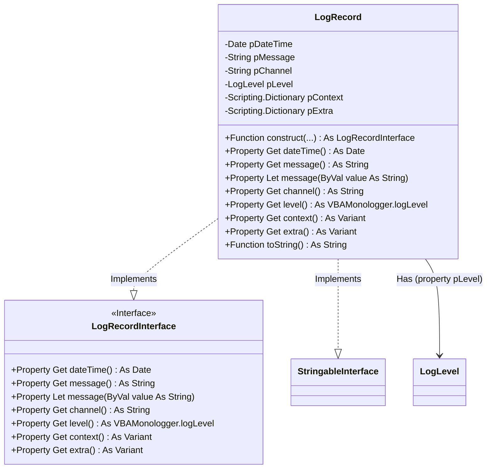

## Concept

A log record refers to an entry that captures specific information about an event or action occurring within an application. A log entry includes several key elements:

- **Date and Time**: To track the exact date and time the log entry was created.
- **Message**: The main text describing the event, *e.g.* "*User attempted to log in.*".
- **Severity level**: The importance or severity level of the log entry, *e.g.* `INFO`, `WARNING` or `ERROR`. See [Log severity levels](./log-severity-levels.md))
- **Channel**: A way to categorize or segment logs based on their source or purpose.
- **Log Context**: Additional relevant information about the event, *e.g.* user ID.
- **Log Extra**: Optional, useful details, *e.g.* memory or CPU usage.

In addition to the basic log message, you may sometimes want to include extra information that helps to provide more context for the event being logged. This could include things like the username of the person triggering the event, a session ID, or any other piece of data that can assist in understanding the log entry better. 

For adding complementary data to a log record, you have two options : `context` and `extra`.

- The `context` is used to add information directly related to the logged event, such as details about an error or an ongoing operation.
- Meanwhile, `extra` is reserved for additional metadata, often generated automatically or added by pre-processors, providing a global context.

Whether it's the `context` option or the `extra` option, they are essentially VBA dictionaries, where you can store key-value pairs that hold relevant information. When you create a log entry, this context can be attached and will be incorporated into the log output, providing deeper insights into the logged event. This feature is a great way to enrich your log entries with important details and provide better traceability and understanding of your application's behavior.

## Modeling

A log record is described in the interface `VBAMonologger.Log.LogRecordInterface` and implemented in the module class `VBAMonologger.Log.LogRecord`.



## Usages

### Creating a LogRecord

To create a log record, just use its constructor like this.

```vbscript
Dim record As VBAMonologger.LogRecord

Set record = New VBAMonologger.LogRecord
Set record = record.construct( _
  "I believe I can fly", _
  VBAMonologger.LEVEL_EMERGENCY _
)

Debug.Print record.toString
```
``` title="Result"
[VBAMonologger.Log.LogRecord]
| dateTime: 04/11/2024 18:41:32
| message: I believe I can fly
| channel: 
| level: EMERGENCY (level value=600)
| context: {}
| extra: {}
```

!!! tip "Typing a `LogRecord`"

    If you use the typing `Dim record As VBAMonologger.LogRecordInterface`, you will not have access to the `toString()` method. In this case, you will only have access to the properties exposed by the interface.


### Attaching a log record to a channel

Log channels identify the source of log entries in large applications, simplifying filtering and searching within shared log files. To attach a log record with a channel, simply specify it as follows in its constructor.

```vbscript
Set record = record.construct( _
  "I believe I can fly", _
  VBAMonologger.LEVEL_INFO, _
  "App" _
)

Debug.Print record.toString
```
``` title="Result"
[VBAMonologger.Log.LogRecord]
| dateTime: 04/11/2024 18:41:32
| message: I believe I can fly
| channel: App
| level: EMERGENCY (level value=600)
| context: {}
| extra: {}
```


### Adding log context and extra metadata from pre-processors

In addition to the basic log message, you may sometimes want to add extra information to provide more context. With a log record, this can be done using either the log context or the log extra. 

The log context allows you to attach additional data that provides more detailed information about the event, such as user information, session details, or request data. On the other hand, the log extra metadata can be used to include supplementary details processed by custom pre-processors (see [Pre-processor](./pre-processor.md)), enabling a more dynamic and flexible logging structure for advanced debugging or analysis.

```vbscript
' Set a dummy log context
Dim logContext As Scripting.Dictionary
Set logContext = New Scripting.Dictionary    
logContext.Add "UserName", "v20100v"
logContext.Add "UserID", 92763
logContext.Add "Operation", "Create"

' Set a dummy extra metadata from pre-processors
Dim logExtra As Scripting.Dictionary
Set logExtra = New Scripting.Dictionary
logExtra.Add "ExecutionTime", " 9,2227 seconds"

Set record = record.construct( _
  "A critical failure occurred for {Operation} process", _
  VBAMonologger.LEVEL_EMERGENCY, _
  "Authentification", _
  logContext,
  logExtra
)
Debug.Print record.toString
```
``` title="Result"
[VBAMonologger.Log.LogRecord]
| dateTime: 04/11/2024 18:41:32
| message: A critical failure occurred for {Operation} process
| channel: Authentification
| level: EMERGENCY (level value=600)
| context: {"UserName":"v20100v","UserID":92763,"Operation":"Create"}
| extra: {"ExecutionTime":"9,2227 seconds"}
```

### Randomize a log record for testing

Here's an example to generate random log records with varying levels of severity, log context, and extra metadata. It's designed to simulate realistic log entries for testing and debugging purposes in the VBA Monologger system.

``` vbscript
'@Description("To generate a random LogRecord")
Public Function randomLogRecord(level As Variant) As VBAMonologger.LogRecord
    Dim record As VBAMonologger.LogRecord
    Set record = New VBAMonologger.LogRecord
        
    Dim logMessage As String
    Select Case level
        Case VBAMonologger.LEVEL_EMERGENCY
            logMessage = "A critical failure occurred in the application for {Operation} process"
        Case VBAMonologger.LEVEL_ALERT
            logMessage = "Action required for process {Operation} failure."
        Case VBAMonologger.LEVEL_CRITICAL
            logMessage = "System is in an unstable state. Unable to authenticate {UserId}."
        Case VBAMonologger.LEVEL_ERROR
            logMessage = "An error occurred when the user {UserId} try to {Operation} the file {file}."
        Case VBAMonologger.LEVEL_WARNING
            logMessage = "The user {UserId} does not exist. Unable to perform '{Operation}' user file."
        Case VBAMonologger.LEVEL_NOTICE
            logMessage = "Process completed successfully with minor issues for {UserId}."
        Case VBAMonologger.LEVEL_INFO
            logMessage = "User {UserId} has logged in successfully."
        Case VBAMonologger.LEVEL_DEBUG
            logMessage = "Authentification function call for user {UserId}."
    End Select
    
    Set randomLogRecord = record.construct( _
        logMessage, _
        level, _
        "App.Authentification", _
        randomLogContext, _
        randomLogExtra _
    )
End Function

'@Description("To generate a random log extra")
Public Function randomLogExtra() As Scripting.Dictionary
    Dim dummyExtra As Scripting.Dictionary
    Set dummyExtra = New Scripting.Dictionary
    Randomize
    dummyExtra.Add "ExecutionTime", Round((Rnd * 10), 4) & " seconds"
        
    Set randomLogExtra = dummyExtra
End Function

'@Description("To generate a random log context")
Public Function randomLogContext() As Scripting.Dictionary
    Dim dummyContext As Scripting.Dictionary
    Set dummyContext = New Scripting.Dictionary
    
    Dim availableUserName As Variant
    Dim availableOperations As Variant
    availableUserName = Array("Bob", "Alice", "Arthur", "v20100v", "CaravanPalace", "2o8o")
    availableOperations = Array("Create", "Read", "Update", "Delete")
    
    Randomize
    dummyContext.Add "UserName", availableUserName(Int(Rnd * (UBound(availableUserName) + 1)))
    dummyContext.Add "UserID", Int((99999 - 10000 + 1) * Rnd + 10000)
    dummyContext.Add "Operation", availableOperations(Int(Rnd * (UBound(availableOperations) + 1)))

    Set randomLogContext = dummyContext
End Function
```

If you want a more complex log context with a nested dictionary, you can use the randomize students function below.

``` vbscript
'@Description("To generate dummy nested dictionnary.")
Public Function randomStudents( _ 
    Optional count As Integer = 3 _ 
) As Scripting.Dictionary
    Dim students As Scripting.Dictionary
    Set students = New Scripting.Dictionary
    
    Dim fullNames As Variant
    fullNames = Array( _
        "Isaac Newton", "Albert Einstein", "Galileo Galilei", "Pythagore", _
        "Alan Turing", "Stephen Hawking", "Marie Curie", "Leonhard Euler", _
        "Pierre de Fermat", "Bernhard Riemann", "Nicolaus Copernicus", _
        "Niels Bohr", "Paul Dirac", "Felix Klein", "Nikola Tesla", _
        "Werner Heisenberg", "Max Planck", "Richard Feynman", _
        "James Clerk Maxwell", "Joseph-Louis Lagrange", "Évariste Galois", _
        "Charles Darwin", "Gregor Mendel", "James Watson", "Francis Crick", _
        "Richard Dawkins", "Jane Goodall", "Carl Sagan", _
        "Pierre-Simon Laplace" _
    )
    Dim randomFullName As String
    randomFullName = fullNames(Int(Rnd * (UBound(fullNames) + 1)))
    
    Dim subjects As Variant
    subjects = Array( _
        "Physics", "Mathematics", "Biology", "Chemistry", "Astrophysics", _
        "Computer Science", "Statistics", "Genetics", "Quantum Mechanics", _
        "Thermodynamics", "Ecology", "Evolutionary Biology", "Organic", _
        "Linear Algebra", "Calculus", "Differential Equations", "Biochemistry" _
    )
     
    Dim student As Scripting.Dictionary
    Dim grades As Scripting.Dictionary
    Dim selectedSubjects As Collection
    Dim randomNumberSubjects As Integer
    Dim randomSubject As String

    Dim i As Integer
    Dim j As Integer
    For i = 1 To count
        Set student = New Scripting.Dictionary
        student.Add "FullName", randomFullName
        student.Add "Age", Int((55 - 18 + 1) * Rnd + 16)
        
        Set grades = New Scripting.Dictionary
        ' Add random number of subjects (2 at 6)
        randomNumberSubjects = Int((6 - 2 + 1) * Rnd + 1)
        Set selectedSubjects = New Collection
        Do While selectedSubjects.count < randomNumberSubjects
            randomSubject = subjects(Int(Rnd * (UBound(subjects) + 1)))
            ' Avoid if subject is already selected
            On Error Resume Next
            selectedSubjects.Add randomSubject, randomSubject
            On Error GoTo 0
        Loop
        For j = 1 To selectedSubjects.count
            Dim subjectName As String
            subjectName = selectedSubjects(j)
            grades.Add subjectName, Int((100 - 11 + 1) * Rnd + 50)
        Next j
        
        student.Add "Grades", grades
        students.Add "Student" & i, student
    Next i

    Set randomStudents = students
End Function
```

