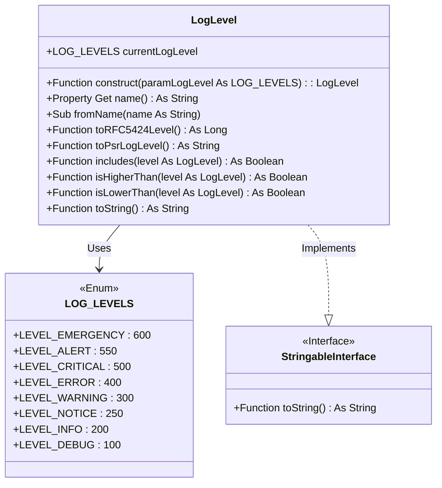

## Concept

The severity levels indicate the severity of each event, from the most trivial to the most catastrophic, and allow administrators or developers to filter messages based on their importance.

**VBA Monologger** manages 8 standard severity levels to classify the importance of log messages, following the [PSR-3](https://www.php-fig.org/psr/psr-3/) standard, which is itself based on RFC 5424, the standard defined by the IETF (*Internet Engineering Task Force*) to specify the format of messages for the Syslog protocol, which is used for transmitting logs over IP networks.

| Log level   | Description                                                                                                                                                                                                                           |
|-------------|---------------------------------------------------------------------------------------------------------------------------------------------------------------------------------------------------------------------------------------|
| `EMERGENCY` | Indicates a very critical situation that requires immediate attention. (*system crash, data corruption*)                                                                                                                              |
| `ALERT`     | Signals an alert condition. (*critical disk space running out*)                                                                                                                                                                       |
| `CRITICAL`  | Indicates a serious error. (*database connection failure, server downtime*)                                                                                                                                                           |
| `ERROR`     | Represents an error in the system. (*failed to save user data, unexpected exception*)                                                                                                                                                 |
| `WARNING`   | A warning about a potential problem. (*use a deprecated function used, low memory warning*)                                                                                                                                           |
| `NOTICE`    | Important notifications that are not urgent. (*user login successful, configuration change detected*)                                                                                                                                 |
| `INFO`      | General information about the normal operation. (*system startup, data processed successfully*)                                                                                                                                       |
| `TRACE`     | Detailed information for debugging. (*variable values during loop iteration, execution details*). Notes, that the '**debug**' method exposes presents in PSR-3 is rename into '**trace**' in order to be compatible in VBA ecosystem. |


## Modeling

To model log entry severity levels in compliance with the RFC 5424 standard, we use a simple enumeration within the `VBAMonologger.Log.LogLevel` class.




### Emulate a constructor in VBA

A class constructor, regardless of the language, is a special method that is automatically called when an instance of a class is created, typically using the `New` keyword. The primary purpose of a constructor is to initialize the members of the class object when it is instantiated, allowing default values to be set, resources to be allocated, or other necessary actions to be taken so that the object is ready to use.

**But in VBA, there is no really constructor, but there is an alternative to emulate one.**

To illustrate, consider the property `currentLogLevel`. Its default value is set in the special VBA procedure `Class_Initialize()`. This procedure is automatically called whenever a class instance is created, *i.e.*, whenever an object is instantiated with the `New` keyword. Below is the code that initializes this default value.

``` vbscript
Public currentLogLevel As LOG_LEVELS

Private Sub Class_Initialize()
    currentLogLevel = LOG_LEVELS.LEVEL_DEBUG
End Sub
```

However, the `Class_Initialize()` procedure neither accepts parameters nor returns values, which limits its function as a true constructor. To emulate a constructor with parameters, an additional function named `construct` (by convention) is added. **Note that this function is not automatically executed upon instantiation. You need to call it manually.**

``` vbscript
Public Function construct(paramLogLevel As LOG_LEVELS)
    currentLogLevel = paramLogLevel
    
    ' Fluent
    Set construct = Me
End Function
```


### Instantiate an instance of LogLevel

Here's an example of how to instantiate an instance of `LogLevel` and use its construct method to set the log level.

``` vbscript
Sub Usecases_LogLevel()    
  Dim level As VBAMonologger.logLevel

  Debug.Print "# Instantiate the class"
  Set level = New VBAMonologger.logLevel
  Debug.Print level.toString

  Debug.Print "# Call the constructor (with 'INFO' level)"
  level.construct LEVEL_INFO
  Debug.Print level.toString
End Sub
```
```bash title="Result"
# Instantiate the class
[VBAMonologger.Log.LogLevel]
 | currentLogLevel: 100
 | name: 'DEBUG'
  
# Call the constructor (with 'INFO' level)
[VBAMonologger.Log.LogLevel]
 | currentLogLevel: 200
 | name: 'INFO'
```


### Implement `StringableInterface` with `toString()` method for readable object representation

The `toString()` function in the interface `StringableInterface` provides a straightforward, meaningful text representation of an instance. This feature proves especially useful for debugging, as it allows developers to easily inspect the state of an object by simply converting it to a string. With `toString()`, the internal data of an object can be output as a human-readable string that reveals key details, such as the current log level, its severity designation, or other significant properties. This approach helps developers quickly understand an object’s state without needing to access each property individually, streamlining both the debugging process and log readability.

The `StringableInterface` is straightforward, defining only a `toString()` function like this.

``` vbscript title="VBAMonologger.Utils.StringableInterface"
'@Interface
'@ModuleDescription("Denotes the class as having a toString() method.")

'@Description("Give a string representation of instance.")
Public Function toString() As String
End Function
```

Within the `LogLevel` module class, the `toString()` function is implemented as follows. We have also a proxy method for public exposition.

``` vbscript title="VBAMonologger.Log.LogLevel"
'@inheritdoc - implements StringableInterface
Private Function StringableInterface_toString() As String
Dim output As String
    output = "[VBAMonologger.Log.LogLevel]" & vbCrLf
    output = output & " | currentLogLevel: " & currentLogLevel & vbCrLf
    output = output & " | name: '" & name() & "'" & vbCrLf

    StringableInterface_toString = output
End Function

'@Description("Proxy method for public exposition.")
Public Function toString() As String
    toString = StringableInterface_toString
End Function
```


## Usages

### Setting the current log level

The public property `currentLogLevel` defines the active log level within an instance. By default, it is set to `LEVEL_DEBUG` upon instantiation. However, this level can be modified in a few different ways:

- Through the class constructor:
  ```vbscript
  Dim level As VBAMonologger.logLevel
  
  Set level = New VBAMonologger.logLevel
  level.construct LEVEL_INFO
  ```
- By setting the property directly:
  ```vbscript
  Set level = New VBAMonologger.logLevel
  level.currentLogLevel = LEVEL_INFO
  ```
- Or by using the `fromName(name As String)` method, which accepts a string representation of the level to set the current log level.
  ```vbscript
  Set level = New VBAMonologger.logLevel
  level.fromName("INFO")
  ```

### Comparing log levels

When working with log levels, it's often necessary to determine their relative importance. For instance, you might want to check if one level is more severe than another, or if a specific level falls within a certain range. Log levels in VBA Monologger are designed to facilitate such comparisons, enabling developers to implement precise logging rules and filters.

You can compare two log levels using the `includes`, `isHigherThan`, and `isLowerThan` methods. These methods allow you to check the relationship between the current log level and another.

- `includes(level As LogLevel)`: Returns True if the current log level is equal to or higher than the specified level.
- `isHigherThan(level As LogLevel)`: Returns True if the current log level is strictly higher than the specified level.
- `isLowerThan(level As LogLevel)`: Returns True if the current log level is strictly lower than the specified level.

These comparisons are useful for filtering log messages based on their severity and ensuring that only relevant logs are processed or displayed.

``` vbscript
Dim level As VBAMonologger.logLevel
Set level = New logLevel
level.currentLogLevel = LOG_LEVELS.LEVEL_WARNING

Dim otherLevel As logLevel
Set otherLevel = New logLevel

' Compare WARNING with INFO
Debug.Print ">>> Compare WARNING with INFO"
otherLevel.currentLogLevel = LOG_LEVELS.LEVEL_INFO
Debug.Print "Is the current level '" & testLevel.name & "' is higher than '" & otherLevel.name & "'? "; testLevel.isHigherThan(otherLevel) ' Result: True
Debug.Print "Is the current level '" & testLevel.name & "' is lower than '" & otherLevel.name & "'? "; testLevel.isLowerThan(otherLevel) ' Result: False
Debug.Print "Is the current level '" & testLevel.name & "' includes '" & otherLevel.name & "'? "; testLevel.includes(otherLevel) ' Result: False

' Compare WARNING with ALERT
Debug.Print ">>> Compare WARNING with ALERT"
otherLevel.currentLogLevel = LOG_LEVELS.LEVEL_ALERT
Debug.Print "Is the current level '" & testLevel.name & "' is higher than '" & otherLevel.name & "'? "; testLevel.isHigherThan(otherLevel) ' Result: True
Debug.Print "Is the current level '" & testLevel.name & "' is lower than '" & otherLevel.name & "'? "; testLevel.isLowerThan(otherLevel) ' Result: False
Debug.Print "Is the current level '" & testLevel.name & "' includes '" & otherLevel.name & "'? "; testLevel.includes(otherLevel) ' Result: False
```
```bash title="Result"
>>> Compare WARNING with INFO
Is the current level 'WARNING' is higher than 'INFO'? True
Is the current level 'WARNING' is lower than 'INFO'? False
Is the current level 'WARNING' includes 'INFO'? False

>>> Compare WARNING with ALERT
Is the current level 'WARNING' is higher than 'ALERT'? False
Is the current level 'WARNING' is lower than 'ALERT'? True
Is the current level 'WARNING' includes 'ALERT'? True
```

